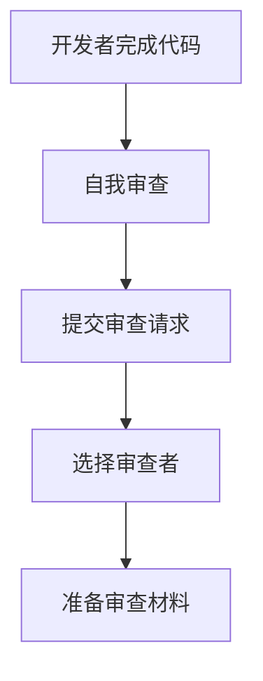
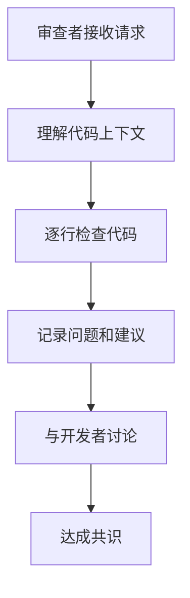
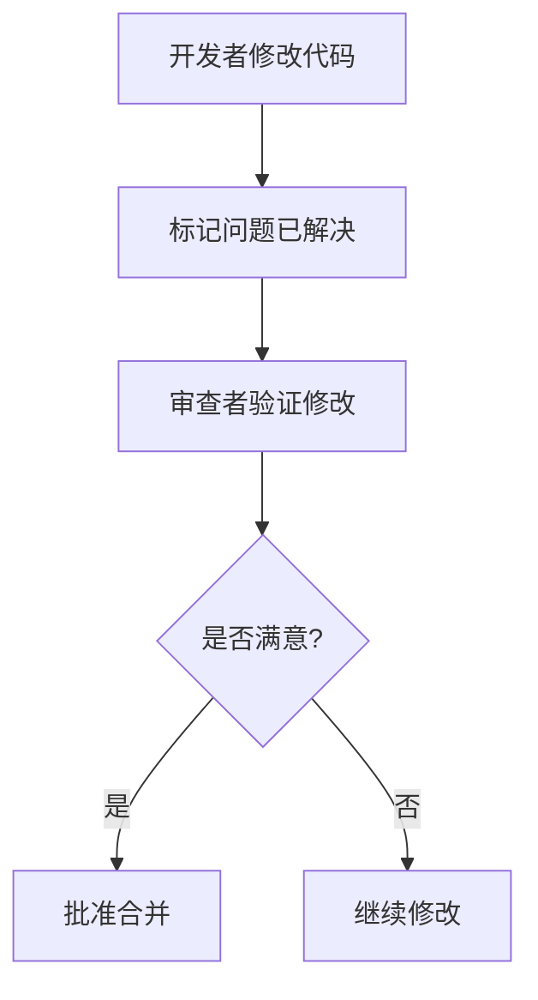

# 代码审查参考文档

## 代码审查概述

### 什么是代码审查
代码审查是软件开发过程中的质量保证活动，通过同行评审的方式检查代码的正确性、可读性、可维护性和安全性。

### 代码审查的价值
- **提高代码质量**: 发现潜在问题和改进机会
- **知识共享**: 团队成员之间相互学习
- **统一标准**: 确保代码风格和架构一致性
- **降低成本**: 早期发现问题，减少后期维护成本
- **团队建设**: 促进团队沟通和协作

### 审查类型

#### 按时间分类
- **正式审查**: 预先安排的、结构化的审查会议
- **非正式审查**: 日常的、轻量级的代码检查
- **工具辅助审查**: 使用自动化工具进行的审查

#### 按范围分类
- **全量审查**: 对整个代码库进行全面审查
- **增量审查**: 只审查新增或修改的代码
- **专项审查**: 针对特定方面的审查（安全、性能等）

## 代码审查流程

### 标准审查流程

#### 1. 准备阶段


#### 2. 审查阶段


#### 3. 修复阶段


### 最佳实践流程

#### GitHub Pull Request流程
```yaml
# .github/pull_request_template.md
## 代码审查清单

### 功能检查
- [ ] 功能实现符合需求
- [ ] 边界条件处理正确
- [ ] 错误处理完善

### 代码质量
- [ ] 代码风格符合规范
- [ ] 命名清晰有意义
- [ ] 注释准确完整
- [ ] 代码复杂度合理

### 测试
- [ ] 单元测试覆盖充分
- [ ] 集成测试通过
- [ ] 性能测试达标

### 安全
- [ ] 无安全漏洞
- [ ] 输入验证完善
- [ ] 敏感信息保护

### 文档
- [ ] API文档更新
- [ ] 使用说明更新
- [ ] 变更记录更新
```

#### GitLab Merge Request流程
```yaml
# .gitlab/merge_request_templates/code_review.md
## 代码审查模板

### 变更描述
- **变更类型**: 
  - [ ] 新功能
  - [ ] 功能改进
  - [ ] Bug修复
  - [ ] 重构
  - [ ] 文档更新
- **变更影响**: _________________________

### 审查重点
- [ ] 架构设计
- [ ] 代码实现
- [ ] 性能影响
- [ ] 安全考虑
- [ ] 测试覆盖

### 测试结果
- [ ] 本地测试通过
- [ ] CI/CD流水线通过
- [ ] 性能测试结果: _________________________

### 部署计划
- [ ] 部署环境: _________________________
- [ ] 部署时间: _________________________
- [ ] 回滚计划: _________________________
```

## 代码审查标准

### 代码质量标准

#### SOLID原则检查清单
```java
// 单一职责原则 (SRP) - 好的示例
class UserService {
    public void createUser(UserData data) {
        validateUserData(data);
        saveUserToDatabase(data);
        sendWelcomeEmail(data.getEmail());
    }
    
    private void validateUserData(UserData data) {
        // 验证逻辑
    }
    
    private void saveUserToDatabase(UserData data) {
        // 数据库操作
    }
    
    private void sendWelcomeEmail(String email) {
        // 邮件发送
    }
}

// 不好的示例 - 违反SRP
class UserService {
    public void createUser(UserData data) {
        // 验证逻辑
        // 数据库操作
        // 邮件发送
        // 日志记录
        // 缓存更新
        // 所有职责混在一起
    }
}
```

#### 开闭原则 (OCP) 示例
```java
// 好的示例 - 对扩展开放，对修改关闭
interface PaymentProcessor {
    void processPayment(Payment payment);
}

class CreditCardProcessor implements PaymentProcessor {
    @Override
    public void processPayment(Payment payment) {
        // 信用卡支付逻辑
    }
}

class PayPalProcessor implements PaymentProcessor {
    @Override
    public void processPayment(Payment payment) {
        // PayPal支付逻辑
    }
}

class PaymentService {
    private List<PaymentProcessor> processors;
    
    public void processPayment(Payment payment, String type) {
        PaymentProcessor processor = findProcessor(type);
        processor.processPayment(payment);
    }
}
```

### 代码复杂度标准

#### 圈复杂度检查
```java
// 高复杂度 - 圈复杂度 > 10
public void processOrder(Order order) {
    if (order == null) {
        throw new IllegalArgumentException("Order cannot be null");
    }
    
    if (order.getStatus() == OrderStatus.CANCELLED) {
        return;
    }
    
    if (order.getAmount() > 1000) {
        if (order.getCustomer().isVip()) {
            applyVipDiscount(order);
        } else {
            if (order.getAmount() > 5000) {
                applyHighValueDiscount(order);
            } else {
                applyStandardDiscount(order);
            }
        }
    } else {
        if (order.getCustomer().isNew()) {
            applyNewCustomerDiscount(order);
        } else {
            if (order.getPaymentMethod() == PaymentMethod.CREDIT_CARD) {
                applyCreditCardDiscount(order);
            } else {
                applyStandardDiscount(order);
            }
        }
    }
    
    // 更多嵌套逻辑...
}

// 低复杂度 - 使用策略模式重构
public void processOrder(Order order) {
    if (order == null) {
        throw new IllegalArgumentException("Order cannot be null");
    }
    
    if (order.getStatus() == OrderStatus.CANCELLED) {
        return;
    }
    
    DiscountStrategy strategy = discountStrategyFactory.getStrategy(order);
    strategy.applyDiscount(order);
}
```

#### 认知复杂度检查
```python
# 高认知复杂度
def calculate_price(user, product, quantity, discount_code=None):
    if user is None:
        raise ValueError("User cannot be None")
    
    if product is None:
        raise ValueError("Product cannot be None")
    
    if quantity <= 0:
        raise ValueError("Quantity must be positive")
    
    base_price = product.price * quantity
    
    if user.is_vip:
        if product.category == "electronics":
            if quantity > 5:
                base_price *= 0.8
            else:
                base_price *= 0.9
        else:
            base_price *= 0.95
    else:
        if product.category == "electronics":
            if quantity > 10:
                base_price *= 0.85
            else:
                base_price *= 0.9
        else:
            base_price *= 0.95
    
    if discount_code:
        if discount_code.startswith("SUMMER"):
            if user.is_vip:
                base_price *= 0.7
            else:
                base_price *= 0.8
        elif discount_code.startswith("WINTER"):
            if product.category == "clothing":
                base_price *= 0.6
            else:
                base_price *= 0.75
        else:
            base_price *= 0.9
    
    return base_price

# 低认知复杂度 - 重构后
def calculate_price(user, product, quantity, discount_code=None):
    validate_inputs(user, product, quantity)
    
    base_price = product.price * quantity
    base_price = apply_user_discount(base_price, user, product, quantity)
    base_price = apply_discount_code(base_price, discount_code, user, product)
    
    return base_price

def apply_user_discount(price, user, product, quantity):
    if user.is_vip:
        return apply_vip_discount(price, product, quantity)
    else:
        return apply_regular_discount(price, product, quantity)

def apply_discount_code(price, code, user, product):
    if not code:
        return price
    
    discount_calculator = DiscountCalculatorFactory.get_calculator(code)
    return discount_calculator.calculate(price, user, product)
```

## 安全审查标准

### OWASP Top 10检查

#### SQL注入检查
```java
// 不安全的SQL查询 - 易受SQL注入攻击
public User getUserById(String userId) {
    String sql = "SELECT * FROM users WHERE id = " + userId;
    return jdbcTemplate.queryForObject(sql, User.class);
}

// 安全的SQL查询 - 使用参数化查询
public User getUserById(String userId) {
    String sql = "SELECT * FROM users WHERE id = ?";
    return jdbcTemplate.queryForObject(sql, new Object[]{userId}, User.class);
}

// 使用JPA Repository
public interface UserRepository extends JpaRepository<User, Long> {
    @Query("SELECT u FROM User u WHERE u.id = :userId")
    User findById(@Param("userId") String userId);
}
```

#### XSS防护检查
```javascript
// 不安全的HTML渲染 - 易受XSS攻击
function renderUserInput(input) {
    document.getElementById('content').innerHTML = input;
}

// 安全的HTML渲染 - 使用文本节点
function renderUserInput(input) {
    document.getElementById('content').textContent = input;
}

// 使用DOMPurify库进行HTML清理
import DOMPurify from 'dompurify';

function renderUserInput(input) {
    const cleanInput = DOMPurify.sanitize(input);
    document.getElementById('content').innerHTML = cleanInput;
}
```

#### 敏感信息处理
```java
// 不安全的敏感信息处理
public class User {
    private String password;
    private String creditCard;
    
    // 直接返回敏感信息
    public String getPassword() {
        return password;
    }
    
    // 日志记录敏感信息
    public void logUserInfo() {
        logger.info("User info: " + toString());
    }
}

// 安全的敏感信息处理
public class User {
    private String password;
    private String creditCard;
    
    // 不返回敏感信息
    public boolean checkPassword(String input) {
        return passwordEncoder.matches(input, password);
    }
    
    // 不记录敏感信息
    @Override
    public String toString() {
        return "User{id=" + id + ", username=" + username + "}";
    }
}
```

## 性能审查标准

### 算法效率检查

#### 时间复杂度分析
```java
// 低效算法 - O(n²)
public List<Integer> findDuplicates(int[] arr) {
    List<Integer> duplicates = new ArrayList<>();
    for (int i = 0; i < arr.length; i++) {
        for (int j = i + 1; j < arr.length; j++) {
            if (arr[i] == arr[j] && !duplicates.contains(arr[i])) {
                duplicates.add(arr[i]);
            }
        }
    }
    return duplicates;
}

// 高效算法 - O(n)
public List<Integer> findDuplicates(int[] arr) {
    Set<Integer> seen = new HashSet<>();
    Set<Integer> duplicates = new HashSet<>();
    
    for (int num : arr) {
        if (!seen.add(num)) {
            duplicates.add(num);
        }
    }
    
    return new ArrayList<>(duplicates);
}
```

#### 数据库查询优化
```java
// 不高效的查询 - N+1问题
public List<Order> getOrdersWithItems(Long userId) {
    List<Order> orders = orderRepository.findByUserId(userId);
    for (Order order : orders) {
        List<OrderItem> items = orderItemRepository.findByOrderId(order.getId());
        order.setItems(items);
    }
    return orders;
}

// 高效的查询 - 使用JOIN FETCH
public List<Order> getOrdersWithItems(Long userId) {
    return orderRepository.findByUserIdWithItems(userId);
}

// Repository接口
public interface OrderRepository extends JpaRepository<Order, Long> {
    @Query("SELECT o FROM Order o LEFT JOIN FETCH o.items WHERE o.userId = :userId")
    List<Order> findByUserIdWithItems(@Param("userId") Long userId);
}
```

### 内存使用优化

#### 内存泄漏检查
```java
// 可能导致内存泄漏的代码
public class CacheManager {
    private static final Map<String, Object> cache = new HashMap<>();
    
    public void put(String key, Object value) {
        cache.put(key, value);
    }
    
    // 没有清理机制，缓存会无限增长
}

// 内存安全的缓存实现
public class CacheManager {
    private static final Map<String, Object> cache = new HashMap<>();
    private static final int MAX_SIZE = 1000;
    
    public void put(String key, Object value) {
        if (cache.size() >= MAX_SIZE) {
            // LRU清理策略
            String oldestKey = cache.keySet().iterator().next();
            cache.remove(oldestKey);
        }
        cache.put(key, value);
    }
    
    // 使用WeakReference避免内存泄漏
    private static final Map<String, WeakReference<Object>> weakCache = new HashMap<>();
}
```

## 测试审查标准

### 测试覆盖率标准

#### 单元测试审查
```java
// 被测试的代码
public class Calculator {
    public int add(int a, int b) {
        return a + b;
    }
    
    public int divide(int a, int b) {
        if (b == 0) {
            throw new IllegalArgumentException("Divisor cannot be zero");
        }
        return a / b;
    }
}

// 高质量的单元测试
public class CalculatorTest {
    private Calculator calculator;
    
    @BeforeEach
    void setUp() {
        calculator = new Calculator();
    }
    
    @Test
    @DisplayName("应该正确执行加法运算")
    void shouldAddCorrectly() {
        // Given
        int a = 5;
        int b = 3;
        
        // When
        int result = calculator.add(a, b);
        
        // Then
        assertEquals(8, result);
    }
    
    @Test
    @DisplayName("应该正确处理除法运算")
    void shouldDivideCorrectly() {
        // Given
        int a = 10;
        int b = 2;
        
        // When
        int result = calculator.divide(a, b);
        
        // Then
        assertEquals(5, result);
    }
    
    @Test
    @DisplayName("除数为零时应该抛出异常")
    void shouldThrowExceptionWhenDividingByZero() {
        // Given
        int a = 10;
        int b = 0;
        
        // When & Then
        assertThrows(IllegalArgumentException.class, () -> {
            calculator.divide(a, b);
        });
    }
    
    @ParameterizedTest
    @ValueSource(ints = {1, 2, 3, 4, 5})
    @DisplayName("应该正确处理不同的加法运算")
    void shouldAddDifferentNumbers(int b) {
        assertEquals(6, calculator.add(1, b));
    }
}
```

#### 集成测试审查
```java
@SpringBootTest
@TestPropertySource(locations = "classpath:test.properties")
@Transactional
public class UserServiceIntegrationTest {
    
    @Autowired
    private UserService userService;
    
    @MockBean
    private EmailService emailService;
    
    @Test
    @DisplayName("应该成功创建用户")
    void shouldCreateUserSuccessfully() {
        // Given
        UserData userData = UserData.builder()
            .username("testuser")
            .email("test@example.com")
            .password("password123")
            .build();
        
        // When
        User createdUser = userService.createUser(userData);
        
        // Then
        assertThat(createdUser).isNotNull();
        assertThat(createdUser.getUsername()).isEqualTo("testuser");
        assertThat(createdUser.getId()).isNotNull();
        
        verify(emailService).sendWelcomeEmail("test@example.com");
    }
    
    @Test
    @DisplayName("用户名重复时应该抛出异常")
    void shouldThrowExceptionWhenUsernameExists() {
        // Given
        UserData userData = UserData.builder()
            .username("existinguser")
            .email("test@example.com")
            .password("password123")
            .build();
        
        // 创建已存在的用户
        User existingUser = User.builder()
            .username("existinguser")
            .build();
        userRepository.save(existingUser);
        
        // When & Then
        assertThrows(UsernameAlreadyExistsException.class, () -> {
            userService.createUser(userData);
        });
    }
}
```

## 代码审查工具

### 静态代码分析工具

#### SonarQube配置
```xml
<!-- pom.xml -->
<plugin>
    <groupId>org.sonarsource.scanner.maven</groupId>
    <artifactId>sonar-maven-plugin</artifactId>
    <version>3.9.1.2184</version>
</plugin>
```

```properties
# sonar-project.properties
sonar.projectKey=my-project
sonar.projectName=My Project
sonar.projectVersion=1.0

sonar.sources=src/main/java
sonar.tests=src/test/java
sonar.java.binaries=target/classes
sonar.java.test.binaries=target/test-classes

sonar.coverage.jacoco.xmlReportPaths=target/site/jacoco/jacoco.xml
sonar.java.code.coverage.plugin=jacoco

# 质量门禁
sonar.qualitygate.wait=true
```

#### ESLint配置
```json
{
  "extends": [
    "eslint:recommended",
    "@typescript-eslint/recommended",
    "plugin:security/recommended"
  ],
  "plugins": ["@typescript-eslint", "security"],
  "rules": {
    "no-console": "warn",
    "no-unused-vars": "error",
    "prefer-const": "error",
    "security/detect-object-injection": "error",
    "security/detect-non-literal-fs-filename": "error"
  },
  "env": {
    "node": true,
    "es6": true
  }
}
```

### 代码审查平台

#### GitHub集成
```yaml
# .github/workflows/code-review.yml
name: Code Review

on:
  pull_request:
    branches: [ main ]

jobs:
  code-review:
    runs-on: ubuntu-latest
    
    steps:
    - uses: actions/checkout@v3
    
    - name: Setup Node.js
      uses: actions/setup-node@v3
      with:
        node-version: '18'
        cache: 'npm'
    
    - name: Install dependencies
      run: npm ci
    
    - name: Run ESLint
      run: npm run lint:check
    
    - name: Run tests
      run: npm run test:coverage
    
    - name: SonarCloud Scan
      uses: SonarSource/sonarcloud-github-action@master
      env:
        GITHUB_TOKEN: ${{ secrets.GITHUB_TOKEN }}
        SONAR_TOKEN: ${{ secrets.SONAR_TOKEN }}
    
    - name: Security scan
      run: npm audit --audit-level high
```

#### GitLab集成
```yaml
# .gitlab-ci.yml
stages:
  - test
  - quality
  - security

variables:
  SONAR_USER_HOME: "${CI_PROJECT_DIR}/.sonar"
  GIT_DEPTH: "0"

cache:
  key: "${CI_JOB_NAME}"
  paths:
    - .sonar/cache

test:
  stage: test
  script:
    - npm ci
    - npm run test:coverage
  coverage: '/Lines\s*:\s*(\d+\.\d+)%/'
  artifacts:
    reports:
      coverage_report:
        coverage_format: cobertura
        path: coverage/cobertura-coverage.xml

sonarcloud-check:
  stage: quality
  image:
    name: sonarsource/sonar-scanner-cli:latest
    entrypoint: [""]
  variables:
    SONAR_HOST_URL: "https://sonarcloud.io"
  script:
    - sonar-scanner
  only:
    - merge_requests
    - main

security-scan:
  stage: security
  script:
    - npm audit --audit-level high
    - npm run security:check
  allow_failure: true
```

## 审查报告模板

### 审查总结报告
```markdown
# 代码审查报告

## 基本信息
- **项目**: [项目名称]
- **分支**: [分支名称]
- **提交**: [Commit Hash]
- **审查者**: [审查者姓名]
- **审查时间**: [审查日期]

## 审查统计
- **文件数量**: 15
- **代码行数**: 1,234 (新增: 456, 删除: 123)
- **发现问题**: 23
- **严重问题**: 3
- **一般问题**: 12
- **建议**: 8

## 问题分类

### 严重问题 (3个)
1. **安全漏洞**: SQL注入风险
   - 文件: `src/main/java/UserRepository.java:45`
   - 建议: 使用参数化查询
   - 优先级: 高

2. **性能问题**: N+1查询问题
   - 文件: `src/main/java/OrderService.java:78`
   - 建议: 使用JOIN FETCH
   - 优先级: 高

3. **功能缺陷**: 空指针异常风险
   - 文件: `src/main/java/Utils.java:23`
   - 建议: 添加空值检查
   - 优先级: 高

### 一般问题 (12个)
1. **代码风格**: 变量命名不规范
2. **注释缺失**: 复杂逻辑缺少注释
3. **异常处理**: 异常处理不完善
4. **测试覆盖**: 单元测试覆盖率不足

### 建议 (8个)
1. **重构建议**: 可以提取公共方法
2. **性能优化**: 可以使用缓存
3. **代码复用**: 可以使用工具类
4. **文档完善**: 添加API文档

## 质量评分
- **代码质量**: 7.5/10
- **测试覆盖**: 85%
- **文档完整性**: 70%
- **综合评分**: 7.2/10

## 审查结论
- [ ] 通过
- [ ] 需要修改
- [ ] 不通过

## 下一步行动
1. 修复严重问题
2. 完善单元测试
3. 更新文档
4. 重新提交审查
```

## 最佳实践

### 审查者指南

#### 审查前准备
1. **理解上下文**: 了解功能需求和业务背景
2. **熟悉代码**: 快速浏览整体代码结构
3. **准备工具**: 确保开发环境和工具就绪
4. **预留时间**: 安排充足的时间进行仔细审查

#### 审查过程
1. **先看整体**: 从整体架构和设计开始
2. **逐行检查**: 仔细检查代码实现细节
3. **关注重点**: 重点关注安全、性能、可维护性
4. **记录问题**: 详细记录发现的问题和建议

#### 反馈技巧
1. **建设性**: 提出具体、可操作的改进建议
2. **礼貌性**: 使用友好、尊重的语言
3. **解释性**: 说明问题的原因和影响
4. **平衡性**: 既指出问题，也肯定优点

### 开发者指南

#### 提交前准备
1. **自我审查**: 先进行自我代码审查
2. **运行测试**: 确保所有测试通过
3. **格式化代码**: 使用代码格式化工具
4. **编写文档**: 更新相关文档

#### 处理反馈
1. **积极接受**: 虚心接受所有反馈意见
2. **及时响应**: 快速响应审查者的评论
3. **详细解释**: 对不理解的问题进行澄清
4. **认真修改**: 认真修改所有指出的问题

## 参考资源

### 官方文档
- [Google Code Review Guidelines](https://google.github.io/eng-practices/review/)
- [Microsoft Code Review Guidelines](https://docs.microsoft.com/en-us/azure/devops/repos/pull-request/code-review-process)
- [GitHub Code Review Best Practices](https://docs.github.com/en/pull-requests/collaborating-with-pull-requests/reviewing-changes-in-pull-requests)

### 工具文档
- [SonarQube Documentation](https://docs.sonarqube.org/)
- [ESLint Documentation](https://eslint.org/docs/)
- [Checkstyle Documentation](https://checkstyle.sourceforge.io/)

### 最佳实践指南
- [Clean Code by Robert C. Martin](https://www.amazon.com/Clean-Code-Handbook-Software-Craftsmanship/dp/0132350884)
- [Code Complete by Steve McConnell](https://www.amazon.com/Code-Complete-Practical-Handbook-Construction/dp/0735619670)
- [The Pragmatic Programmer by Andy Hunt](https://www.amazon.com/Pragmatic-Programmer-journey-mastery-Anniversary/dp/0135957056)

### 社区资源
- [Stack Overflow Code Review](https://codereview.stackexchange.com/)
- [Reddit r/programming](https://www.reddit.com/r/programming/)
- [Hacker News](https://news.ycombinator.com/)
