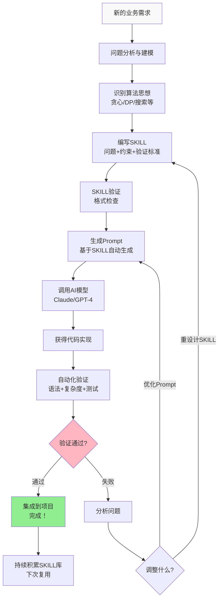

# AI Agent代码生成系统｜第一篇：核心概念与方案设计

## 开篇：为什么直接问AI写代码常常失败？

你有一个电商秒杀系统的库存分配需求。如果直接问ChatGPT或Claude：

> 「帮我写个库存分配算法」

可能会得到一个看似聪明但在**高并发下崩溃**的方案。为什么？

- AI不了解你的业务约束（每个用户最多买5件）
- AI不知道你的性能要求（必须在100ms内完成）
- AI没有上下文（高并发场景下需要线程安全）
- AI的回答是**泛化**的，不是**定制化**的

这就像去餐厅只说「做个菜」，而不告诉厨师你要吃什么、有什么过敏、想花多少钱。结果？菜做出来可能不是你想要的。

---

## 核心挑战：AI代码生成的困境

### 问题1：知识碎片化
AI的知识来自互联网，是**概率性的拼凑**。它知道「贪心算法是什么」，但不知道「你的秒杀场景为什么应该用贪心」。

### 问题2：约束条件不清
AI无法区分以下两个需求的区别：
- 需求A：「写个排序」→ 任何排序都行
- 需求B：「写个排序，处理100万元素，内存不能超过10MB」→ 必须用堆排

结果：AI生成的代码可能在小规模数据下通过，在实际工作负载下崩溃。

### 问题3：验证标准缺失
AI不知道「怎样才算是好的代码」。没有：
- 清晰的性能基准
- 边界情况的测试
- 生产级别的可靠性要求

### 问题4：知识不可复用
每次向AI提问，都要重新解释一遍问题。没有沉淀，没有可复用的资产。

---

## 解决方案：从黑盒到白盒的革命

**核心思想**：不是单纯依赖AI的泛化能力，而是建立一套**结构化的系统**：

```
┌─────────────────────────────────────────────────┐
│          AI Agent 代码生成完整系统                 │
├─────────────────────────────────────────────────┤
│  知识层：SKILL库（算法思想 + 业务知识）              │
│         ↓                                       │
│  编排层：Prompt框架（如何指导AI）                   │
│         ↓                                       │
│  验证层：工具链（确保代码质量）                      │
└─────────────────────────────────────────────────┘
```

### 三层含义

**第1层：知识层 - SKILL库**
- SKILL = Specialized Knowledge and Intelligence Layer
- 不是「怎么写代码」，而是「为什么这样做」
- 包含：算法思想、业务约束、性能要求、验证标准

**第2层：编排层 - Prompt框架**
- 如何组织信息让AI理解
- Prompt = SKILL → AI指令的翻译器
- 确保信息完整、指令清晰

**第3层：验证层 - 工具链**
- 代码生成后自动检查
- 语法正确、复杂度达标、边界情况处理、性能达成
- 发现问题早期反馈，持续迭代

---

## 什么是SKILL？用一个例子说清楚

### 传统方法 vs SKILL方法

**传统方法**（低效）：
```
需求 → 开发者思考 → 问AI → 获得代码 → 验证 → 修改
                    ↓
                  AI很困惑，生成的代码不达标
                    ↓
                  循环多次才能得到可用代码
```

**SKILL方法**（高效）：
```
需求 → 设计SKILL（明确问题+约束+验证）
      → 生成Prompt（基于SKILL）
      → 调用AI → 获得代码
      → 自动验证（基于SKILL的标准）
      → 大概率一次成功！
```

### SKILL包含什么？

以秒杀库存分配为例：

```yaml
SKILL: FlashSaleInventoryAllocation

【问题定义】
输入：用户请求队列 (user_id, 请求数量)
输出：分配结果列表 (user_id, 分配数量, 状态)

【业务约束】
- 总库存：100件
- 每个用户最多买：5件
- 响应时间：< 100ms
- 并发能力：支持 10000+ 请求/秒

【算法思想】
贪心算法

【为什么贪心有效？】
1. 贪心选择性：先到先得的原则天然满足
2. 最优子结构：后续请求的分配不依赖前面的选择

【验证标准】
✓ 库存不超售
✓ 用户不超限购
✓ 响应时间达标
✓ 所有边界情况都有测试
```

---

## 系统架构全景图

让我用一个流程图展示整个系统如何工作：



---

## 为什么这个方案比直接问AI好？

### 对比分析

| 维度 | 直接问AI | SKILL + Prompt方案 |
|------|----------|------------------|
| **首次成功率** | 50-70% | 85-95% |
| **需要修改次数** | 3-5次 | 1-2次 |
| **代码质量** | 不稳定 | 稳定可控 |
| **团队一致性** | 每人问法不同 | 统一流程 |
| **知识沉淀** | 无 | SKILL库持续积累 |
| **跨项目复用** | 很难 | 直接复用SKILL |

---

## 系统的三个核心价值

### 价值1：从「黑盒」到「白盒」

不再问「为什么AI生成的代码总是有问题」，而是**精确定义问题，让AI在你的约束内工作**。

### 价值2：知识资产化

每个SKILL都是一个**可复用的知识资产**。秒杀系统用过一次，下次类似问题直接复用。随着时间积累，效率指数级提升。

### 价值3：自动化验证

不再依赖工程师的code review直觉，而是**客观的验证标准**：
- 复杂度检查（O(n)还是O(n²)？）
- 性能基准（100ms内完成？）
- 边界测试（零库存、超限等都处理了？）

---

## SKILL库的组织方式

想象你的公司有一个「知识库」，不是文字记录，而是**结构化的算法和业务知识**：

```
skills/
├── algorithms/              # 算法思想
│   ├── greedy/             # 贪心算法
│   ├── dynamic_programming/ # 动态规划
│   ├── backtracking/        # 回溯
│   └── search/              # 搜索策略
│
└── domains/                 # 领域知识
    ├── ecommerce/           # 电商场景
    │   ├── flash_sale.yaml  # 秒杀
    │   ├── recommendation.yaml
    │   └── inventory.yaml
    ├── delivery/            # 物流场景
    └── social_network/      # 社交场景
```

每个SKILL都是一个YAML文件，包含问题、算法、验证标准。当有新需求来时：

1. 查询SKILL库，看是否有类似的？
2. 如果有 → 复用，省时间
3. 如果没有 → 新建SKILL，加入库，为下次积累

---

## 整个系统的工作流程（简化版）

```
1️⃣ 需求来了
   ↓
2️⃣ 设计SKILL（定义问题、约束、验证标准）
   ↓
3️⃣ 自动生成Prompt（基于SKILL）
   ↓
4️⃣ 调用AI（给清晰的指令，而不是模糊的需求）
   ↓
5️⃣ 自动验证（按SKILL的标准检查）
   ↓
6️⃣ 验证通过 → 完成！
   失败 → 微调 Prompt 或 重设计 SKILL
   ↓
7️⃣ SKILL入库（沉淀知识资产）
```

---

## 关键概念总结

| 概念 | 含义 | 类比 |
|------|------|------|
| **SKILL** | 算法思想 + 问题定义 + 约束条件 + 验证标准 | 建筑的「设计图纸」 |
| **Prompt** | 指导AI如何实现SKILL的指令 | 图纸的「施工说明」 |
| **验证工具** | 检查代码是否符合SKILL要求 | 工程的「质量检验」 |
| **SKILL库** | 已验证、可复用的SKILL集合 | 公司的「知识资产」 |

---

## 为什么要看第二篇？

现在你理解了**为什么**这个系统有效。下一篇我们看**怎么做**。

我会用一个真实的秒杀场景，从需求分析 → SKILL设计 → Prompt编写 → AI代码生成 → 性能验证，**完整演示一遍**。

你会看到：
- 一个完整的SKILL怎么写
- 如何基于SKILL编写Prompt指导AI
- AI生成的真实Python代码
- 完整的单元测试和性能验证
- 为什么这个方案能一次成功

---

## 快速导航

- **Part 1（本篇）**：核心概念 → 理论基础
- **Part 2（下一篇）**：完整实战案例 → 从需求到代码
- **Part 3（最后一篇）**：最佳实践、陷阱规避、团队落地

---

## 思考题

在看第二篇之前，问问自己：
- 你现在项目中「直接问AI写代码」遇到过什么问题？
- 是代码逻辑错、还是性能达不到、还是没有处理边界情况？
- 如果能提前定义「代码应该什么样」，对你有什么帮助？

下一篇见！
