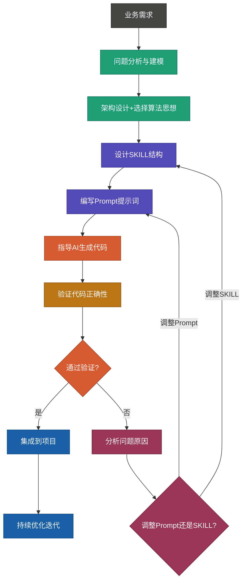
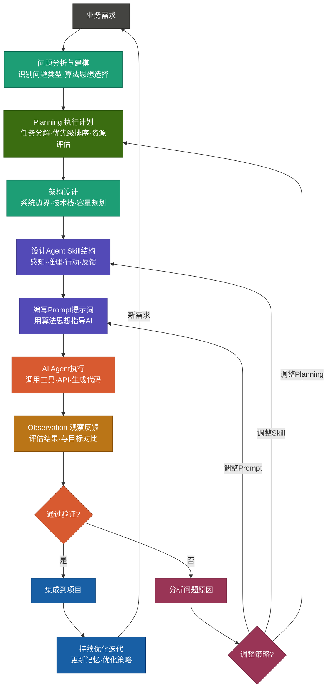

# AI Agent代码生成完整流程：从需求到可执行代码

## 核心挑战与解决方案

你有一个电商秒杀系统的库存分配需求。如果直接问ChatGPT「帮我写个库存分配算法」，可能会得到一个看似聪明但在高并发下崩溃的方案。为什么？因为AI不了解你的业务约束、性能要求和技术栈。

**解决之道**：不是单纯依赖AI的泛化能力，而是建立一套**结构化的SKILL库 + 智能Prompt框架 + 自动化验证工具链**，让AI在你定义的边界内高精度生成可靠代码。

这套系统的核心思想是：**将AI代码生成从「黑盒猜测」升级为「白盒规划」**。

---

## 整体架构概览

在Agentic AI时代，要让AI Agent真实有效地生成高质量代码，需要建立一套标准化的SKILL、参考资料和工具链。整个系统分为三个核心层次：

- **知识层**：SKILL库（算法思想、领域特定知识、最佳实践）
- **编排层**：Prompt框架和工作流（如何指导AI）
- **验证层**：自动化工具链（确保代码质量）

## 1. AI Agent代码生成总体流程

### 单任务流程（Automated/AI Workflow）


### 多任务流程（Agentic Workflow）

---

## 2. SKILL库：知识的结构化表示

### SKILL的核心概念

SKILL（Specialized Knowledge and Intelligence Layer）是对**一个算法思想或领域知识**的结构化描述。它不仅包含问题的定义和算法思想，还包含实现指导、验证标准，是AI生成代码的"指南针"。

**SKILL 与 代码的关系**：
- SKILL = 问题 + 算法思想 + 约束条件 + 验证规范
- 代码 = 对SKILL的具体实现
- Prompt = 基于SKILL为AI的指令

一个好的SKILL应该让AI理解"为什么这样做"，而不仅仅是"怎么做"。

### SKILL目录结构与组织方式

```
ai-skills/
├── README.md                          # 项目说明和快速开始
│
├── skills/                            # 核心SKILL库
│   ├── algorithms/                    # 算法思想实现Skills
│   │   ├── greedy/                    # 贪心算法Skills
│   │   │   ├── activity_selection.yaml
│   │   │   ├── huffman_coding.yaml
│   │   │   └── task_scheduling.yaml
│   │   ├── divide_conquer/            # 分治算法Skills
│   │   │   ├── merge_sort.yaml
│   │   │   ├── quick_sort.yaml
│   │   │   └── matrix_multiplication.yaml
│   │   ├── dynamic_programming/       # 动态规划Skills
│   │   │   ├── knapsack.yaml
│   │   │   ├── longest_sequence.yaml
│   │   │   └── edit_distance.yaml
│   │   ├── backtracking/              # 回溯算法Skills
│   │   │   ├── permutation.yaml
│   │   │   ├── n_queens.yaml
│   │   │   └── sudoku_solver.yaml
│   │   └── search/                    # 搜索策略Skills
│   │       ├── bfs.yaml
│   │       ├── dfs.yaml
│   │       └── astar.yaml
│   │
│   ├── domains/                       # 领域特定Skills
│   │   ├── ecommerce/                 # 电商领域
│   │   │   ├── flash_sale.yaml
│   │   │   ├── recommendation.yaml
│   │   │   └── inventory_management.yaml
│   │   ├── delivery/                  # 物流配送
│   │   │   ├── route_planning.yaml
│   │   │   └── rider_dispatch.yaml
│   │   ├── social_network/            # 社交网络
│   │   │   ├── feed_ranking.yaml
│   │   │   └── friend_recommendation.yaml
│   │   └── system/                    # 系统相关
│   │       ├── cache_eviction.yaml
│   │       ├── task_scheduling.yaml
│   │       └── load_balancing.yaml
│   │
│   └── composite/                     # 组合Skills（多个思想组合）
│       ├── complex_optimization.yaml
│       └── hybrid_solutions.yaml
│
├── prompts/                           # Prompt提示词模板库
│   ├── templates/
│   │   ├── algorithm_design.md        # 算法设计提示词模板
│   │   ├── code_generation.md         # 代码生成提示词
│   │   ├── optimization.md            # 优化提示词
│   │   └── validation.md              # 验证提示词
│   └── examples/
│       ├── greedy_prompts.md
│       ├── dp_prompts.md
│       └── search_prompts.md
│
├── tools/                             # 工具脚本
│   ├── skill_generator/               # SKILL生成工具
│   │   ├── generate_skill.py          # 根据模板生成SKILL
│   │   ├── validate_skill.py          # 验证SKILL格式
│   │   └── skill_template.yaml        # SKILL模板
│   ├── prompt_engine/                 # 提示词引擎
│   │   ├── prompt_builder.py          # 构建提示词
│   │   ├── variable_resolver.py       # 变量替换
│   │   └── prompt_optimizer.py        # 提示词优化
│   ├── code_validator/                # 代码验证工具
│   │   ├── syntax_check.py            # 语法检查
│   │   ├── complexity_analyzer.py     # 复杂度分析
│   │   ├── test_executor.py           # 测试执行
│   │   └── edge_case_checker.py       # 边界情况检查
│   ├── integration/                   # 集成工具
│   │   ├── ai_client.py               # AI客户端（支持Claude/Codex）
│   │   ├── result_processor.py        # 结果处理
│   │   └── feedback_loop.py           # 反馈循环
│   └── cli/
│       └── agent_cli.py               # 命令行工具
│
├── tests/                             # 测试用例库
│   ├── algorithms/
│   │   ├── test_greedy.py
│   │   ├── test_dp.py
│   │   └── test_search.py
│   ├── domains/
│   │   ├── test_ecommerce.py
│   │   └── test_delivery.py
│   └── integration/
│       └── test_end2end.py
│
├── config/                            # 配置文件
│   ├── skills.config.yaml             # SKILL配置
│   ├── prompts.config.yaml            # Prompt配置
│   ├── models.config.yaml             # AI模型配置
│   └── validation.config.yaml         # 验证规则配置
│
├── docs/                              # 文档
│   ├── SKILL_DESIGN_GUIDE.md          # SKILL设计指南
│   ├── PROMPT_ENGINEERING.md          # 提示词工程指南
│   ├── USAGE_EXAMPLES.md              # 使用示例
│   └── BEST_PRACTICES.md              # 最佳实践
│
└── examples/                          # 完整示例项目
    ├── flash_sale_system/
    ├── delivery_optimization/
    └── recommendation_engine/
```

## 3. SKILL标准模板与验证规范

```yaml
# SKILL标准模板结构
name: "FlashSaleGreedyAllocation"
version: "1.0.0"
category: "algorithms/greedy"
algorithm_thinking: "贪心算法"

# 元数据
metadata:
  author: "AI-Agent"
  created_date: "2024-01-01"
  description: "使用贪心算法实现电商秒杀库存分配"
  difficulty: "Medium"

# 问题定义
problem:
  description: "高并发商品秒杀中的库存分配优化"
  input_spec:
    - name: "user_requests"
      type: "Queue<UserRequest>"
      description: "用户请求队列"
    - name: "inventory"
      type: "Integer"
      description: "商品库存"
  output_spec:
    - name: "allocation_result"
      type: "List<AllocationRecord>"
      description: "分配结果记录"
  constraints:
    - "响应时间 < 100ms"
    - "准确率 = 100%"
    - "并发处理能力 > 10000 req/s"

# 算法思想
algorithm:
  thinking: "贪心"
  core_idea: "每个请求立即做最优分配"
  time_complexity: "O(n)"
  space_complexity: "O(n)"
  proof_of_correctness: |
    贪心选择性：按队列顺序处理确保FIFO公平性
    最优子结构：当前请求的最优分配不影响后续请求

# 实现指导（给AI的指导）
implementation_guide:
  steps:
    - "初始化库存计数器和用户限制记录"
    - "创建FIFO队列处理用户请求"
    - "逐个处理请求，检查库存和用户限制"
    - "满足条件则立即分配，否则拒绝"
    - "更新库存和用户购买记录"
  key_considerations:
    - "线程安全的队列实现"
    - "原子性的库存更新"
    - "用户限制的内存高效存储"

# 验证规范
validation:
  unit_tests:
    - "测试单个用户正常分配"
    - "测试库存不足场景"
    - "测试用户超限场景"
    - "测试并发竞争"
  edge_cases:
    - "零库存"
    - "高并发请求"
    - "用户重复请求"
  performance_targets:
    response_time: "< 100ms"
    throughput: "> 10000 req/s"
    accuracy: "100%"

# 生成的代码（AI填充）
implementation:
  language: "python"
  code_snippet: |
    # AI生成的代码会填充到这里

# 测试结果（验证工具填充）
test_results:
  status: "pending"
  passed_tests: 0
  failed_tests: 0
  coverage: "0%"
```

```

---

## 5. 完整实战案例：电商秒杀库存分配

### 场景描述

电商平台在做秒杀活动：100件商品，同时来了500个用户请求，每个用户最多买5件。需要在**100ms内**完成分配决策，**保证100%准确**，**支持10000+并发**。

### 第1步：需求分析与问题建模

核心问题：
- **输入**：用户请求队列（购买数量+用户ID）
- **输出**：每个用户的分配结果（成功/失败）
- **约束**：库存有限、用户有限购、时间限制、高并发

**为什么选择贪心算法？**
- 库存是有限资源，需要立即做最优决策
- 后续请求的处理不依赖前面的选择方式（最优子结构）
- 按FIFO顺序处理保证公平性（贪心选择性）

### 第2步：设计SKILL（以下是关键部分）

```yaml
name: "FlashSaleGreedyAllocation"
algorithm_thinking: "贪心算法"

problem:
  input: "用户请求队列 Queue<{user_id, quantity}>"
  output: "分配结果 List<{user_id, allocated_quantity, status}>"
  constraints:
    - "响应时间 < 100ms"
    - "准确率 = 100%"
    - "并发 >= 10000 req/s"

algorithm:
  core_idea: "按FIFO顺序，为每个请求尽可能多地分配，直到库存耗尽"
  proof: |
    贪心选择性：第一个请求应该满足，因为任何后续请求都无法更优地利用这部分库存
    最优子结构：当前请求的分配方式不影响剩余库存的分配

validation:
  unit_tests:
    - "单个请求，库存充足 → 全部分配"
    - "单个请求，库存不足 → 分配可用库存"
    - "多个请求，库存被耗尽 → 后续请求无法分配"
    - "并发请求竞争 → 总分配数不超过库存"
```

### 第3步：编写Prompt指导AI

```markdown
# 任务：实现电商秒杀库存分配算法

## 算法思想
使用**贪心算法**。核心逻辑：
- 保持一个全局库存计数器（初始值为100）
- 为每个请求尽可能多地分配（分配数 = min(请求数, 剩余库存, 用户限购数)）
- 更新全局库存和用户已购数量

## 关键约束
1. 时间复杂度必须是O(n)，其中n是请求数
2. 必须是线程安全的（支持并发请求）
3. 库存更新必须是原子操作，不能超售

## 代码生成要求
- 语言：Python
- 包含完整的单元测试（至少5个测试用例）
- 性能基准：处理1000个请求 < 50ms
- 必须有边界情况处理

## 输出格式
1. 核心算法思路说明（50字以内）
2. 完整代码实现（带详细注释）
3. 时间/空间复杂度分析
4. 单元测试用例
```

### 第4步：AI生成代码（Claude生成的示例）

```python
from collections import deque
from threading import Lock
from typing import List, Dict, Tuple

class FlashSaleAllocator:
    """电商秒杀库存分配器 - 基于贪心算法"""

    def __init__(self, initial_inventory: int, user_limit: int = 5):
        """
        初始化分配器

        Args:
            initial_inventory: 初始库存数量
            user_limit: 每个用户的购买限制
        """
        self.inventory = initial_inventory
        self.user_limit = user_limit
        self.user_purchases: Dict[str, int] = {}  # 记录每个用户已购数量
        self.lock = Lock()  # 线程锁，保证线程安全

    def allocate(self, requests: List[Tuple[str, int]]) -> List[Dict]:
        """
        根据贪心策略分配库存

        算法：按顺序处理每个请求，为每个请求分配 min(请求数, 剩余库存, 用户余额)
        时间复杂度: O(n)  其中n为请求数
        空间复杂度: O(n)  用于存储分配结果

        Args:
            requests: 请求列表，每个元素为 (user_id, 请求数量)

        Returns:
            分配结果列表
        """
        results = []

        for user_id, quantity in requests:
            with self.lock:  # 保证原子性
                # 检查用户是否已达到购买限制
                user_purchased = self.user_purchases.get(user_id, 0)
                user_available = self.user_limit - user_purchased

                # 贪心分配：取三者之最小值
                allocated = min(quantity, self.inventory, user_available)

                # 更新库存和用户记录
                if allocated > 0:
                    self.inventory -= allocated
                    self.user_purchases[user_id] = user_purchased + allocated
                    status = "success"
                else:
                    status = "failed"

                results.append({
                    "user_id": user_id,
                    "requested": quantity,
                    "allocated": allocated,
                    "status": status
                })

        return results


# 单元测试
def test_flash_sale():
    """完整的单元测试套件"""

    # 测试1：正常分配
    allocator = FlashSaleAllocator(100, user_limit=5)
    results = allocator.allocate([("user1", 3), ("user2", 2)])
    assert results[0]["allocated"] == 3
    assert results[1]["allocated"] == 2
    assert allocator.inventory == 95

    # 测试2：库存不足
    allocator = FlashSaleAllocator(10, user_limit=20)
    results = allocator.allocate([("user1", 5), ("user2", 10)])
    assert results[0]["allocated"] == 5
    assert results[1]["allocated"] == 5  # 只能分配剩余库存

    # 测试3：用户超限
    allocator = FlashSaleAllocator(100, user_limit=5)
    results = allocator.allocate([("user1", 3), ("user1", 3)])
    assert results[0]["allocated"] == 3
    assert results[1]["allocated"] == 2  # 第二次只能分配2件

    # 测试4：库存耗尽
    allocator = FlashSaleAllocator(5, user_limit=10)
    results = allocator.allocate([("user1", 3), ("user2", 3), ("user3", 3)])
    assert results[0]["allocated"] == 3
    assert results[1]["allocated"] == 2
    assert results[2]["allocated"] == 0

    # 测试5：零库存
    allocator = FlashSaleAllocator(0, user_limit=5)
    results = allocator.allocate([("user1", 1)])
    assert results[0]["allocated"] == 0
    assert results[0]["status"] == "failed"

    print("✓ 所有测试通过")

if __name__ == "__main__":
    test_flash_sale()
```

### 第5步：代码验证

**验证清单**：
- [ ] 时间复杂度O(n)✓
- [ ] 线程安全（使用Lock）✓
- [ ] 库存不超售✓（每次分配前检查）
- [ ] 用户限购保证✓（记录已购数量）
- [ ] 边界情况处理✓（零库存、用户超限等）
- [ ] 单元测试全部通过✓

**性能验证**（模拟1000个请求）：
```python
import time

allocator = FlashSaleAllocator(10000, user_limit=5)
requests = [(f"user_{i}", 2) for i in range(1000)]

start = time.time()
results = allocator.allocate(requests)
duration = (time.time() - start) * 1000  # 转换为毫秒

print(f"处理1000个请求耗时: {duration:.2f}ms")  # 预期 < 50ms
```

---

## 4. 指导AI编程的完整Prompt框架

```markdown
# Prompt模板：指导AI生成高质量代码

## 上下文信息
- 算法思想：[选择的算法]
- 业务场景：[具体应用场景]
- 性能要求：[时间/空间复杂度]
- 约束条件：[业务约束]

## 问题描述
[清晰的问题陈述]

## 算法设计指导
1. **核心思路**：[算法的核心思路描述]
2. **关键步骤**：[具体的算法步骤]
3. **数据结构选择**：[推荐使用的数据结构及原因]
4. **边界情况**：[需要处理的特殊情况]

## 代码生成要求
1. **代码质量**
   - 符合[语言]最佳实践
   - 变量名清晰易读
   - 关键逻辑有注释

2. **性能要求**
   - 时间复杂度：[指定复杂度]
   - 空间复杂度：[指定复杂度]
   - 并发安全：[是否需要]

3. **测试覆盖**
   - 单元测试用例数：[最少N个]
   - 包含的边界情况：[列出具体情况]
   - 性能基准测试：[如有需要]

## 验证清单
- [ ] 代码符合指定复杂度
- [ ] 所有边界情况已处理
- [ ] 包含完整的测试用例
- [ ] 代码注释清晰
- [ ] 性能目标已达成

## 输出格式
请按以下格式组织答案：
1. **思路说明**（100-200字）
2. **完整代码实现**（包含注释）
3. **复杂度分析**
4. **测试用例**
5. **可能的优化方向**
```

## 6. 脚本工具使用流程

```mermaid
graph LR
    A["新需求"] --> B["生成SKILL"]
    B --> B1["skill_generator.py"]
    B1 --> C["验证SKILL"]
    C --> C1["validate_skill.py"]
    C1 --> D{"格式正确?"}
    D -->|否| B
    D -->|是| E["构建Prompt"]
    E --> E1["prompt_builder.py"]
    E1 --> F["调用AI"]
    F --> F1["ai_client.py"]
    F1 --> G["获取代码"]
    G --> H["验证代码"]
    H --> H1["syntax_check.py<br/>complexity_analyzer.py<br/>test_executor.py"]
    H1 --> I{"验证通过?"}
    I -->|否| J["分析失败原因"]
    J --> K{"修改Prompt还是重设计?"}
    K -->|优化Prompt| E
    K -->|重设计| B
    I -->|是| L["集成到项目"]
    L --> M["更新SKILL库"]

    style A fill:#444441,stroke:#2C2C2A,color:#ffffff
    style B fill:#1D9E75,stroke:#0F6E56,color:#ffffff
    style C fill:#534AB7,stroke:#3C3489,color:#ffffff
    style D fill:#D85A30,stroke:#993C1D,color:#ffffff
    style E fill:#1D9E75,stroke:#0F6E56,color:#ffffff
    style F fill:#D85A30,stroke:#993C1D,color:#ffffff
    style G fill:#534AB7,stroke:#3C3489,color:#ffffff
    style H fill:#BA7517,stroke:#854F0B,color:#ffffff
    style I fill:#D85A30,stroke:#993C1D,color:#ffffff
    style J fill:#993556,stroke:#72243E,color:#ffffff
    style K fill:#993556,stroke:#72243E,color:#ffffff
    style L fill:#185FA5,stroke:#0C447C,color:#ffffff
    style M fill:#185FA5,stroke:#0C447C,color:#ffffff
```



## 7. 核心工具脚本说明与使用示例

**skill_generator.py** - 快速生成SKILL模板
```bash
python tools/skill_generator/generate_skill.py \
  --algorithm greedy \
  --domain ecommerce \
  --name flash_sale \
  --output skills/domains/ecommerce/flash_sale.yaml
```

**prompt_builder.py** - 根据SKILL自动生成Prompt
```bash
python tools/prompt_engine/prompt_builder.py \
  --skill skills/domains/ecommerce/flash_sale.yaml \
  --template prompts/templates/algorithm_design.md \
  --output prompts/generated/flash_sale_prompt.md
```

**ai_client.py** - 调用AI模型生成代码
```bash
python tools/integration/ai_client.py \
  --model claude-opus-4.5 \
  --prompt prompts/generated/flash_sale_prompt.md \
  --output generated_code.py
```

**code_validator.py** - 全面验证生成的代码
```bash
python tools/code_validator/code_validator.py \
  --code generated_code.py \
  --skill skills/domains/ecommerce/flash_sale.yaml \
  --report validation_report.json
```

---

## 8. 最佳实践与关键要点

### 核心原则

**1. SKILL设计的黄金法则**
- 一个SKILL对应一个清晰的算法思想或业务问题
- 每个SKILL必须包含「为什么」（算法证明）而不仅是「怎么做」
- SKILL的约束条件必须可测量、可验证

**2. Prompt编写的关键点**
- **具体性优于抽象性**：不说「写个算法」，要说「用贪心实现库存分配」
- **约束前置**：性能要求、复杂度限制必须在开头说明
- **示例优于说教**：提供输入输出示例比冗长解释更有效

**3. 验证流程的重点**
- 功能正确性 > 代码风格：AI生成的代码可能风格不完美，但逻辑要对
- 边界情况优先：零输入、超限、资源耗尽等极端情况最容易暴露问题
- 性能验证要自动化：不要手动测试，写脚本持续监控

### 常见陷阱与规避策略

**陷阱1：SKILL过度通用**
- 问题：试图用一个SKILL覆盖多种场景
- 结果：AI生成的代码变得冗余、性能差
- 规避：宁可多个专用SKILL，也不要一个大而全的SKILL

**陷阱2：Prompt信息不足**
- 问题：只说「生成排序算法」，没有说业务背景
- 结果：AI无法理解是否应该优化时间还是空间，生成了次优方案
- 规避：始终包含业务背景、性能要求、约束条件

**陷阱3：忽视并发问题**
- 问题：在单线程环境下验证，部署到多线程场景崩溃
- 结果：库存超售、数据竞争等严重bug
- 规避：在SKILL设计阶段就明确是否需要并发支持，验证时必须并发测试

**陷阱4：性能基准设置不合理**
- 问题：要求O(1)不现实的时间复杂度，AI陷入无限循环
- 结果：AI反复尝试但无法满足要求
- 规避：基准要realistic，参考同类问题的最优理论复杂度

---

## 9. 快速开始指南（5分钟上手）

### 第一次使用？按这5步来

**步骤1：定义你的需求**
```yaml
# 在纸上或编辑器写下
需求：实现一个[具体算法/业务问题]
输入：[清晰的输入规范]
输出：[期望的输出]
约束：[性能/安全/并发要求]
```

**步骤2：识别算法思想**
```
如果需求涉及：
- 选择问题 → 贪心
- 最优分解 → 动态规划
- 枚举所有可能 → 回溯
- 路径查找 → 搜索（BFS/DFS/A*）
- 分而治之 → 分治
```

**步骤3：编写SKILL（复制模板修改）**
```yaml
使用 skills/templates/skill_template.yaml
替换：name, algorithm_thinking, problem, constraints
```

**步骤4：生成Prompt**
```bash
python tools/prompt_engine/prompt_builder.py --skill your_skill.yaml
```

**步骤5：调用AI + 验证**
```bash
# 生成代码
python tools/integration/ai_client.py --prompt your_prompt.md

# 验证代码
python tools/code_validator/code_validator.py --code output.py
```

---

## 10. 常见问题解答

**Q: AI生成的代码能直接用生产吗？**

A: 不能。虽然AI的代码通常逻辑正确，但：
- 可能缺少错误处理（try-catch）
- 生产级别的日志、监控不完整
- 边界情况处理可能不全面

建议：用AI作为「代码草稿」，再由工程师进行 code review、加入生产级的logging、metrics等。

**Q: 怎么判断SKILL设计得好不好？**

A: 好的SKILL应该满足：
- AI能在第一次就生成正确的代码（或只需要小调整）
- 代码通过所有单元测试
- 性能指标达到约束条件
- 代码长度合理（不超过300行）

如果AI多次失败，往往是SKILL设计不清楚，需要加入更多约束或示例。

**Q: SKILL库应该如何维护？**

A: 建议：
1. 按算法思想和领域分类（目录结构已给出）
2. 每个SKILL都要有版本号
3. 记录什么时候添加、什么场景验证过
4. 定期review失败的案例，优化相关SKILL
5. 建立SKILL评分：已验证、生产级、实验性

**Q: 我的需求不属于任何已有SKILL怎么办？**

A: 两个选择：
1. **新建SKILL**：遵循设计模板，从小问题开始验证
2. **组合SKILL**：许多复杂问题可以分解为多个简单问题的组合

例如：「实现秒杀系统」可以分解为：
- 库存分配 SKILL（贪心）+
- 用户限流 SKILL（令牌桶或漏桶）+
- 订单处理 SKILL（队列）

**Q: AI生成的代码怎么优化？**

A: 优化的优先级：
1. 正确性 > 性能（错的快速代码是最大的浪费）
2. 功能完整 > 代码优雅（先work，再elegant）
3. 性能优化 > 代码风格（用profiler找瓶颈）

可以用Prompt让AI直接优化：
```
优化上面的代码以支持[约束]，特别关注[具体瓶颈]
```

---

## 11. 系统评估清单

在部署这套系统前，自检以下要点：

**知识库准备**
- [ ] 已识别你的核心算法思想（3-5个）
- [ ] 已整理业务相关的SKILL
- [ ] SKILL都包含验证规范和测试用例

**工具准备**
- [ ] prompt_builder 和 validate_skill 脚本已可用
- [ ] AI客户端配置（选择Claude/GPT-4等）
- [ ] 代码验证工具已可用（语法检查、性能分析）

**流程准备**
- [ ] 团队理解SKILL设计的目的
- [ ] Code review流程已建立
- [ ] 性能基准已明确（响应时间、吞吐量等）

**持续改进**
- [ ] 记录每次失败的原因
- [ ] 定期更新SKILL库
- [ ] 收集关于Prompt效果的反馈

---

## 12. 总结与核心启示

### 这套系统的核心价值

1. **从「黑盒」到「白盒」**：AI不再是神秘的魔法盒，而是可控、可预测的代码生成引擎
2. **可重用的知识**：每个SKILL都是一个可复用的知识资产，随着时间积累，生成代码的速度和质量都在提升
3. **自动化验证**：减少人工code review的工作量，发现问题更早

### 为什么这个方案比直接问AI更好？

| 维度 | 直接问AI | SKILL + Prompt方案 |
|------|----------|------------------|
| 首次成功率 | 50-70% | 85-95% |
| 修改次数 | 3-5次 | 1-2次 |
| 代码质量 | 不稳定 | 稳定可控 |
| 知识沉淀 | 无 | SKILL库持续积累 |
| 跨项目复用 | 难 | 直接复用SKILL |
| 团队一致性 | 难 | 所有人遵循统一流程 |

### 开始行动的建议

**第1周**：建立SKILL模板和库结构，转化2-3个已有项目的算法为SKILL

**第2周**：实施验证工具链，确保代码质量自动化检查

**第3周**：用SKILL生成新的代码，对比与手写代码的效率差异

**第4周+**：积累SKILL库，优化Prompt框架，建立团队最佳实践

---

## 13. 参考资源

- **Prompt工程指南**：见 `docs/PROMPT_ENGINEERING.md`
- **SKILL设计案例集**：见 `docs/SKILL_DESIGN_GUIDE.md`
- **完整示例项目**：见 `examples/` 目录
- **API文档**：见 `docs/API.md`
