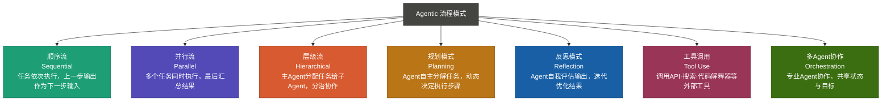
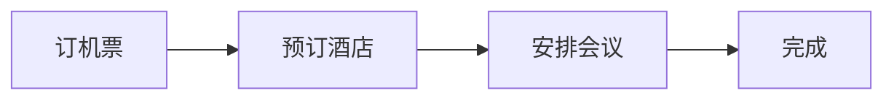
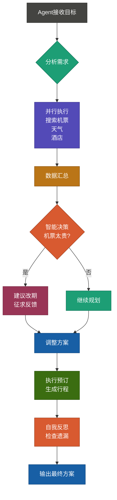
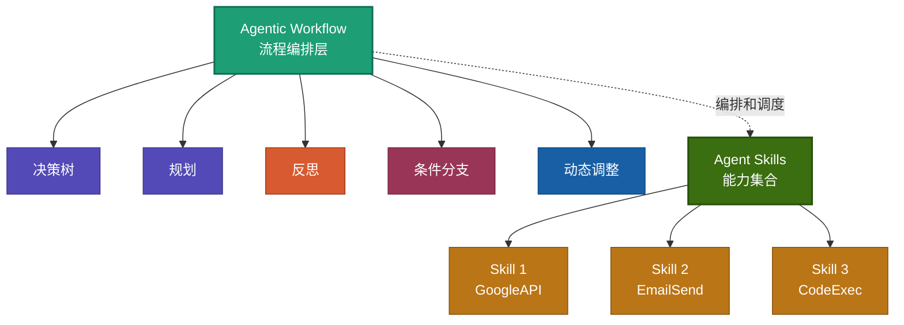
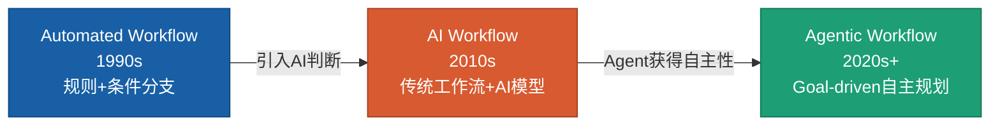
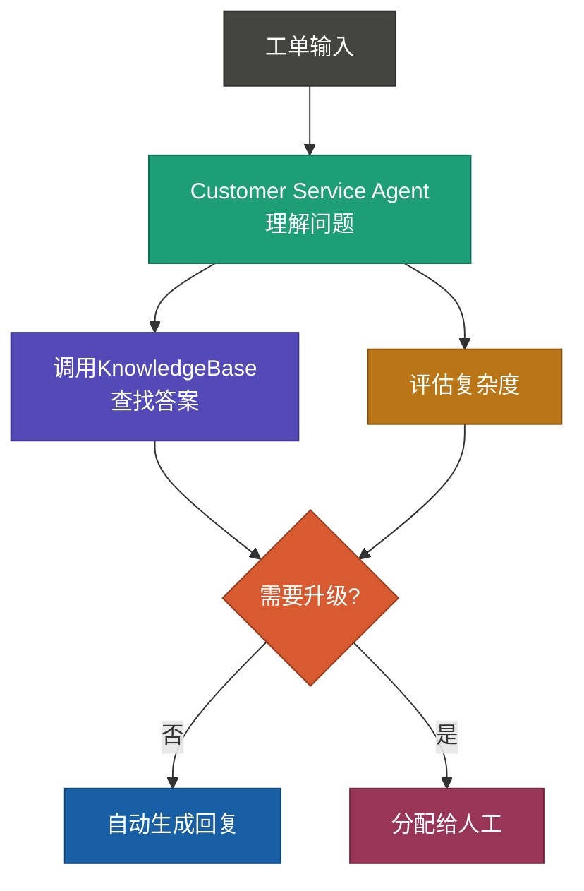
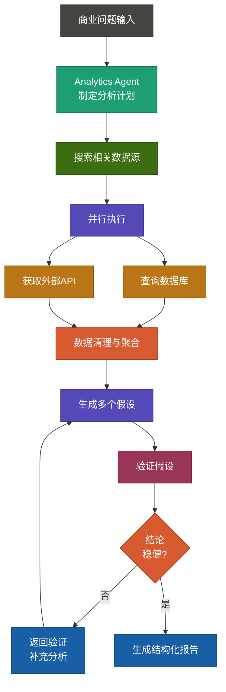

# 什么是Agentic Workflow，它与Agent Skill有何关系？

目录结构：
- 什么是Agentic Workflow
- Agentic Workflow与Agent Skill的关系
- 市面上有哪些Agentic Workflow工具和平台
- Automated Workflow、AI Workflow、Agentic Workflow对比分析
- 如何设计Agentic Workflow
- 如何使用Agentic Workflow
- 总结及Agentic Progress

## 什么是Agentic Workflow

Agentic Workflow（智能体工作流）是一种**由AI Agent驱动的自适应流程管理范式**。与传统工作流程不同，它不仅仅是任务的顺序执行，而是赋予AI系统主动决策、规划和适应的能力。

这个概念的出现源于对现实场景的观察：许多复杂任务无法在项目启动时完全预定义。比如，一个产品分析师在编写竞品分析报告时，可能需要根据发现的信息动态调整研究方向。传统自动化无法胜任，而Agentic Workflow恰恰解决了这个问题——让AI具备类人的灵活性和自主性。




### 核心特征

- **自主决策**：Agent基于上下文和目标自动调整执行策略
- **动态规划**：无需预先定义所有步骤，流程可根据实时情况变化
- **环境感知**：能够利用工具、API、搜索等外部资源
- **迭代优化**：通过反思和评估持续改进结果质量
- **可观测性**：清晰记录Agent的思考过程和决策逻辑

### 一个直观的例子

想象你要规划一次商务出差。以下是传统工作流 vs Agentic Workflow的对比：

**传统工作流**


**Agentic Workflow**


## Agentic Workflow与Agent Skill的关系

### 关键区别

| 维度 | Agent Skill | Agentic Workflow |
|------|-----------|-----------------|
| **层级** | 微观（单个能力） | 宏观（任务流程） |
| **职能** | 执行具体操作 | 协调和策划 |
| **示例** | 调用API、搜索、代码执行 | 多步骤项目管理、复杂问题求解 |
| **灵活性** | 原子性，相对固定 | 高度自适应，动态调整 |

### 它们的关系：建筑与砖块

**Agent Skill** 是构建块（砖块）：
- 单一职责，做好一件事
- 例如：`GoogleSearch()`, `SendEmail()`, `ExecutePythonCode()`

**Agentic Workflow** 是建筑设计（蓝图）：
- 组织和安排这些Skill的使用
- 决定什么时候用哪个Skill，以及如何组合它们
- 能够在运行时根据结果动态调整Skill的使用顺序

### 协作示意图



## 市面上有哪些Agentic Workflow工具和平台

Agentic Workflow市场已经形成多个梯队的解决方案，从轻量级开发框架到完整的企业级平台。选择合适的工具取决于你的使用场景、团队技术栈和预算考量。

### 第一梯队：通用Agent框架

| 工具 | 特点 | 最佳场景 |
|------|------|--------|
| **Claude Agent SDK** | 轻量级、SDK友好、支持递归 | 嵌入式Agent应用 |
| **LangGraph** | 有状态图、可视化流程 | 复杂多步骤工作流 |
| **Crew AI** | 多Agent协作、角色明确 | 团队模拟、分工合作 |
| **Autogen** | 双Agent对话、自动优化 | 对话式问题求解 |

### 第二梯队：垂直领域平台

- **n8n / Make**：无代码工作流自动化，已支持AI Agent
- **Zapier Central**：自然语言驱动的自动化
- **LivePerson Conversational Cloud**：客服场景Agent编排
- **Microsoft Copilot Studio**：企业级Agent构建

### 第三梯队：研究与创新

- **Stanford Simulator (STAR)**：Agent社交模拟
- **OpenAI Swarm**：实验性轻量级Agent编排
- **Anthropic Agentkit**：Claude Agent生态工具集

## Automated Workflow、AI Workflow、Agentic Workflow对比分析

### 三者的演进关系



### 详细对比

#### Automated Workflow（自动化工作流）
- **触发机制**：规则+条件分支（IF-THEN）
- **决策能力**：无（完全预定义）
- **适应性**：低（必须修改规则配置）
- **例子**：
  ```
  IF 订单金额 > 5000
  THEN 转到人工审批
  ELSE 自动通过
  ```

#### AI Workflow（AI工作流）
- **触发机制**：传统工作流 + AI模型判断
- **决策能力**：有限（通过预训练模型）
- **适应性**：中等（模型可重训练）
- **例子**：
  ```
  1. 提取订单信息
  2. 用NLP分类风险等级
  3. 根据分类结果执行不同分支
  ```

#### Agentic Workflow（智能体工作流）
- **触发机制**：Goal-driven，Agent自主规划
- **决策能力**：强（能理解复杂context，实时适应）
- **适应性**：极高（能在运行时重新规划）
- **例子**：
  ```
  Agent思考：「审批这个订单需要什么信息？」
  → 主动搜索供应商信誉
  → 查阅历史订单记录
  → 咨询市场行情
  → 自主决定：「虽然金额大，但买家信誉好，建议审批」
  → 反思：「有没有漏掉竞品对比？」
  ```

### 对比表格

| 特性 | Automated | AI Workflow | Agentic |
|------|----------|-----------|---------|
| 工作流定义 | 完全手动 | 手动 + AI | AI自主规划 |
| 工具集成 | 固定接口 | 预定义工具 | 动态工具发现 |
| 错误处理 | Try-catch | 模型置信度 | Agent反思+重试 |
| 性能优化 | 代码调优 | 模型微调 | 提示词工程 |
| 可解释性 | 高 | 中 | 高（完整推理链） |

## 如何设计Agentic Workflow

设计一个高效的Agentic Workflow就像建筑师设计大楼：需要明确的需求、合理的结构、以及充分的容错机制。以下5步框架涵盖了从概念到实现的完整过程。

### 设计流程（5步框架）

#### 第1步：明确目标和约束
```
问题清单：
□ 最终目标是什么？（必须具体可度量）
□ 有哪些硬约束？（成本、时间、安全）
□ 什么是成功？（定义KPI）
```

#### 第2步：清点可用资源（Agent Skills）
```
技能库：
- 信息获取：WebSearch, DatabaseQuery, FileRead
- 数据处理：JSONParse, DataValidation, Aggregation
- 执行操作：APICall, EmailSend, FileWrite
- 分析能力：DataAnalysis, Reasoning, Synthesis
```

#### 第3步：设计流程架构
选择合适的工作流模式（见下方的Mermaid图）：
- **顺序流**：任务有严格依赖关系
- **并行流**：可同时执行，加速处理
- **分支流**：根据条件选择不同路径
- **循环流**：迭代改进结果

#### 第4步：定义Agent角色和能力
```yaml
AgentProfile:
  Name: "数据分析师Agent"
  Goal: "生成深度市场分析报告"
  Tools: [WebSearch, DataAnalysis, Visualization]
  Constraints: "分析必须基于最近30天数据"
  ReflectionCycle: "每3步检查一次假设"
```

#### 第5步：实现和测试
- 用简单用例验证逻辑
- 逐步增加复杂度
- 监控Agent的决策过程
- 收集用户反馈迭代

### 最佳实践

**单一职责原则**
- 每个Agent专注一个领域
- 避免让一个Agent做太多不相关的事

**反思循环**
- 设置检查点让Agent评估中间结果
- 鼓励Agent在卡住时尝试新方法

**优雅降级**
- 关键Skill失败时有后备方案
- 不让整个流程因一个环节崩溃

**可观测性**
- 记录Agent的完整推理过程
- 便于调试和优化

## 如何使用Agentic Workflow

### 快速开始（伪代码）

```python
# 1. 定义Workflow
workflow = AgenticWorkflow(
    name="市场调研助手",
    objective="为产品发布生成竞品分析"
)

# 2. 添加Agent
workflow.add_agent(
    role="研究员",
    instructions="深入调查竞品的功能、价格、优劣势",
    tools=["web_search", "data_extraction", "comparison"]
)

# 3. 定义工作流步骤
workflow.add_step(
    agent="研究员",
    task="列举前5个竞品",
    depends_on=None
)

workflow.add_step(
    agent="研究员",
    task="分析每个竞品的优劣势",
    depends_on="step_1"
)

# 4. 执行
result = workflow.execute(
    input_data={"product": "AI笔记应用"},
    max_iterations=5,
    timeout=300
)

# 5. 获取结果和推理过程
print(result.output)
print(result.reasoning_trace)  # 完整决策过程
```

### 实战场景示例

#### 场景1：客服工单自动分类与处理



#### 场景2：数据驱动决策支持



### 性能优化建议

| 问题 | 解决方案 |
|------|--------|
| Agent决策慢 | 使用并行流处理独立任务 |
| 反复重试浪费Token | 改进提示词，提高首次成功率 |
| 决策不稳定 | 增加反思循环和验证步骤 |
| 工具调用错误 | 实现Tool Use的严格schema validation |

### 常见设计陷阱与避免方式

**陷阱1：过度设计复杂流程**
- 问题：试图一开始就设计完美的流程，导致学习曲线陡峭
- 避免：从最简单的顺序流开始，逐步引入并行、分支等复杂模式

**陷阱2：工具调用过度**
- 问题：给Agent太多工具选择，导致决策时间变长，调用错误增多
- 避免：精心挑选3-5个关键工具，避免工具过载

**陷阱3：忽视成本控制**
- 问题：频繁调用API或大模型，导致成本爆炸
- 避免：为每个Agent设置token预算，监控调用频率，优化提示词

**陷阱4：缺乏可观测性**
- 问题：无法理解Agent的决策逻辑，困难排查问题
- 避免：从一开始就建立完整的日志和追踪机制

## 总结

### 核心要点

**Agentic Workflow是AI自动化的下一个阶段**，它将AI从"工具"升级为"决策者"

**Agent Skill是基础砖块，Agentic Workflow是建筑蓝图**——两者有机结合才能构建真正智能的系统

**已有多个成熟平台支持**，从开源框架到企业级解决方案，应用门槛逐年降低

**设计和使用Agentic Workflow的关键是明确目标、资源清点、迭代优化**

### 什么是Agentic Progress

**Agentic Progress** 是指AI Agent在执行工作流过程中对任务进度和目标达成度的实时跟踪、评估和自我调适机制。不同于传统意义上的"进度"（简单计算百分比），Agentic Progress强调Agent的主动感知和动态调整。

**核心特征：**
- **实时评估**：Agent不是被动执行，而是持续评估自己是否朝着目标靠近
- **自适应调整**：当发现当前方向不优或遇到阻碍时，主动重新规划而不是硬生生继续
- **意图对齐**：确保每一步的执行都与最终目标保持一致，避免"南辕北辙"
- **可观测的推理链**：记录Agent思考和决策的全过程，便于理解为什么做出某个选择

**实际例子**
一个编写报告的Agent可能的进度判断：
```
初始目标：生成完整的Q1市场分析报告

步骤1：收集基础数据 → 进度20%
评估：数据来源是否权威？时效性是否足够？→ 发现某些数据过时
动作：主动搜索最新数据源

步骤2：整理和分析数据 → 进度50%
评估：分析深度是否足够？是否回答了核心问题？→ 发现缺少竞品对标
动作：追加竞品分析

步骤3：生成洞察 → 进度80%
评估：结论是否有数据支撑？逻辑是否严密？→ 自我反思并修正观点

步骤4：定稿 → 进度100%
```

这个过程中，Agent不是被动地完成四个步骤，而是在每步都在评估和调整，这就是Agentic Progress。

### 展望未来
- **多Agent生态演进**：从单Agent到复杂团队协作
- **自我学习**：Agent从执行中自动优化工作流
- **行业标准化**：统一的Workflow定义和互操作性
- **人机协作深化**：Agent主导，人类智慧纠正

---