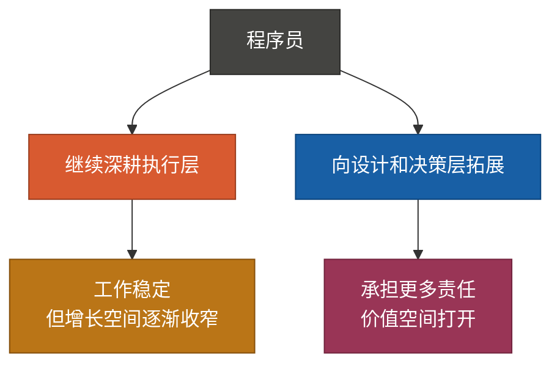
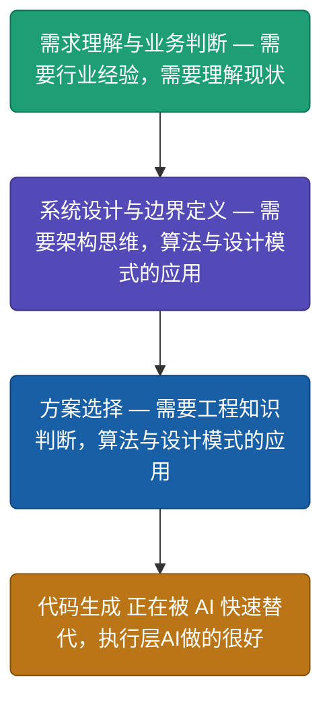
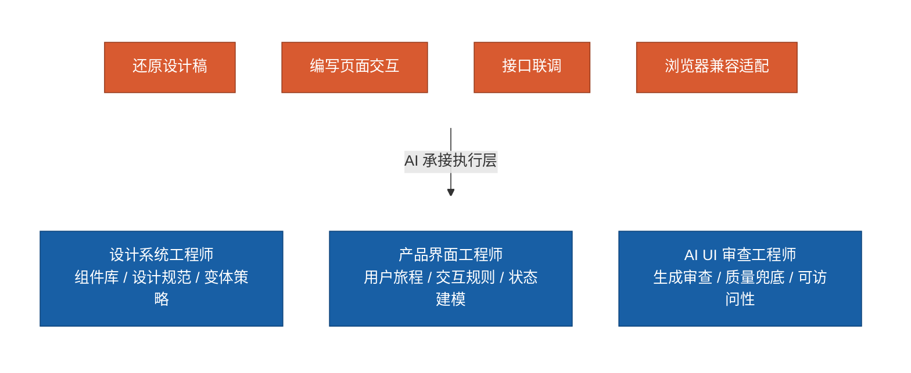
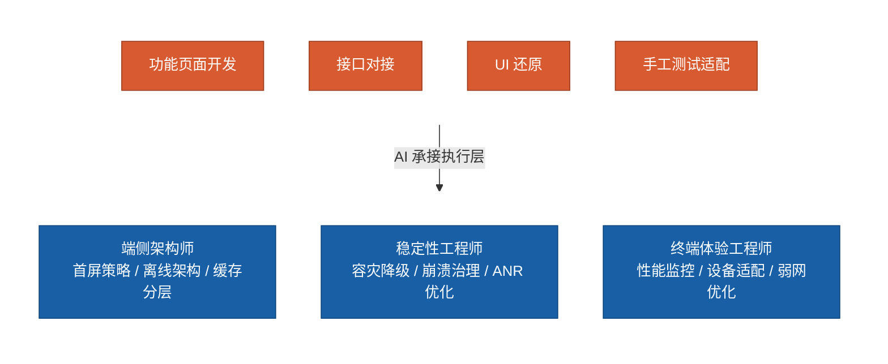
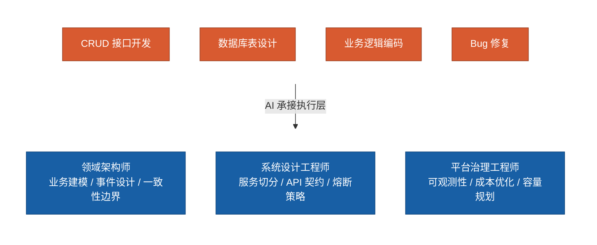
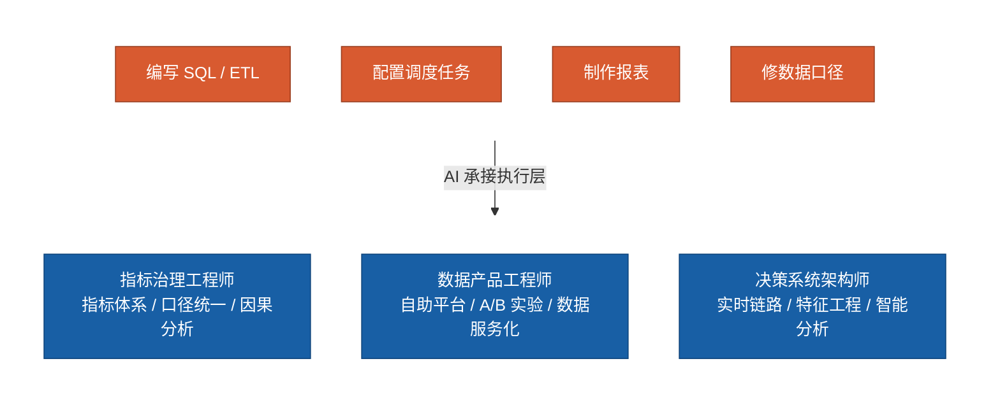
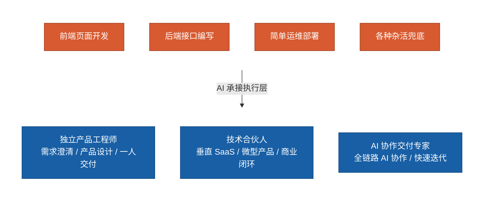
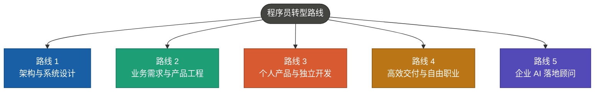
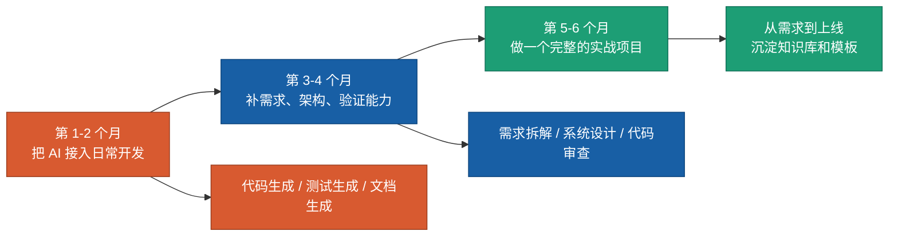

# 2026年，程序员面临的转型之路

> 程序员被AI取代的话题越来越热。ClaudeCode和OpenClaw出来之后，很多人感叹程序员要被淘汰了。不少人感到沮丧，但我想说的是，别灰心，跟上时代的步伐，及时转型。

## 一、编码方式已经改变

ChatGPT刚推出时，大家还在质疑"AI到底行不行"。现在不用质疑了——前端页面、后端接口、测试脚本、SQL、运维脚本、文档整理，AI已经能又快又好地生成。当然不是毫无问题，但很多时候确实比人干得好。

我们来看这个变化发展阶段：

软件开发协作方式发生了很大改变：以前一个功能需要产品写文档、设计师画UI、前端写页面、后端写接口、测试补用例，五六个人一起转。现在变成：少数核心工程师定好目标和约束，AI负责大部分初稿，人负责决策、校正和验收，一个人可以身兼数职。

### 一些网络数据

- **Stack Overflow 2024 调查**：76% 的开发者已经在使用或计划使用 AI 工具
- **Stack Overflow 2025–2026 调查**：84% 的开发者已使用或计划使用 AI，约 51% 每天使用，2026 年每日使用比例上升至约 58%，但仅约 29%–33% 的开发者信任 AI 输出
- **JetBrains 2025 调查**：86% 的开发者使用 AI 编程助手，但只有约 40%–45% 认为其真正有效——差异在于是否参与系统设计与需求澄清
- **行业与企业数据（2026）**：约 90% 的开发者在工作中使用 AI，超过 90% 的组织已经引入 AI 代码生成能力

**标准化工作（CRUD、模板代码、测试脚本）确实容易被替代，但工程师的价值可以往业务理解、系统设计、质量验证方向集中。**

---

## 二、面对AI，程序员面临着两条路

一条是传统方式：**接需求 → 写代码 → 改 bug → 交付**，不用或用AI工具辅助编程。这在目前还是主流，但几年后大概率会慢慢消失。

另一条是让AI开发：**程序员厘清业务目标和边界，明确约束（成本、性能、风险），让AI快速出方案对比，自己专注决策、评审和验证**，代码编写大部分交给AI。互联网大厂已经在这么做了。

两条路都在"做开发"，但职责已经不一样了。

AI擅长执行定义清楚的任务，定义越清晰执行越好。所以核心问题不是"AI会不会取代程序员"，而是你工作中**有多少是"定义问题"，多少是"执行问题"**。定义问题，AI暂时替代不了；执行问题，AI很可能干得比你好。

---

## 三、程序员不会消失，但价值在变

AI强在执行，弱在决策。它能给你十个方案，但不知道哪个更适合你的业务节奏、团队水平和项目预算。它能生成大段代码，但有些事还目前它做不了：

1. 这个需求到底值不值得做
2. 哪些边界必须守住，约束条件是哪些？
3. 哪些复杂度属于过度设计
4. 哪些性能问题将来可能会是隐患
5. 这次交付到底算不算真解决了用户的痛点

程序员的价值，正在从"代码生成"向上迁移：

越往上，越靠近需求、边界和责任，这些越越离不开人。

**不是离开技术，而是站到比"写代码"更高一层的位置。**以前只是写代码，现在的要求是：

1. 能不能把业务问题讲清楚
2. 能不能定义好边界、约束和取舍
3. 能不能判断 AI 的产出哪里靠谱、哪里有坑
4. 能不能对最终交付结果负责

**重心正在从"把代码写出来"移到"把问题定义好、把系统设计好、把结果验证好"。**

---

## 四、几种程序员岗位的变革

程序员不同岗位受冲击的方式不一样。前端、客户端、后端、大数据和全栈，各自面临什么变化、可以往哪走。

| 角色 | 根本变化 | 需要投入的方向 |
|------|------|------|
| 前端工程师 | 从交互实现转向产品界面工程 | 设计系统、产品工程、AI UI 审查 |
| 客户端工程师 | 从功能开发转向终端体验负责 | 端侧架构、稳定性工程、跨端体验 |
| 后端工程师 | 从接口开发转向领域建模与系统设计 | 业务架构、平台治理、可观测性 |
| 大数据工程师 | 从跑任务转向数据资产与决策系统 | 指标治理、数据产品、智能分析 |
| 全栈工程师 | 从什么都要写转向一人交付业务 | 独立产品、微型 SaaS、技术合伙人 |

### 1. 前端工程师：从"页面开发"到"产品界面工程"

还原设计稿、写交互、对接口、做兼容——这些AI已经能完成大半。前端得往更上层走。

**举个例子**：电商前端以前主要写商详、购物车、结算页面。现在更值钱的是：定义这三个流程的交互规则、组件模型和状态流转，让AI针对不同渠道（PC、移动、小程序）快速生成页面变体。

转型后需要能做：

- **理解产品流程**：从用户旅程出发，识别哪些交互影响转化、哪些状态流转容易出错——不只是"按设计稿做"
- **设计组件体系**：定义组件库、API 规范、变体策略，让一个组件系统支撑多个业务线
- **状态建模**：用状态机等方式定义复杂交互，而不是靠堆 flag 变量
- **自动化质量保障**：用工具验证可访问性和兼容性，而不是手工测每个浏览器

自测：能不能用5个组件规范加一套状态规则，让AI生成一个完整业务流程的页面？通过引导AI来提升效率，尤其是全业务流程的交互验证。

### 2. 客户端工程师：从"功能开发"到"终端体验负责"

客户端看起来也能被AI大量生成，但有个天然门槛：**真实设备环境太复杂**。弱网、低端机、系统版本碎片化、厂商定制——这些AI没法自己搞定。

**举个例子**：电商App客户端工程师，核心工作变成：设计首屏加载策略、离线缓存方案、网络异常时的UI降级和重试机制。代码让AI来，架构决策靠人。

转型后需要能做：

- **端侧架构设计**：定义首屏、离线、缓存、网络分层的整体策略
- **容灾和降级**：网络异常时怎么补偿、版本不兼容时怎么降级、内存溢出时怎么恢复
- **性能指标闭环**：用 Lighthouse、RUM 等工具定义可量化目标，并持续追踪
- **设备适配策略**：理解 Android/iOS 版本差异和厂商坑点，提前规避而不是靠测试发现

自测：能不能独立设计一套完整的"弱网加载方案"——缓存、重试、降级、通知？

### 3. 后端工程师：从"写接口"到"领域建模与系统设计"

后端受冲击最直接。接口开发、ORM映射、CRUD服务、脚手架代码——规则明确、重复度高，AI最擅长。继续在"写接口速度"上卷，性价比越来越低。

**举个例子**：做交易系统的后端，核心工作变成：设计订单、支付、库存的事件模型和状态机，定义库存扣减的一致性策略，设计补偿和重试机制。这些决策出错代价很高，代码可以交给AI，设计决策必须人来做。

需要补齐的能力：

- **业务建模和领域分析**：从业务流程反推数据模型、事件序列、一致性边界
- **服务设计**：服务怎么切、API 规范怎么定、熔断降级怎么处理、跨服务一致性以及高并发稳定性怎么保证
- **可观测性架构**：日志、链路追踪、指标体系——系统出问题时 15 分钟内定位，而不是人工排查
- **成本和复杂度权衡**：缓存、索引、分片、数据库选型，每一个都是成本和性能的折衷

从"CRUD工程师"到"系统设计工程师"，通常需要一定时间的沉淀，最好经历过一两次大规模的重构或性能优化。这类能力稀缺性最高，竞争也最激烈。一旦具备了较好的系统设计能力，那么AI就不好替代了。

### 4. 大数据工程师：从"跑数写任务"到"数据资产与决策系统"

数据工程师的日常：写SQL、搭ETL、配调度、做报表、修口径。模式化很强，AI非常擅长。

**举个例子**：原来负责日报和埋点的工程师，可以转做"指标治理"或"增长分析平台"——定义GMV、漏斗、配送时长等关键指标的计算口径，建立从原始事件到指标的计算链路，让业务方能自己查数据。代码AI生成，但指标定义和业务逻辑的对错必须人把关。

需要补齐的能力：

- **指标体系设计**：什么是关键指标、怎么分层、指标之间的因果关系是什么
- **口径治理**：不同系统对"用户""订单"等概念的定义不同，怎么统一
- **实时 vs 离线分层**：什么指标该实时算、什么该离线跑，成本和延迟怎么平衡
- **数据产品化**：把数据管道包装成面向业务的自助工具

从"数据工程师"到"数据架构师"需要深入理解业务。纯技术背景容易做出"技术正确但业务用不上"的东西，这点要特别注意。而一旦拥有了业务能力，那么AI替代的可能性也很小了。

### 5. 全栈工程师：从"什么都写一点"到"一人交付整个业务"

全栈在AI时代其实是最有机会的。前后端、脚本、部署、测试都能让AI代劳后，真正能把一个完整产品从需求做到上线的人，反而更稀缺。

**举个例子**：给中小培训机构做"招生线索管理 + 课消分析 + 家长回访"的轻量SaaS。过去至少3-5人团队，现在一个人加AI可以做出第一版并上线收费。关键不在技术栈多全，而在于能独立走完从业务分析到上线运维的全过程。

需要的能力更偏"产品 + 交付"：

- **需求澄清和产品设计**：能跟业务方聊需求、做原型、定优先级
- **系统折衷**：功能、性能、成本、速度之间怎么权衡，前后端一起考虑
- **全链路交付**：从开发到上线、监控、迭代，整条链都能自己搞
- **业务指标意识**：知道怎么评估产品是不是真的解决了问题

转型周期18-24个月，最好在小团队或个人项目里完整试过。市场机会最大——垂直SaaS、内部工具、创业项目都缺这样的人。但也要注意：中大型企业倾向专业分工，全栈的主战场在小公司、创业和独立开发。

---

## 五、程序员可以转型的路线

AI时代下，个人公司越来越多了，一个人或几个人干一个团队的活也很正常了。但也不是每个人都要做管理或创业，如果你还是继续奋斗一线，那么以下几条路也是走得通的。

### 路线 1：架构设计和系统设计

适合后端、资深全栈、基础架构工程师。

价值不再是"写服务"，而是定义边界、切模块、做容量规划、定SLA、控制成本、决定哪些交给AI哪些必须人工兜底。

**比如**：做了多年订单系统的后端工程师，升级成业务架构负责人。以前亲自写服务写接口，以后更多是拆业务域、定事件模型、做容灾策略，让AI帮生成代码、测试和文档。

### 路线 2：业务需求和产品工程

适合前端、客户端、做了很多年业务开发的人。

AI最怕的不是代码难写，而是问题说不清楚。真正理解业务的人，在AI时代反而更值钱。

**比如**：长期做运营平台的前端，其实非常懂业务流程、权限模型、表单规则。完全可以升级成"产品工程师"——自己跟业务方对需求、拉AI生成页面和接口、自己做验收，效率比传统协作模式高很多。

### 路线 3：做个人产品，跑小而美的软件业务

这是AI时代给程序员最大的新增机会。

以前一个人做产品，难在人手不够、周期太长。现在门槛大幅降低了。有技术底子加上AI协作，垂直行业SaaS、小型管理后台、内部工具、数据分析工具，一个人就能启动。

**比如**：全栈工程师针对某个垂直行业做轻量管理工具。以前至少3-5人团队，现在一个人加AI可以做出MVP、上线、收费、迭代。核心竞争力不是技术多全面，而是对行业的理解和快速交付能力。

### 路线 4：高效交付和自由职业

以前做兼职，最大问题是时间不够、交付太慢。现在不一样了。

把AI用到交付流程里，很多中小项目变得可做：企业官网、CRM/ERP定制、小程序、数据报表平台、自动化脚本。

**比如**：熟悉React和Java的工程师，以前接一个后台系统要6周。现在把需求拆清、让AI生成前后端主体代码、自己盯业务规则和部署，2-3周就能交第一版。单价未必更高，但单位时间产出明显提升。

### 路线 5：企业AI落地顾问

门槛不低，但适合资深工程师。

很多公司不缺"会用AI的人"，缺的是能把AI真正接进研发流程的人——怎么建团队提示词规范、搭内部知识库、让AI参与编码测试评审、定义自动化边界、把模型能力接进业务系统。

**比如**：做过平台工程或数据平台的工程师，可以给中型企业做"AI研发效能改造"。不是卖概念，而是把需求模板、代码规范、知识库、测试策略、自动审查流程都具体落下来。

---

## 六、用好AI，实际能带来什么

学AI到底能带来什么改变？

- **交付效率**：同样的时间内，产出更多、质量更稳定，AI是把利器
- **更大的项目空间**：公司倾向于把更复杂的任务交给会用 AI 的工程师
- **晋升优势**：架构师、技术负责人这类位置，企业会优先看"既懂系统设计、又能用 AI 提效"的人
- **职业自由度**：兼职、独立项目、小团队，熟练掌握 AI 的人有更多机会

现在会用AI是个优势，就像当初会用电脑一样，但当"用AI"变成基本技能后，这个优势也会被拉平。而**真正长期升值的，是系统设计能力 + 业务理解能力 + AI协作能力的组合**，而不是单纯的"我会用AI，我掌握了Agent的工作流程"。

你可以对AI持任何态度，但生产方式确实变了。早点适应，多一些选择权。

---

## 七、以下四种能力值得增强

根据这两年的AI编程实践，尤其是2025年下半年来，我觉得以下四种能力很有价值，也能经得住时间的考验。

### 1. 把问题定义清楚

很多人觉得 AI "生成质量不高""不符合需求"，但可能根本原因是问题没说清楚。

可以试试按以下五个维度来拆解需求：

- **What**：具体做什么？关键词搜索、标签筛选还是组合查询？
- **Who**：给谁用？内部员工还是终端用户？技术水平如何？
- **Scale**：数据规模和并发量多大？这直接决定技术方案
- **Constraint**：响应时间、成本、精度各要求多少？
- **Edge**：哪些边界必须处理？空值、超长输入、特殊字符、多语言？

把这五个问题答清楚再让AI动手，产出质量会好很多。

### 2. 做好系统设计的权衡

AI 能快速产出几个方案，但选哪个，为什么，这些还是要靠人判断。

每次推进方案时，都认真思考一遍这几组权衡：

- **功能 vs 时间**：这个版本必须做什么、可以砍什么？
- **性能 vs 成本**：缓存、CDN、数据库投入多少才划算？
- **通用 vs 特化**：值不值得做通用方案，还是针对当前业务定制？
- **简单 vs 完善**：第一版要多完善？容灾、监控、扩展性做到什么程度？

这些也没有标准答案，需要你得经验，更取决于公司的发展阶段、预算和风险承受力。AI是帮不了你做这个决定的。

### 3. 整理问题思路，给AI指方向

AI很强大，但都是按照已有的通用规则去解决问题。而实际上，每个企业，每一个项目并不相同，这其中都需要很多个性化的考量。

比如遇到搜索问题，你得判断该用索引、倒排还是 B 树；遇到调度问题，得判断贪心够不够、要不要上动态规划；遇到实时计算，得决定时间窗口怎么划分、迟到数据怎么处理。

快速判断问题类型、给出方向，AI负责实现细节。方向对了，效率能翻好几倍；方向错了，代码生成再快也是白搭。

### 4. 验证AI的产出

AI最常犯的错是"看起来对但其实有问题"。验证时关注：

- **业务逻辑**：核心流程、边界情况、异常处理讲不讲得通？
- **数据**：输入数据的实际分布是什么？AI 考虑到了吗？
- **性能**：有没有明显瓶颈？大数据量下还能跑吗？
- **安全**：SQL 注入、权限绕过、信息泄露这些有没有？
- **可维护性**：半年后你还改得动吗？

建议建一套Review Checklist，每次审查AI产出都过一遍。用工具辅助——单元测试、性能分析、SAST扫描，别全靠肉眼。

---

## 八、程序员的转型实战路线

我们必须做好准备，全面切换到驱动AI编程——自己很少或不写代码，完全利用AI来写。

### 第1个月：让AI成为日常工具

选一个趁手的工具（Claude、Codex、Gemini以及Cursor、Windsurf、GitHub Copilot等），每天用（常用常新，多试几个）。从小任务开始——写测试、写脚本、写设计文档、写需求描述。记录哪些AI产出能直接用、哪些需要大幅修改，找到自己的节奏。

需要注意的坑：一是频繁"调提示词"，其实80%的收益来自好的需求定义，而不是提示词微调。二是"什么都交给AI"导致代码风格混乱、技术债堆积。要给自己定义一个"AI交付标准"，需要建立自己的Skills体系。

目标：2周内养成习惯——遇到任务下意识想"先让AI来一版"。简单任务的直用率达到90%以上。

### 第2个月：补上层能力

集中精力补一个最薄弱的方向，别贪多：

- **需求拆解**：用需求拆解方法拆几个真实需求，最好在团队内部试用
- **系统设计**：读几个开源项目的架构文档，搞清楚它为什么这么设计
- **代码审查**：建一套自己的 Review Checklist，每次都用

注意：这个月容易"学了一堆但没在实际工作中用"。一定要挑真实项目练手。

目标：能写出一份自己理解透彻的系统设计文档。Code Review的反馈从"格式命名"上升到"逻辑、性能、可维护性"。

### 第3个月：完整做一个项目

选一个不大但完整的项目——管理后台、内部工具、小程序、自动化系统都行。重点不在规模，而在于完整走一遍从需求到上线的全流程。

要求自己做到：

- 需求用需求描述框架写清楚
- 开工前定好"哪些部分 AI 生成、哪些手工来写、哪些用开源组件"
- 至少 90%以上 的代码由 AI 产出，你只负责审核和验收
- 自己尽量不写，如果非要写，则只写核心策略逻辑和关键调度
- 项目要真的跑起来

做完之后回头看：能不能解释为什么这样设计、为什么选这个方案？如果能，你已经走过了一次"AI时代的开发全流程"，后续任何项目都能套用这个框架。

---

## 九、最后

AI让很多程序员焦虑，这很正常。这不是因为AI本身，而是因为我们过去十几年的核心能力——写代码——正在被逐步替代。

但如果我们看清楚几件事后，其实没那么可怕：

**这个过程会有一个过程。** 可能得有一两年的时间调整。

**入门门槛不高。** 不需要搞懂AI大模型的原理机制（能理解就行），也不需要追逐最新框架和API，我们还是在编程，不过是换了一种方式而已。

**不是所有人都必须"往上爬"。** 有人就是喜欢写代码，喜欢一行行敲，这完全没问题。这类工作不会消失，最核心地方还得依赖人。

**不同公司、不同领域的节奏完全不同。** 基础设施团队可能暂时不太受影响，创业公司和大公司的压力也不一样。

如果你有精力，可以花几个月完整经历一次"用AI从需求到上线"的流程。并仔细想想：什么工作AI能做好、什么工作还得靠你、你在新流程中的角色是什么、你愿不愿意往这个方向走。

**时代变迁的脚步无法阻挡，我们唯有一路向前！**

---

## 相关链接

- AI编程核心知识库：https://microwind.github.io

- 程序员 Prompt Engineering 知识库： https://github.com/microwind/ai-prompt

- AI 编程 Skills 知识库大全： https://github.com/microwind/ai-skills

- GitHub Octoverse 2024: https://github.blog/news-insights/octoverse/octoverse-2024/

- Stack Overflow 2024 Developer Survey AI Insights: https://stackoverflow.blog/2024/07/22/2024-developer-survey-insights-for-ai-ml/

- Anthropic Economic Index, AI's impact on software development: https://www.anthropic.com/news/impact-software-development
