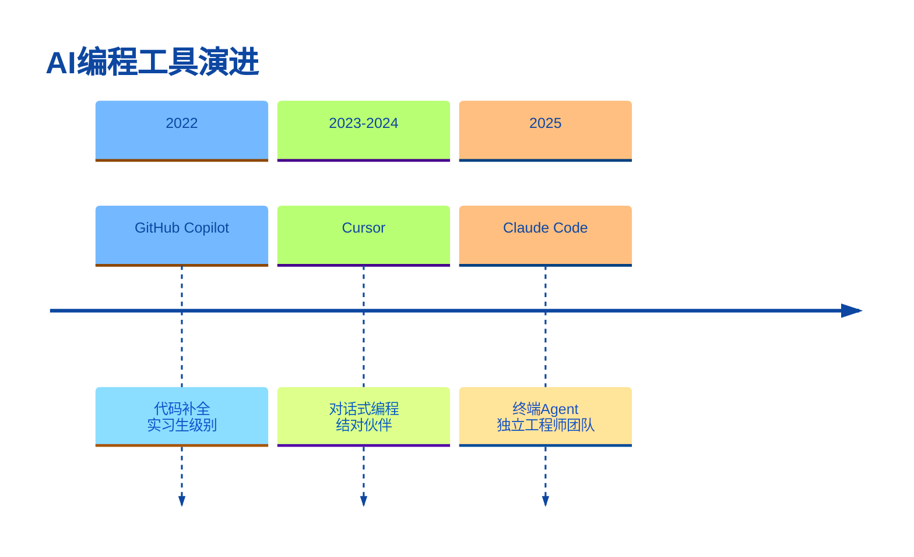
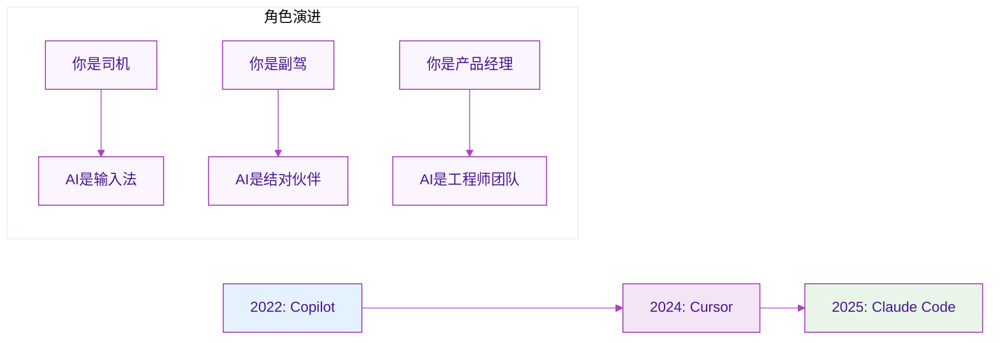
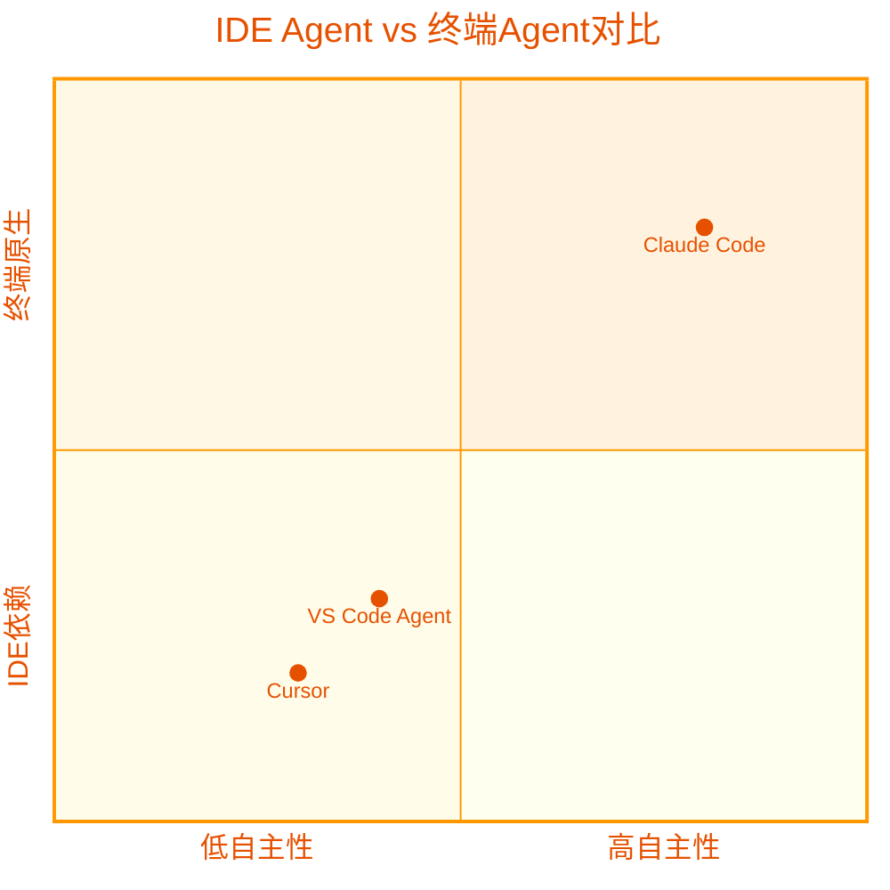
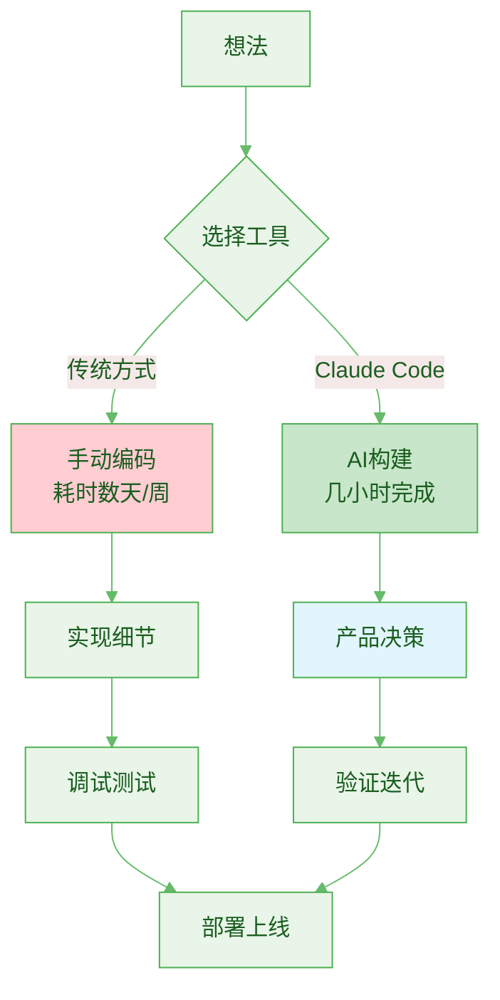
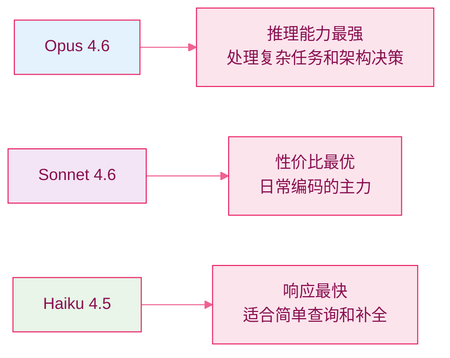
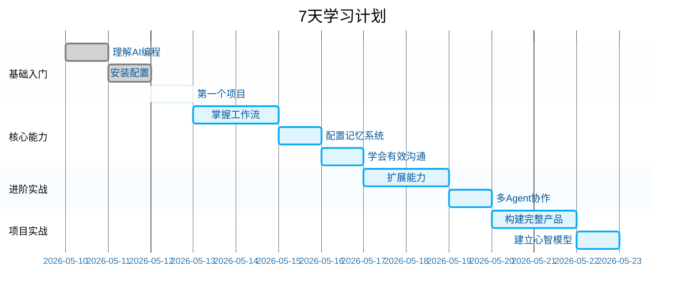
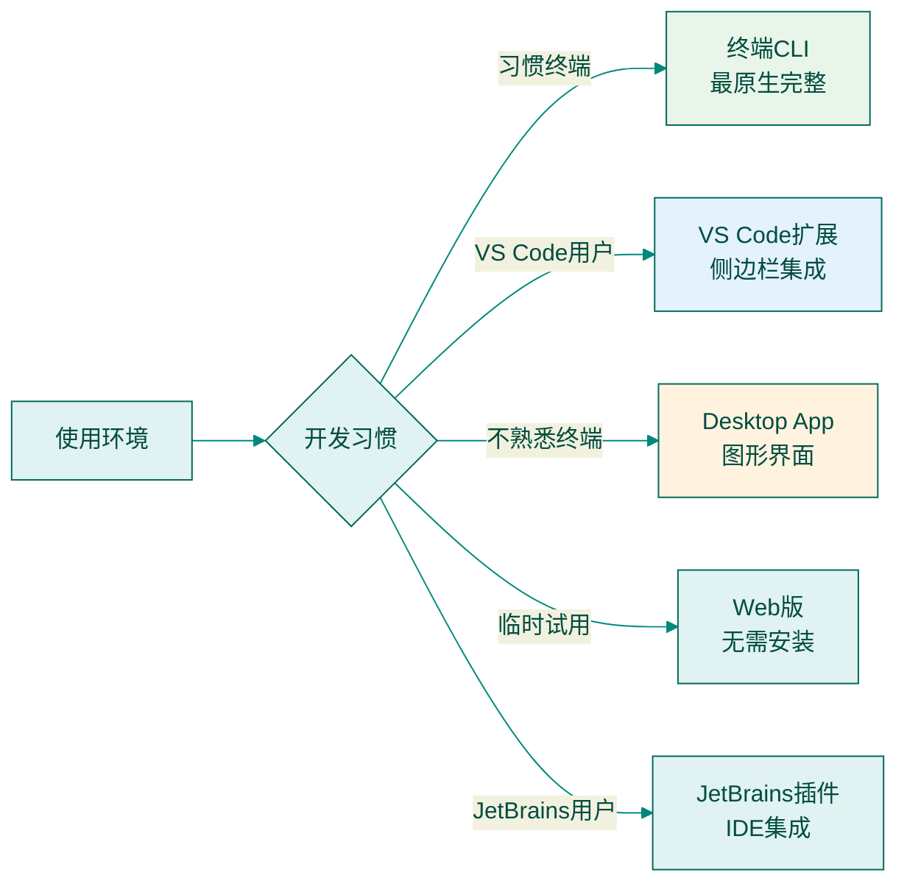
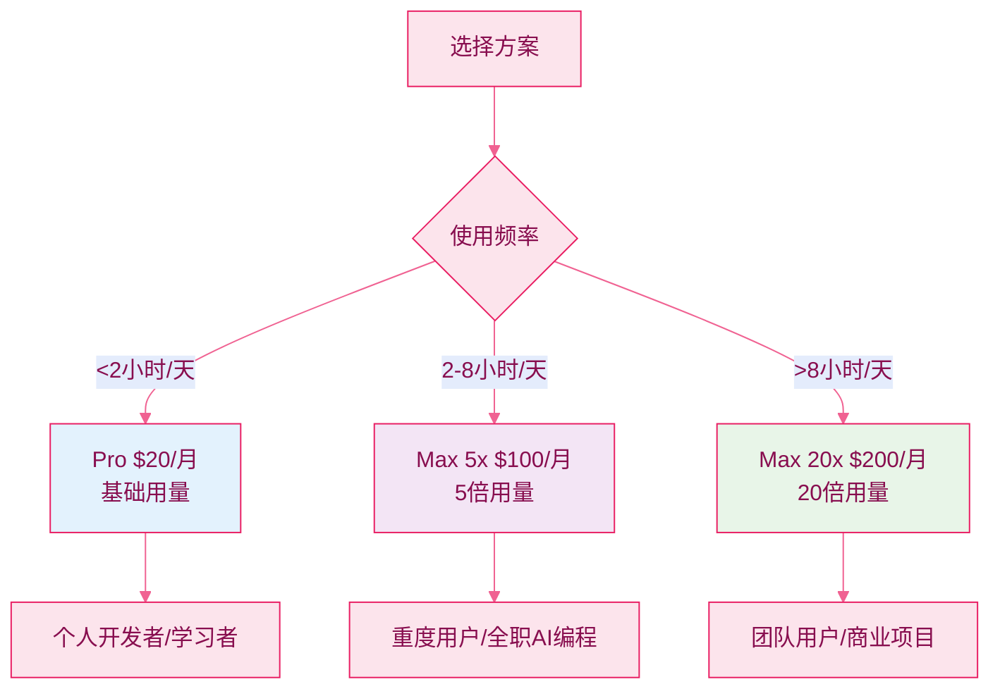
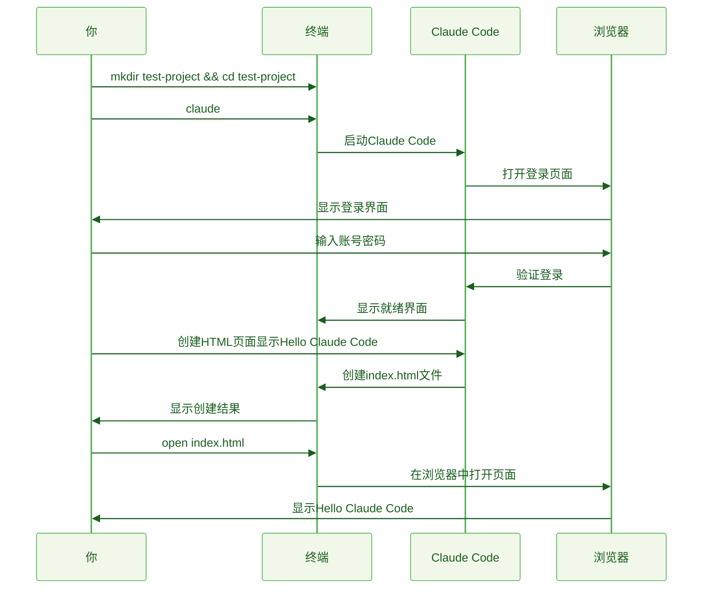

# Claude Code AI编程完全指南

> 让AI成为你的开发团队，而不是代码补全工具

## 目录

**Part 1: 起步**

- [01 为什么是 Claude Code](#01-为什么是-claude-code)
- [02 10 分钟完成安装](#02-10-分钟完成安装)
- [03 你的第一个项目](#03-你的第一个项目)

**Part 2: 核心能力**

- [04 核心工作流](#04-核心工作流)
- [05 CLAUDE.md：给 AI 一张地图](#05-claudemd给-ai-一张地图)
- [06 进阶对话技巧](#06-进阶对话技巧)

**Part 3: 程序员场景实战**

- [07 五个程序员场景实战](#07-五个程序员场景实战)

**Part 4: 进阶能力**

- [08 扩展能力：Skills、Hooks 与 MCP](#08-扩展能力skills-hooks-与-mcp)
- [09 多 Agent 协作](#09-多-agent-协作)

**Part 5: 项目级实战**

- [10 从零构建一个完整产品](#10-从零构建一个完整产品)

**Part 6: 长期心智**

- [11 心智模型与持续进化](#11-心智模型与持续进化)


### 01 为什么是 Claude Code

AI编程工具在三年里变了三次。这个演变路径，决定了Claude Code的独特价值。

#### 三年三次进化



2022年的Copilot像个实习生，你写上半句它补下半句。2023-2024年的Cursor成了结对伙伴，能理解自然语言指令但在IDE内工作。2025年的Claude Code直接在终端运行，成了独立的工程师团队。

#### 角色的根本转变



这个转变的核心在于：你从代码执行者变成了需求定义者。

#### Claude Code vs Cursor：本质差异



| 维度 | IDE Agent | 终端Agent |
|------|----------|----------|
| 运行环境 | 编辑器内嵌，依赖IDE框架 | 终端原生，直接操作系统 |
| 自主程度 | 需要用户确认，半自动 | 可完全无人值守运行 |
| 系统集成 | 通过插件桥接git/CLI | 直接操作git、shell、MCP |
| 记忆系统 | 隐式项目索引 | 显式CLAUDE.md记忆文件 |
| 并行能力 | 主要单实例工作 | 原生支持多实例并行 |

重点看最后两行。CLAUDE.md让你把项目知识、编码规范、架构决策写成文件，Claude Code每次启动都会读，相当于给AI一个持久的项目记忆。多实例并行意味着你可以同时让几个Claude Code各自处理不同模块，像一个小团队。

打个比方：Cursor像坐在你IDE里的结对伙伴，你们看着同一个屏幕协作；Claude Code更像一个独立干活的工程师，你告诉他需求，他自己拉代码、写代码、跑测试、提交，你去喝杯咖啡回来看结果就好。

Boris Cherny，Claude Code的创建者，说自己用Opus 4.5之后就再也没有手写过一行代码。47天里有46天都在用，最长单次session跑了1天18小时50分钟。这不是营销话术，是一个正在大规模发生的现实。

> 花叔的经验：我本人从未手写过代码，所有产品（包括AppStore付费榜Top 1的小猫补光灯）都是用AI完成的。Claude Code让「不会写代码但能构建产品」这件事，从少数人的实验变成了大多数人的可能。
#### 从写代码到构建产品

Claude Code解决的不仅是代码效率问题，更是产品构建效率。



传统方式让你陷入实现细节，Claude Code让你专注于产品决策。

#### 目标读者

- **工程师，想提高10倍效率。** 你已经会写代码，但每天大量时间花在样板代码、调试、写测试、处理CI/CD上。Claude Code能接管这些，让你把精力放在架构决策和产品思考上。

- **产品经理，想自己做MVP。** 你有产品直觉和用户洞察，但受限于开发资源。Claude Code让你一个周末做出一个能跑的原型，不用等排期，不用写PRD等开发理解。

- **创业者，想实现一人公司。** 你想验证商业想法，但不想在技术上花太多钱和时间。Claude Code让一个人拥有一个小团队的开发能力，网站、App、后端API，都可以一个人搞定。

> 核心建议：不管你属于哪一类，这本书假设你聪明，但可能从没用过AI编程工具。我们从零开始，但不会在基础概念上磨叽太久。
#### 增长数据

Claude Code在2025年2月公开发布（研究预览版），5月正式GA。GA后仅6个月，达到**10亿美元年化收入**。这个速度在SaaS历史上极其罕见。

企业端采用也很快。Netflix、Spotify、DoorDash、Notion、Vercel都在内部大规模使用。Anthropic的数据显示，使用Claude Code的团队平均提效2-5倍。

当前Claude Code背后的模型有三个：



这些数字背后的信号其实就一个：Agent式编程不再是极客的玩具，正在变成软件开发的标准方式。

#### 学习路线



每章都有实操部分，可以跟着做。不用一口气读完，读一章、做一章、再回来读下一章，完全没问题。

下一章，我们花 10 分钟把Claude Code装好。


### 02 10分钟完成安装

安装很简单。这一章讲清楚安装方式、使用环境选择，以及第一次对话。

#### 安装方式

```mermaid
%%{init: {'theme': 'base', 'themeVariables': { 'primaryColor': '#f3e5f5', 'primaryTextColor': '#4a148c', 'primaryBorderColor': '#9c27b0', 'lineColor': '#ab47bc', 'fillType0': '#fce4ec', 'fillType1': '#f8bbd9', 'fillType2': '#f48fb1' }}}%%
flowchart TD
    A[选择安装方式] --> B{操作系统}
    B -->|macOS/Linux| C[Native Install<br>curl -fsSL https://claude.ai/install.sh | bash]
    B -->|macOS| D[Homebrew<br>brew install --cask claude-code]
    B -->|Windows| E[WinGet<br>winget install Anthropic.ClaudeCode]
    
    C --> F[推荐：一行命令搞定]
    D --> G[适合brew用户]
    E --> H[Windows首选]
    
    style C fill:#e8f5e8
    style F fill:#c8e6c9
```

#### macOS/Linux安装

打开终端运行：

```bash
curl -fsSL https://claude.ai/install.sh | bash
```

脚本会自动检测系统、下载二进制文件、添加到PATH。装完输入`claude`就能启动。

#### Windows安装

Windows需要先装Git for Windows：

1. 安装Git：从git-scm.com下载或`winget install Git.Git`
2. 安装Claude Code：`winget install Anthropic.ClaudeCode`
3. 验证：重新打开终端，输入`claude --version`

> 注意：Windows用户需要使用PowerShell或Git Bash，CMD可能有兼容问题。
#### 使用环境选择



> 建议：这本书后续所有演示都基于终端CLI。终端是Claude Code的完全体，其他环境都是它的简化版。

#### 订阅方案



> 核心建议：先从Pro开始，用几天自然知道够不够。
企业用户还可以通过Anthropic API按token计费，适合有自定义集成或合规要求的团队。v2.1.88新增了
claude auth login --console 命令，可以直接用Anthropic Console账号登录（走API计费），不需要再单独
配置API密钥。但对本书读者来说，直接订阅是最简单的开始方式。

#### 第一次对话

装好登录后，来第一次对话：



**测试命令：**
```bash
# 创建测试项目
mkdir ~/my-first-project && cd ~/my-first-project

# 启动Claude Code
claude

# 在Claude Code中输入：
创建一个简单的HTML页面，显示"Hello, Claude Code!"，用好看的CSS样式。

# 查看结果
open index.html  # macOS
```

如果看到一个带样式的"Hello, Claude Code!"页面，恭喜，一切正常。

看起来简单，但注意它的意义：一句自然语言，AI完成了「理解需求 → 创建文件 → 编写代码」的完整循环。后
面所有进阶操作都是在这个基础上展开的。

###### 确认一切正常

跑一遍这个清单：

| 检查项 | 命令/操作 | 预期结果 |
|--------|-----------|----------|
| CLI 可用 | `claude --version` | 显示版本号 |
| 账号已登录 | `claude` 启动后不再要求登录 | 直接进入对话界面 |
| 能创建文件 | 让 Claude Code 创建一个测试文件 | 文件出现在当前目录 |
| 能读取项目 | 在已有项目目录启动，问「这个项目是做什么的」 | Claude Code 能正确描述项目 |
| 能运行命令 | 让它运行 `ls` 或 `git status` | 返回命令输出结果 |
全部通过？可以开干了。

###### 遇到问题了？

**连不上、登录不了**

Claude Code需要访问Anthropic的API服务器。国内网络环境下可能连不上，需要配代理：

```bash
# 设置 HTTP 代理（替换为你的代理地址和端口）
export HTTPS_PROXY=http://127.0.0.1:7890
export HTTP_PROXY=http://127.0.0.1:7890
```
建议把这两行加到你的shell配置文件（~/.zshrc 或 ~/.bashrc）中，这样每次打开终端都会自动生效。

**安装时报Permission denied**


macOS / Linux用户遇到权限错误，不要用 sudo。这么搞：

```
# 确保本地bin目录存在且有写权限
mkdir -p ~/.local/bin
# 重新运行安装脚本
curl -fsSL https://claude.ai/install.sh | bash
```
如果问题仍然存在，检查你的PATH中是否包含 ~/.local/bin。

**怎么升级**

Claude Code会提醒你有新版本。手动更新就重新跑一遍安装命令：

```
# Native Install用户
curl -fsSL https://claude.ai/install.sh | bash
```
```
# Homebrew用户
brew upgrade --cask claude-code
```
```
# WinGet用户
winget upgrade Anthropic.ClaudeCode
```
```
保持更新。 Claude Code迭代极快，几乎每周都有新功能。新版本不只是修bug，经常带来能力上的明显提升。
建议至少每两周更新一次。
```
**装VS Code扩展**

想在VS Code里用Claude Code的话：

1. 打开VS Code的扩展市场（Cmd+Shift+X 或 Ctrl+Shift+X）
2. 搜索「Claude Code」
3. 安装Anthropic官方的扩展
4. 安装后在侧边栏会出现Claude Code的图标，点击即可开始对话

VS Code扩展底层调用的是同一个CLI，所以你不需要单独配置账号，登录状态是共享的。

**装Desktop App**

不习惯终端的用户可以用桌面应用。去 claude.ai/download 下载安装包，双击装好就行。本质上是终端CLI的
图形界面包装。

```
注意
不管你选哪种方式，都建议先把CLI装好。CLI是基础，VS Code扩展和Desktop App都依赖它。CLI能跑，其他
环境基本不会有问题。
```

装完了，账号登了，第一次对话也跑通了。下一章，正式开始做一个真实项目。


### 03 你的第一个项目

Your First Project — Learning by Doing

理论讲完了，直接上手。这一章从零做一个真实的CLI工具。做完之后，你就真正理解对话式编程是怎

么回事了。

###### 做个什么

一个每日AI新闻聚合器，CLI工具。功能很简单：

```
从几个RSS源（TechCrunch AI、The Verge AI、Hacker News等）抓取最新文章
用AI总结每篇文章的要点
输出一份格式整齐的Markdown日报
```
为什么选这个？够小，一个下午能做完。又够完整，涉及网络请求、数据处理、AI调用、文件输出。一次项目
就能把Claude Code的各种能力体验个遍。

```
先转换一下心态： 从现在开始，你是产品经理，Claude是你的工程师。你的活是说清楚要什么，不是写代码。
哪怕你是资深程序员，也请先按这个方式来一遍。
```
###### 第一步：告诉Claude你要什么 Describe What You Want

打开终端，进一个空文件夹，启动Claude Code：

```
mkdir ai-news-digest && cd ai-news-digest
claude
```
然后，用自然语言告诉Claude你想要什么：


```text
# 你在 Claude Code 中输入的 prompt：
帮我做一个 AI 新闻聚合 CLI 工具。需求如下：

1. 从以下 RSS 源抓取最近 24 小时的文章：
   - TechCrunch AI (https://techcrunch.com/category/artificial-intelligence/feed/)
   - The Verge AI (https://www.theverge.com/rss/ai-artificial-intelligence/index.xml)
   - Hacker News 前 30 条 (https://hnrss.org/newest?q=AI&count=30)
2. 对每篇文章提取标题、链接、发布时间、来源
3. 按时间倒序排列，输出一份 Markdown 格式的日报到 output/ 目录
4. 用 TypeScript 写，用 tsx 直接运行

先别急着写代码，给我一个实现方案。
```
注意最后那句「先别急着写代码，给我一个实现方案」。这不是客气，是一个重要技巧：让Claude先 **想清楚** 再动
手。

```
核心建议
需求描述的质量直接决定输出质量。几个原则：说清楚最终产物长什么样（Markdown日报）、指定技术选型
（TypeScript + tsx）、给具体数据源URL而不是说「几个RSS源」。越具体越好。
```
###### 第二步：看它怎么想的 Review the Plan

Claude收到需求后，不会直接开写，会先给你一个方案。大概长这样：


```text
我来帮你做这个 AI 新闻聚合工具。先说一下方案：

项目结构：
ai-news-digest/
├── src/
│   ├── index.ts       # 入口文件
│   ├── fetcher.ts     # RSS 抓取逻辑
│   ├── formatter.ts   # Markdown 格式化
│   └── types.ts       # 类型定义
├── output/            # 日报输出目录
├── package.json
└── tsconfig.json

技术方案：
- RSS 解析用 rss-parser 库
- HTTP 请求用 node 内置的 fetch
- 日期处理用 date-fns
- 用 tsx 直接运行 TypeScript，不需要编译步骤

实现流程：
1. 并行抓取三个 RSS 源
2. 统一格式、过滤 24 小时内文章
3. 按时间排序
4. 生成 Markdown 格式日报
5. 写入 output/YYYY-MM-DD.md

需要我开始实现吗？
```
这时候你就是在看工程方案的产品经理。觉得行就说OK，想调整就直接说。比如：

```text
# 你的反馈：
方案没问题。补充两点：

1. 日报里每篇文章除了标题和链接，加一句话摘要（从文章 description 里截取前 100 字）
2. 日报开头加一个统计：共收录 X 篇，来自 Y 个源
```

这个来回就是对话式编程的核心：Claude出方案，你补充细节，Claude修正。不用画流程图、不用写技术文
档，直接用人话说。

###### 第三步：看它干活 Watch Claude Work

确认方案后，Claude开始执行。终端里会看到一系列操作：


1. **初始化项目**
   Claude 会运行 `npm init -y`，然后安装依赖包。你会看到它请求运行命令的权限提示：

   ```
   Claude wants to run: npm init -y
   Allow? (y/n)
   ```

   按 `y` 允许。后面它还会请求安装 rss-parser、date-fns、tsx 等包。

2. **创建源代码文件**
   Claude 会逐个创建 TypeScript 文件。你会看到它写入代码的过程，每个文件都会展示差异（diff）。不需要逐行看，但可以快速扫一眼文件结构是否合理。

3. **运行测试**
   代码写完后，Claude 通常会自己试着运行一次看看有没有报错。如果报错了，它会自己读错误信息、找问题、修代码、再运行，形成一个自动修复循环。
整个过程大约2-5分钟。你干嘛？ **看着就行。** 就像把任务交给新同事，前几次你会盯着看他怎么做事。等熟悉了
他的风格，以后放心让他自己干就好。

```
注意
执行过程中Claude可能多次请求权限。初期建议每次都看一眼它要跑什么命令。熟悉后可以用 /permissions
预授权常见命令（04会细讲），或者直接开Auto模式。
```
###### 第四步：看看结果对不对 Verify the Output

Claude干完了，跑一下看看：

```
npx tsx src/index.ts
```
如果一切顺利，你会在 output/ 目录下看到一个Markdown文件，内容大概是这样的：


```markdown
# AI 新闻日报 — 2026-03-28

> 共收录 23 篇文章，来自 3 个源

---

## TechCrunch AI

### OpenAI 发布新版 GPT-5.4，上下文窗口扩展至 200 万
🔗 https://techcrunch.com/2026/03/28/openai-gpt-54
📅 2026-03-28 14:32
> OpenAI 今日发布了 GPT-5.4 版本，最大的变化是上下文窗口从 100 万扩展至 200 万 tokens。

### Anthropic 推出 Claude Code Desktop App
🔗 https://techcrunch.com/2026/03/28/anthropic-desktop
📅 2026-03-28 11:15
> Anthropic 宣布 Claude Code 正式推出桌面应用程序，支持 macOS 和 Windows。

---

## The Verge AI
...
```
打开文件看看格式和内容。大多数情况下，第一次就能跑通。

如果报错了？直接把错误信息丢给Claude：

```
# 运行报错时，把错误信息粘贴给Claude：
运行报错了：
TypeError: Cannot read properties of undefined (reading 'map')
at formatArticles (src/formatter.ts:15:23)
```
Claude会读错误信息、定位问题、改代码、再跑。这个报错到修复的循环，一般1-2轮就搞定。

###### 第五步：加功能 Iterate and Improve

能跑了，但你想加点东西。继续用自然语言说就行：

```text
# 第一个改进：加 AI 摘要
现在每篇文章的摘要是从 description 里截取的，比较粗糙。
改成用 AI 来总结：对每篇文章的标题 + description，用 Claude API 生成一句话总结。
API key 从环境变量 ANTHROPIC_API_KEY 读取。
```
Claude会修改代码，加入API调用逻辑。你验证后继续：


```text
# 第二个改进：加定时运行
加一个 cron 模式，每天早上 8 点自动运行一次，用 node-cron 实现。
加一个命令行参数：
- `npx tsx src/index.ts` 立即运行一次
- `npx tsx src/index.ts --cron` 开启定时模式
```

```text
# 第三个改进：加去重逻辑
有些文章在多个源里重复出现了。加一个基于 URL 的去重。
```
每一轮，Claude改代码、跑测试、确认结果。你始终只做两件事：说清楚要什么，验证结果。

到这里，第一个项目完成了。回头看看整个过程：

#### 描述需求 → 审查方案 → 确认执行 → 验证结果 → 迭代改进

```
   ┌──────────────┐        ┌──────────────┐        ┌──────────────┐
   │ 描述需求     │ ─────→ │ 审查方案     │ ─────→ │ 确认执行     │
   │（自然语言）  │        │（Plan 模式） │        │（Auto-edit） │
   └──────────────┘        └──────────────┘        └──────┬───────┘
          ▲                                                │
          │                                                ▼
   ┌──────┴───────┐                                ┌──────────────┐
   │ 迭代改进     │ ←─────────────────────────────  │ 验证结果     │
   │（继续对话）  │                                │（跑代码/测试）│
   └──────────────┘                                └──────────────┘
```

不管项目大小，不管是小工具还是完整产品，底层模式都是这五步。

###### 一个重要的心态转变 The Mental Shift

做完这个项目，你应该有个直觉上的感受： **你的价值不在于写代码，而在于定义要做什么、判断做得对不对。**

很多工程师第一次用Claude Code时，本能地想看每一行代码、理解每个实现细节。正常反应，但它会让你变
慢。

更高效的方式是把它当团队成员来管理：

| 传统编程 | Claude Code 编程 |
|----------|-------------------|
| 自己想方案，自己写代码 | 描述需求，Claude 出方案和代码 |
| 一行一行调试 | 把错误信息给 Claude，它自己调 |
| 查文档、查 StackOverflow | 直接问 Claude「怎么实现 XXX」 |
| 代码 review 靠人工 | 让 Claude 解释它写的代码 |
| 重构要先理解全部代码 | 告诉 Claude「把这块重构成 XXX 模式」 |
不是说完全不管代码。而是你的注意力应该在更高层面：需求准不准确？方案合不合理？结果符不符合预期？
这些才是你该花时间的地方。


###### 新手常见困惑 Common Questions from Beginners

**「代码看不懂怎么办？」**

直接问它。「解释一下 fetcher.ts 的实现逻辑」，Claude会用人话讲清楚。还可以追问：「为什么用
Promise.allSettled 而不是 Promise.all？」它会解释背后的技术选择。

你不需要能写出这段代码，但需要理解它在做什么。就像你不用会修发动机，但得知道车在正常运转。

**「写错了怎么办？」**

直接说哪里不对。你不需要知道怎么改，描述现象就够了：

| ✅ 推荐 | ❌ 不推荐 |
|--------|----------|
| 「运行后只输出了 TechCrunch 的文章，另外两个源的文章没有。检查一下抓取逻辑。」 | 「你的代码第 23 行有 bug。」（除非你确实知道问题在哪） |
描述现象比定位代码行更有效。Claude可能发现问题根源不在你以为的地方。

**「该管多少？」**

四个字： **信任但验证** 。让Claude去做，但每一步检查结果。方案阶段仔细看，确保方向对。编码阶段扫一眼文
件结构就行。运行阶段看输出符不符合预期。改进阶段多测试边界情况：空数据、网络超时、格式异常。

这个分寸感做几个项目自然就有了。

**「跑偏了怎么办？」**

偏得不远，直接纠正：「停，不要用XXX库，换YYY。」偏得太远，按 Esc 停止，重新描述需求。按两次 Esc 会
打开Rewind菜单，可以回滚对话、回滚代码改动，或者两者都回滚。

一个经验：纠正两次还不行，就果断停下来重来。在错误基础上打补丁只会越补越乱。

```
这一章的核心： 描述需求、审查方案、确认执行、验证结果、迭代改进。你管要什么和好不好，Claude管怎么
实现。这个分工形成默契之后，生产力会有质的变化。
```

###### 🛠️ 动手练习 03

把这一章的 RSS 聚合器自己跑一遍，但换成你真正会用的需求。三选一：

1. **GitHub Star 摘要器**：抓你 star 过的仓库最近一周的 release notes，生成日报
2. **Hacker News 个人趋势**：抓你订阅的 keywords，每天给一个邮件式摘要
3. **个人博客 RSS 转 Markdown**：把 RSS 转成可发布到自己博客的 Markdown 文件

验收清单：
- [ ] 能用一句自然语言启动整个流程
- [ ] 出错时能 5 分钟内修复（把错误粘给 Claude）
- [ ] 第二轮迭代加 1 个新功能（去重 / 分类 / 翻译 / cron）
- [ ] 总耗时 < 1 小时

### 04 核心工作流

Core Workflows — The Patterns That Matter

跑通第一个项目之后，你可能觉得Claude Code也就这样——写代码、确认权限、看结果。但日常用

下来，真正拉开效率差距的是几个核心工作模式。这一章把它们拆开聊。

###### Plan模式：先想清楚再动手 Plan Mode

Boris（Claude Code的创建者）说过一句话： **「一个好的计划真的很重要。」** 他自己大多数会话都从Plan模式开
始。

Plan模式的作用很直接：让Claude只规划、不执行。它会告诉你它打算怎么做，但不会动你的代码、不会装
包、不会运行命令。你们来回讨论方案，确认了再放手让它去做。

**Claude Code 三种权限模式的状态机**

```
                    ┌──────────────────┐
                    │   default 模式   │ ← 启动时的默认
                    │ 每个写操作都确认 │
                    └────────┬─────────┘
                             │  Shift+Tab
                             ▼
                  ┌──────────────────────┐
                  │  acceptEdits 模式    │
                  │ 自动放行编辑，跑代   │
                  │ 码/装包仍要确认      │
                  └────────┬─────────────┘
                           │  Shift+Tab
                           ▼
                  ┌──────────────────┐         按 Shift+Tab
                  │   plan 模式      │ ───────→ 回到 default
                  │ 只规划不动代码   │
                  └──────────────────┘
```

**如何进入Plan模式**

在Claude Code的输入框中，按两次 Shift+Tab。你会看到界面切换到Plan模式。此时Claude的行为会改变：

```
它可以读取文件来理解代码，但不会修改任何文件
它会给出详细的实现方案，包括要改哪些文件、怎么改
你可以反复讨论、修改方案
```
**Plan模式的黄金工作流**

Boris推荐的完整流程是这样的：

```
1 Plan模式下描述需求，来回讨论
用 Shift+Tab × 2 进入Plan模式，描述你的需求。Claude给出方案后，你可以说「第三步换个方式」
「这里的库用XXX替换」，反复调整。
```
```
2 用编辑器写一份详细的执行指令
方案大致满意后，按 Ctrl+G，会在你的默认编辑器（由 $EDITOR 环境变量决定）中打开输入框。你可
以在编辑器里写一份完整的执行指令，把讨论中确认的方案细节、约束条件都写进去，保存后内容回到
Claude Code的输入框，作为下一步的prompt发出。
```
```
3 切换到执行模式，开启Auto-accept
计划确认后，按 Shift+Tab 切回正常模式。因为计划已经讨论充分，你可以放心地让Claude一次性执行
完成，不需要逐步确认。
```

这个流程的精髓在于： **把纠结放在Plan阶段解决完，执行阶段一气呵成。** 边做边改、反复返工是最浪费tokens
的用法。

**什么时候该用Plan模式**

| 用 Plan 模式 | 跳过 Plan，直接做 |
|--------------|-------------------|
| 你不确定实现方案 | 改一行代码、修个 typo |
| 需要改动多个文件 | 加一行 console.log 调试 |
| 你对这块代码不熟悉 | 你很清楚要改什么 |
| 重构或架构级别的变更 | 跑个测试、装个包 |
| 第一次接触一个新项目 | 重复性的日常操作 |
```
核心建议
一条实用判断标准：如果你需要跟同事解释才能让他做的任务，就值得用Plan模式。如果你能用一句话说清的
任务，直接做就行。
```
###### Auto模式：更安全的自动驾驶 Auto Mode

用了一阵Claude Code之后，你大概已经体会到那种「烦躁感」了。每次写文件要确认、运行命令要确认、装
个依赖也要确认。按到第 50 次 y 的时候，你根本不看它要执行什么了。

Anthropic内部的数据证实了这一点： **93%的权限请求被用户直接批准了。** 审批疲劳让安全机制形同虚设。

Auto模式就是为了解决这个问题。核心思路：用一个AI分类器替你做权限判断。安全操作自动放行，危险操作
才拦截。

**Auto模式的工作原理**

Auto模式有两层防御：

**输入层：** 一个Prompt Injection探测器会扫描Claude读取的所有内容（文件、网页、命令输出）。如果内容看起
来像在试图劫持Claude的行为（比如某个文件里写着「忽略之前的指令」），探测器会在内容传给Claude之前附
加一条警告。

**输出层：** 一个Transcript分类器会在每个操作执行前评估它的风险。分类器分两个阶段运行：

- **第一阶段**：快速判断（一个 token 的 yes/no），倾向于谨慎，有 8.5% 的误报率
- **第二阶段**：只对第一阶段标记的操作做深度推理，把误报率降到 0.4%
大部分安全操作在第一阶段就直接通过了，只有可疑操作才会触发第二阶段的深度分析。


**Auto模式会拦截什么**

Anthropic从内部事件日志中提炼出的真实案例：

- **范围升级**：你说「清理旧分支」，Claude 把远程分支也删了。Auto 模式会拦截，因为「清理」这个词太模糊，不构成删远程分支的授权
- **凭证探索**：Claude 遇到认证错误，开始自行在环境变量中搜索其他 API token。会被拦截
- **绕过安全检查**：部署命令预检失败，Claude 用 `--skip-verify` 重试。会被拦截
- **数据外泄**：Claude 想分享代码，自行创建了一个公开的 GitHub Gist。会被拦截
**如何启用Auto模式**

```bash
# 在 Team plan 上启用（Research Preview 功能）
claude --permission-mode auto

# 或者在运行中按 Shift+Tab 循环切换模式
# 默认 → acceptEdits → plan（Auto 仅特定计划提供）
```

`--permission-mode` 的标准取值有：`default`（每步确认）、`acceptEdits`（自动放行文件编辑和常见 filesystem 命令）、`plan`（只规划不执行）、`bypassPermissions`（跳过所有，等价于 `--dangerously-skip-permissions`）。`auto` 在不同分发版可能不可用——如果你的版本没有，就用 `acceptEdits` 配合下一节的 `/permissions` 白名单。

```
注意
Auto模式不是万能的。Anthropic公开的数据显示，对于「过度主动行为」，分类器仍有17%的漏检率。操作生
产数据库、管理云基础设施这类事情，还是手动确认比较踏实。Auto模式最适合日常开发：写代码、跑测试、
Git操作。
```
**Auto模式 vs --dangerously-skip-permissions**

你可能在社区里看到有人推荐用 --dangerously-skip-permissions 来跳过所有权限提示。两者的区别很关
键：

| 维度 | Auto 模式 | `--dangerously-skip-permissions` |
|------|-----------|----------------------------------|
| 安全性 | 有 AI 分类器评估每个操作 | 完全无保护 |
| 危险操作 | 会被拦截，Claude 被引导换一种方式 | 直接执行，不会有任何提示 |
| Prompt Injection 防护 | 有输入层探测器 | 无 |
| 适用场景 | 日常开发 | 完全隔离的沙箱环境、CI/CD |
Boris本人的做法是两者都不用。他用 /permissions 预授权安全命令（下一节会讲）。但对于大多数人来说，
Auto模式是一个很好的平衡点。


###### 权限管理：你来定规矩 Permission Management

Auto模式之外，Claude Code还有更精细的权限控制。

**/permissions：预授权安全命令**

输入 /permissions 打开权限管理界面。你可以预先允许Claude执行某些操作，这样它就不会每次都问你了。

支持通配符匹配：

```
# 允许运行所有npm脚本
Bash(npm run *)
# 允许编辑docs目录下的所有文件
Edit(/docs/**)
```
```
# 允许运行测试
Bash(npx vitest *)
Bash(npx jest *)
```
```
# 允许git操作
Bash(git add *)
Bash(git commit *)
Bash(git push)
```
这些规则可以保存到 .claude/settings.json 并提交到Git，让整个团队共享同一套权限配置。

```
核心建议
Boris的做法：不用Auto模式也不跳过权限，而是用 /permissions 仔细配置一套白名单。白名单会check进
git，和团队共享。这是最精细也最安全的方案，只是初始配置需要花点时间。
```
**三层权限选择**

总结一下Claude Code的权限体系，从最省心到最精细：

| 方式 | 省心程度 | 安全程度 | 适合谁 |
|------|----------|----------|--------|
| Auto 模式 | 高 | 中（AI 分类器保护） | 大多数日常开发者 |
| `/permissions` 白名单 | 中 | 高（精确控制每条命令） | 团队使用、需要精细控制 |
| 逐个确认（默认） | 低 | 最高 | 高风险操作、初学阶段 |
刚开始用的时候，建议先用默认的逐个确认。等你跑了几个项目、知道Claude通常会执行哪些命令之后，再切
换到Auto模式或配置白名单。


###### Git操作：Claude天然就懂 Git Operations

Claude Code对Git的理解不只是帮你跑 git 命令。它真的知道你项目当前的版本控制状态，知道你改了哪些文
件、在哪个分支上。

**一句话commit和PR**

最常用的操作：

```
# 让Claude自己看看改了什么，写一个commit message
提交当前的改动，写一个有意义的commit message
```
```
# 或者更具体一点
commit这些变更，描述清楚我们添加了RSS抓取功能
```
```
# 直接创建PR
创建一个PR，标题和描述写清楚这个功能的作用
```
Claude会分析你的代码变更，生成一个描述性的commit message，然后执行 git add + git commit。创建
PR时它还会自动生成PR描述，包括改了什么、为什么改。

**Git Worktrees：并行工作利器**

这是Boris的第一推荐技巧。Git worktree是 git 自带的功能，允许你在同一个仓库中同时checkout多个分支，每个分支有自己的工作目录。

```bash
# 在主仓库目录下创建一个新的 worktree（独立分支、独立目录）
git worktree add ../myproj-feature-x -b feature/x

# 进新目录起一个独立的 Claude Code session
cd ../myproj-feature-x && claude
```

好处是：
- 不影响你当前分支的代码
- 可以同时开多个worktree，每个处理不同的任务
- 每个worktree有独立的工作目录，多个 Claude 实例不会互相干扰

完事后用 `git worktree remove ../myproj-feature-x` 清理。Claude 也能帮你跑这串命令——直接说「给当前仓库开一个 feature/auth 的 worktree 在 ../auth 目录」即可。

这在多任务并行时特别有用。比如你在修一个bug的同时，想让Claude在另一个分支做一个新功能。用
worktree，两件事互不干扰。

```
Boris的并行工作方式： 他在终端里同时运行 5 个Claude Code实例，每个在不同的worktree中工作。加上
claude.ai/code网页端的5-10个会话，他一个人就能同时推进十几个任务。这就是Agent式工作的威力：你不需
要自己做所有事，你管理一群Agent帮你做事。
```

###### Computer Use：AI长了眼睛和手 Computer Use

前面讲的所有工作流，Claude都是在文本世界里操作的：读代码、写代码、跑命令行。文字处理这块它确实
强，但你桌面上那个Figma窗口、那个Photoshop、那个只有GUI没有API的老旧管理后台，它碰不到。

现在可以了。Claude Code的Computer Use功能让Claude直接看到你的屏幕截图，然后操控鼠标和键盘。不是
模拟，不是调API，是真的在看你的屏幕、移动你的光标、点击你的按钮。

**怎么用**

零配置。Pro和Max订阅用户自动可用，你不需要开任何开关。Claude在工作过程中如果判断需要操作GUI，它
会自己截一张屏幕截图来「看」当前画面，然后决定下一步该点哪里、该输入什么。

你也可以主动让它看屏幕：

```
# 让Claude看看当前屏幕上的东⻄
看一下我屏幕上的这个⻚面，告诉我布局有什么问题
```
```
# 让它操作一个GUI应用
打开系统偏好设置，把暗色模式关掉
# 测试你正在开发的Web应用
在浏览器里打开 localhost:3000，走一遍注册流程，看看有没有bug
```
**实际场景**

我自己用下来，Computer Use最顺手的几个场景：

| 场景 | 为什么需要 Computer Use |
|------|-------------------------|
| 测试 Web 应用的 UI | Claude 不只是跑测试脚本，它能像用户一样点击页面、填表单、看到渲染结果，发现视觉上的问题 |
| 操作没有 API 的桌面软件 | 老旧的管理后台、只有 GUI 的工具，以前 Claude 完全帮不上忙，现在它可以直接操作 |
| 自动化重复的 GUI 操作 | 批量处理文件、在多个窗口之间来回复制数据，这种机械活让 Claude 代劳 |
| 调试 Chrome 扩展 | 扩展的 popup、content script 效果只能在浏览器里看到，Claude 可以直接截图查看并定位问题 |
**这意味着什么**

Computer Use看着只是一个新功能，但往深了想，它代表AI编程工具的一个方向性转变。

过去一年，AI编程的所有能力都建立在文本操作之上。读文件、写文件、执行命令、分析日志。整个交互界面
就是一个终端。换个说法：AI只能操作那些可以被文本描述的东西。


Computer Use打破了这个边界。AI获得了和人类一样的GUI操作能力，它能看到屏幕上的一切，并且对它做出
反应。

为什么这件事重要？因为 **它直接扩大了「谁能用AI编程工具」这个圈** 。以前你至少得理解命令行，知道什么是
terminal，才能跟Claude Code协作。现在一个PM可以对Claude说「帮我在Figma里把这个按钮改成蓝色」，
一个运营可以说「帮我在后台把这批用户状态改成VIP」。不需要理解任何技术概念。

长远来看， **AI的操作边界从「能写代码的地方」扩展到「屏幕上看得到的一切」** 。这是一个质变。

**当前的限制**

先别太激动。现阶段Computer Use还有明显短板：

- **慢**：每一步操作都需要截图 → 分析 → 决定 → 执行，一个人类 0.5 秒完成的点击，Claude 可能需要几秒钟
- **精细操作不靠谱**：拖拽一个滑块到精确位置、在一个密密麻麻的表格里选中某个特定单元格，这类操作它经常偏
- **不适合需要快速反应的场景**：动画、实时交互、游戏测试，Claude 的反应速度跟不上
```
核心建议
Computer Use现阶段最好的定位是：把它当成一个耐心但手速慢的测试员。给它那些「按照固定流程重复操
作」的任务，它做得很好。需要灵活判断和快速反应的，还是自己来。
```
###### Voice Mode：开口说话就能编程 Voice Mode

按住空格说话，松开发送。就这么简单。

在Claude Code里输入 /voice，就进入了语音模式。支持 20 种语言，中文当然包括在内。你按住空格键说出
你的需求，松手后Claude会把语音转成文字，然后像正常输入一样处理。

**什么时候用语音比打字好**

语音不是用来替代键盘的，它有自己最舒服的场景：

- **手不方便的时候**：走路想到一个 bug 的修复思路、做饭时突然想起一个需求。掏出手机（如果你用 SSH 连了服务器的话）或者对着电脑说一嘴，比找键盘快
- **脑暴的时候**：想法哗哗地冒，打字速度跟不上大脑。语音可以一口气把一段混乱的思路倒给 Claude，让它帮你理成结构化的需求
- **描述空间和视觉概念的时候**：「我想要一个左边是侧边栏、右边分上下两栏、上面是图表下面是表格」，这种话说出来比画 ASCII 图快多了
**交互方式的变化比功能更新重要**

我想多聊聊这个。

Voice Mode的功能本身挺简单的，就是语音转文字。但交互方式的变化，影响力往往比功能更新大得多。


键盘→鼠标→触屏→语音。回头看，每次交互方式变了，用工具的人就多了一大圈。鼠标让不会打字的人能用
电脑，触屏让老人和小孩能用手机，语音呢？

现在把Voice Mode和Computer Use放在一起看：用语音描述你想要什么，Claude用Computer Use操作屏幕
帮你实现。 **Voice说需求，Computer Use执行操作。人可以完全脱离键盘和代码，纯靠说话让AI帮你构建东
西。**

我们离「对着电脑说话就能做出一个产品」这件事，已经比大多数人想象的更近了。

**当前的限制**

语音模式目前还有几个不够顺滑的地方：

- 需要相对安静的环境，嘈杂背景下识别率会下降
- 长指令还是打字更精确。你说一段 200 字的详细技术需求，中间可能出现误识别，还不如打字靠谱
- 目前最适合的是启动任务和快速交互：「帮我跑一下测试」「把这个函数重命名成 XXX」「看看这个文件有什么问题」
```
核心建议
一个实用的组合：语音快速启动任务（「帮我做个XXX」），然后切回键盘输入精确的细节和约束条件。两种交互
方式混着用，比纯用一种效率高。
```
###### 会话管理：别让上下文变成垃圾场 Session Management

Claude Code有上下文限制。对话越长，Claude对当前任务的注意力越分散。用好Claude Code，会话管理这
件事比你想的重要得多。

**核心命令速查**

| 操作 | 命令/快捷键 | 什么时候用 |
|------|-------------|------------|
| 清空当前会话 | `/clear` | 切换到完全不相关的任务时 |
| 压缩上下文 | `/compact` | 会话太长、Claude 开始变慢或遗忘 |
| 停止当前操作 | `Esc` | Claude 在做你不想要的事 |
| Rewind（回滚） | `Esc × 2` 或 `/rewind` | Claude 改坏了代码，打开回滚菜单选择恢复对话/代码/两者 |
| 恢复上次会话 | `claude --continue` | 终端不小心关了，想接着之前的会话 |
| 恢复指定会话 | `claude --resume` | 想回到某个历史会话继续工作 |
| 侧链提问 | `/btw` | 想问个不相关的问题，不污染当前上下文 |

**/clear 的使用时机**

这个命令比你想象的更重要。/clear 会清空当前会话的所有对话历史，回到一个干净的起点。Claude Code启
动时读取的CLAUDE.md和项目文件不受影响。

什么时候该用？ **当你要开始一个和之前对话完全不同的任务时。**

比如你刚才在修一个API的bug，现在想让Claude帮你写一个新的前端组件。如果不clear，Claude的上下文里
还残留着大量关于那个API bug的信息，会干扰它对新任务的理解。

| ✅ 推荐 | ❌ 不推荐 |
|--------|----------|
| 修完 API bug → `/clear` → 开始前端组件任务 | 修完 API bug → 直接说「接下来帮我做个前端组件」→ Claude 可能把 API 的上下文混进来 |
**/compact 和 /btw 的妙用**

/compact 不是清空对话，而是让Claude把当前对话压缩成一个摘要。适合在一个长会话中途使用：你和
Claude已经讨论了很多，上下文太长影响了性能，但你不想丢掉讨论的结论。/compact 会保留关键信息，释
放上下文空间。

/btw 是一个容易被忽略但非常实用的命令。它开启一个「侧链」对话：你可以问Claude一个和当前任务不相
关的问题，问完之后侧链结束，主对话的上下文不受影响。

比如你正在让Claude重构一段代码，突然想问「TypeScript的 Record 类型怎么用来着？」用 /btw 问，不会
污染重构任务的上下文。

###### 六个坑，你大概率会踩 Common Anti-Patterns

聊聊使用Claude Code时最常见的错误。这些坑我自己踩过，官方Best Practices也反复提，社区里更是老生常
谈。

**坑 1 ：一个会话什么都塞**

修bug、加功能、重构代码、写文档，全在一个会话里做。上下文被塞满，Claude对每个任务的理解都很浅。

一个会话聚焦一个任务。做完就 /clear，或者开新终端窗口。

**坑 2 ：反复纠正，越改越偏**

Claude做错了一步，你纠正；改了又错另一个地方，再纠正；第三次还是不对。你花在纠正上的时间比自己动
手还多。

纠正两次不行，果断 /clear 重来。重新描述需求，这次说得更具体。在一个已经跑偏的对话上修补，远不如
推倒重来。

**坑 3 ：看着像对的就接受了**


Claude写了一大堆代码，输出看着挺合理，你就接受了，没实际跑一下。过几天发现边界情况的bug。

每一轮改动都实际运行一次。「代码看起来对」和「代码是对的」差距可能很大。Boris说的第 13 条技巧就是：
给Claude一种验证工作的方式。你自己也一样。

**坑 4 ：过度微操**

Claude每写一个文件你都要看、每改一行代码你都要评论。结果你和Claude都很慢，而且你其实在用Claude
Code做传统编程。

关注结果。让Claude把一个完整任务做完，看最终输出是否符合预期。中间过程除非明显跑偏，不用管。

**坑 5 ：需求模糊，然后怪Claude不懂你**

「帮我优化一下这个代码」「让这个页面好看点」。Claude只能猜，而它猜的方向很可能不是你想要的。

给具体的、可验证的需求：「把这个API的响应时间从 2 秒优化到500ms以内，瓶颈在数据库查询，考虑加缓存或
优化SQL」。越具体，输出越接近预期。

**坑 6 ：不写CLAUDE.md**

项目根目录没有CLAUDE.md，或者有但从不更新。每次新会话都要重新解释项目背景、代码规范、技术选型。

这个太重要了，整整一章来讲。翻到05。

```
这一章的核心： Plan模式想清楚再动手，Auto模式减少审批疲劳，/permissions精细控权限，Git集成管版本，
会话管理保持上下文干净。这五个工作流覆盖90%的日常场景。剩下10%的高级用法后面几章展开。
```

### 05 CLAUDE.md：给AI一张地图

CLAUDE.md — The Map You Draw for Your AI

Claude Code每次对话开始时会自动读取CLAUDE.md。这个文件不是说明书，它更像一份契约。你和

AI之间关于怎么干活的约定，就写在这一个文件里。

###### 为什么它是最重要的文件

用Claude Code写代码，你会接触到很多配置文件。package.json、tsconfig.json、.eslintrc...但有一
个文件的重要性超过它们加起来。

CLAUDE.md。

原因很简单： **Claude Code每次启动新会话，第一件事就是读这个文件。** 项目结构、代码风格、测试命令、常
见陷阱，Claude都从这里了解。没有它，Claude就像空降到陌生代码库的新同事，什么都得从头摸索。有了
它，它一进来就知道规矩。

Shrivu Shankar（Abnormal AI的AI战略VP，团队每月消耗数十亿tokens做代码生成）说得很直白：

```
在有效使用Claude Code时，代码库中最重要的文件就是根目录的CLAUDE.md。这个文件是agent的「宪法」，
是它了解你的特定代码库如何工作的主要真相来源。
```
他用了「宪法」这个词。宪法的特点是短、原则性强、不处理细节。这个类比很精确。

###### 从护栏开始，别写手册 Guardrails, Not Manuals

新手写CLAUDE.md最常犯的错：试图写一本百科全书。把每个函数的用法、每个文件的作用、每个API的参数
都塞进去。写了几千行，Claude光读这个文件就吃掉大量上下文，真正干活的空间反而被挤小了。

Boris（Claude Code的创建者）团队的CLAUDE.md只有大约2500 tokens，大概 100 行。管理Claude Code这
个产品本身的核心规则文件，就这么短。

Shrivu分享了一个更有意思的做法：

```
核心建议
你的CLAUDE.md应该从小开始，基于Claude做错的事情来记录。不要试图预先写一本完整手册，而是 每次
Claude犯错，就加一条规则 。这就是「从护栏开始」的意思。
```

这个方法好在哪？规则文件永远精准，因为每条都对应一个真实踩过的坑。文件也天然保持精简，因为你只记
录真正出过问题的地方。

Boris在他的使用技巧中还提到一个飞轮效应：

#### Claude犯错 → 记录到CLAUDE.md → 下次不再犯 → 错误率持续降低

他在代码审查时甚至会在同事的PR上@.claude，让它自动把某条规则加到CLAUDE.md里。团队共享一个
CLAUDE.md文件，check进git，每周都有人贡献。 **这个文件是活的，不是写完就放那不管的。**

Boris的原话：「Claude非常擅长为自己编写规则。」你告诉它犯了什么错，它自己就能写出精确的规则防止下次
再犯。

###### CLAUDE.md到底该写什么

这可能是最实用的部分。判断标准就一条： **Claude自己能从代码里读出来的，不要写；Claude猜不到的，必须
写。**

| ✅ 该写 | ❌ 不该写 |
|--------|----------|
| Claude 猜不到的 Bash 命令（如自定义构建脚本） | Claude 读代码就能知道的事（如「这是一个 React 项目」） |
| 与默认不同的代码风格偏好 | 标准语言规范（Claude 已经知道） |
| 测试命令和偏好的测试框架 | 详细 API 文档（给链接，不要全文粘贴） |
| 项目架构决策和背景 | 频繁变化的信息（每次都要改的东西不适合放这里） |
| 开发环境的坑（如特殊的环境变量） | 文件逐一描述（Claude 会自己看文件树） |
| 常见陷阱和修复方式 | 「写整洁代码」「遵循最佳实践」这种废话 |
Shrivu补充了几个常见反模式：

**不要用** @ **引用大文档。** 在CLAUDE.md里@一个长文件，它会在每次会话开始时被完整嵌入，白白吃掉上下文。
正确做法是提到路径，告诉Claude什么情况下去读。比如：「遇到FooBarError时，参阅
docs/troubleshooting.md了解故障排除步骤。」

**不要只写「永远不要做X」。** 当Claude觉得必须做X时它会卡住。永远提供替代方案：「不要用--foo-bar标志，
改用--baz。」

**把CLAUDE.md当作简化代码库的强制函数。** 如果某个CLI命令复杂到需要在CLAUDE.md里写几段话来解释，那
说明这个命令本身需要简化。写一个bash包装器，用清晰的API，然后在CLAUDE.md里只记录那个包装器。


###### 层级结构 Hierarchy

CLAUDE.md不只是一个文件，而是一套层级系统。Claude Code会自动按顺序读取多个位置的CLAUDE.md：

```
                  ┌─────────────────────────────────────┐
                  │  ~/.claude/CLAUDE.md                │ ← 全局个人偏好
                  │  （所有项目都生效）                 │   不入 git
                  └──────────────┬──────────────────────┘
                                 │
                  ┌──────────────▼──────────────────────┐
                  │  ./CLAUDE.md                        │ ← 项目级团队规则
                  │  （当前项目所有 session 都生效）    │   入 git 共享
                  └──────────────┬──────────────────────┘
                                 │
                  ┌──────────────▼──────────────────────┐
                  │  ./src/CLAUDE.md                    │ ← 子目录级
                  │  ./apps/api/CLAUDE.md               │   monorepo 子模块
                  │  （进对应目录时叠加加载）           │   入 git 共享
                  └─────────────────────────────────────┘

       优先级：越深的目录越靠后加载，可覆盖上层规则
```

文件路径速查：

```
~/.claude/CLAUDE.md ← 全局级：所有项目共用的偏好
./CLAUDE.md ← 项目级：检入git，与团队共享
./src/CLAUDE.md ← 子目录级：monorepo中特定模块的规则
./src/api/CLAUDE.md ← 更深层子目录
```
1. **全局级 `~/.claude/CLAUDE.md`**
   放你个人的通用偏好。比如：优先用 TypeScript、测试框架偏好 Jest、commit message 用英文。这些规则在所有项目中生效，不需要每个项目都写一遍。

2. **项目级 `./CLAUDE.md`**
   放项目特有的规则。这个文件应该检入 git，团队成员共享。Boris 团队就是这么做的。代码风格、架构约束、测试命令、常见陷阱，全在这里。

3. **子目录级**
   monorepo 场景下特别有用。前端目录放前端的规则，后端目录放后端的规则，互不干扰。Claude 进入某个目录时会自动加载对应的 CLAUDE.md。
还有一个@引用语法，可以在CLAUDE.md中导入其他文件：

```
# CLAUDE.md
@docs/coding-standards.md
@docs/api-conventions.md
```
但注意前面说的：被@引用的文件会完整嵌入上下文。只引用那些真正每次都需要的短文件。

###### 一个真实的好CLAUDE.md长什么样

下面是一个简洁精炼的项目级CLAUDE.md示例。注意它有多短：


```markdown
# MyApp

## 架构
- Next.js 15 + TypeScript + Tailwind CSS
- 数据库：PostgreSQL + Drizzle ORM
- 认证：Better Auth
- 状态管理：Zustand（不要用 Redux）

## 开发命令
- 启动开发服务器：pnpm dev
- 跑测试：pnpm test（Jest + React Testing Library）
- 类型检查：pnpm typecheck
- Lint：pnpm lint

## 代码风格
- 组件用函数式，不用 class
- 样式用 Tailwind，不要写 CSS 文件
- 数据获取用 server component，不用 useEffect
- 错误处理用 error.tsx 边界，不用 try-catch 包裹组件

## 常见陷阱
- Drizzle 迁移后必须跑 pnpm db:generate，否则类型不同步
- 环境变量改了之后要重启 dev server
- better-auth 的 session 检查在 middleware 中，不要在页面组件里重复检查

## 不要做
- 不要安装新依赖除非我明确同意
- 不要修改 drizzle.config.ts
- 不要在 client component 中直接调数据库
```

整个文件不到 300 字。但每一行都有价值：要么是Claude猜不到的命令，要么是踩过坑的经验。没有一句废
话。

```
注意
不要把这个示例直接复制过去。好的CLAUDE.md是从你自己的项目中「长出来」的。空文件开始，Claude犯
一次错就加一条，三个月后那个文件就是你的定制护栏。
```
###### Auto Memory：Claude自己记住的东西 Automatic Memory

除了你手写的CLAUDE.md，Claude Code还有一个自动记忆系统。

当你在对话中纠正Claude的行为，比如「以后commit message都用英文」「测试文件放在/_tests/_目录」，
Claude会自动把这些偏好保存下来。下次对话它就记住了，不需要你再说一遍，也不需要你手动写进
CLAUDE.md。


这些记忆存储在~/.claude/projects/<项目>/memory/目录下，以MEMORY.md为入口文件，和CLAUDE.md并
行工作。区别是：

| 手写 CLAUDE.md | Auto Memory |
|----------------|-------------|
| 适合团队共享的规则 | 适合个人偏好 |
| 检入 git | 存在本地 |
| 你主动维护 | Claude 自动维护 |
| 结构化、有组织 | 零散、按时间累积 |
两者配合使用效果最好。团队规则写在项目CLAUDE.md里，个人习惯让Auto Memory自动处理。

###### 迭代飞轮：越用越好的系统 The Iterative Flywheel

回到开头说的飞轮。这不只是个比喻，它就是Claude Code用户的真实体验曲线。

Mitchell Hashimoto（HashiCorp联合创始人，Terraform的创造者）描述过一模一样的过程。他给Ghostty搭
建AI工作流时，配置文件里的每一行都对应agent过去犯过的一次错。 **文件是活的，一直在长。**

这个过程是这样的：

1. **第一周：空文件**
   你只写了基本的项目架构和开发命令。Claude 犯很多错。

2. **第二周：护栏初现**
   你把 Claude 犯过的错一条条记下来。「不要在这个文件里用相对路径」「跑完迁移记得重新生成类型」。错误率开始下降。

3. **第一个月：飞轮启动**
   CLAUDE.md 有了 20-30 条规则，都是真实的坑。Claude 的输出质量明显提升，你需要纠正的次数越来越少。

4. **之后：持续迭代**
   偶尔加新规则，偶尔删掉过时的。文件保持精简但高度定制。你把同样的方法迁移到新项目，启动速度越来越快。
这就是为什么说CLAUDE.md是最重要的文件。每一条规则背后都是一次真实踩过的坑，每次迭代都让Claude更
懂你的项目。


**一句话总结：** CLAUDE.md从空文件开始，每次犯错加一条，保持精简（Boris团队只用了约2500 tokens），检
入git与团队共享。用三个月养出来的那个文件，是你最有价值的AI资产。


### 06 进阶对话技巧

Advanced Prompting & Context Engineering

Claude Code不是搜索引擎，你不需要精心雕琢关键词。但怎么跟它说话，确实会影响输出质量。这

一章聊的都是实战中真正管用的对话策略，不讲理论。

###### 怎么说话Claude才听得懂 Describing What You Want

很多人第一次用Claude Code，会写「帮我做一个用户管理系统」。Claude会做，但做出来的东西大概率不是你
想要的。信息太少，它只能猜。

官方Best Practices总结了三条原则，我觉得确实管用：

```
1 具体化：指定文件、场景、偏好
不要说「做个登录功能」，要说「在src/auth/目录下新增Google OAuth登录，用Better Auth库，参考
现有的GitHub登录实现方式」。文件路径、技术选型、参考模式，越具体Claude越知道往哪走。
```
```
2 指向已有模式：「照着这个做」
你项目里已经有一个UserWidget写得很好？直接告诉Claude：「看src/components/UserWidget.tsx的
实现方式，照着做一个CalendarWidget」。Claude读代码的能力极强，给它一个范本比写十行描述有
效。
```
```
3 描述症状，不要猜原因
遇到bug别说「token刷新逻辑有问题」（除非你确认了），说「用户在session超时后登录失败，请检查
src/auth/下的token刷新流程」。Claude能看到全部代码，让它自己定位原因比你猜更靠谱。
```
看几个Before/After对比就明白了：

| ❌ 不推荐 | ✅ 推荐 |
|----------|--------|
| 帮我加个搜索功能 | 在 `src/components/Header.tsx` 的导航栏中添加搜索框，用 Fuse.js 做模糊搜索，搜索范围是 posts 数组，参考现有的 FilterDropdown 组件的样式 |
| 接口报错了，帮我看看 | `POST /api/orders` 在 `quantity > 100` 时返回 500，检查 `src/api/orders.ts` 的输入验证和数据库写入逻辑 |
| 优化一下性能 | 首页加载需要 4 秒，主要瓶颈在 Dashboard 组件，它一次获取了所有用户数据。改成分页加载，每页 20 条 |
###### Context Engineering：信息不是越多越好 Context Engineering

后面第十章会详细聊Harness Engineering的三层架构：Prompt、Context、Harness。这一节先聊Context。

Context不只是你打的那句话。CLAUDE.md的内容、Claude读过的文件、你粘贴的截图、对话历史，全部加起
来都是Context。

直觉上你可能觉得：给Claude的信息越多越好吧？

恰恰相反。

Anthropic工程团队发现， **上下文太多，模型表现反而变差。** 它会在海量信息中迷失，做出混乱的决策。Shrivu
建议定期用/context命令看看上下文窗口的使用情况。他在monorepo里测过，一个新会话光加载基础配置就
吃掉约20k tokens，剩下180k才是干活的空间。

```
核心建议
上下文管理的核心原则： 不是给所有信息，而是给对的信息。 让Claude看到它解决当前问题需要的上下文，而
不是整个项目的百科全书。
```
你可以通过几种方式主动管理上下文：

- **@ 引用文件**：用 `@src/utils/auth.ts` 告诉 Claude 去读某个特定文件
- **粘贴截图**：UI 问题直接截图粘贴，比文字描述准确 10 倍
- **Pipe 数据**：`cat error.log | claude` 直接把日志喂给 Claude
- **给 URL**：Claude 可以读取网页内容，给它 API 文档的链接比复制粘贴更好
###### 让Claude采访你 Let Claude Interview You

当你要做一个比较大的功能（比如从零搭建一个支付系统），不要一上来就写需求文档。先对Claude说：


```
我想做一个支付功能，在动手之前，先采访我，
问清楚所有你需要知道的事情。
```
Claude会开始问你一系列问题：支持哪些支付方式？需要处理退款吗？并发量预估多少？需要支持webhook回
调吗？用什么货币？

这些问题中，至少有一半是你自己没考虑过的。Claude帮你做了需求分析师的工作。

采访结束后，让Claude把答案整理成一份Spec（规格文档）。然后关键来了： **开一个全新的会话** ，把Spec喂给
新的Claude，让它执行。

为什么要开新会话？因为采访过程中积累的对话历史已经很长了，占了大量上下文。新会话从一份干净的Spec
开始，Claude能更专注地执行，不会被中间讨论过程干扰。

#### 采访阶段 → 生成Spec → 新会话执行

###### 把Claude当高级工程师提问 Claude as Your Senior Engineer

很多人只把Claude Code当写代码的工具。其实它同样是一个极好的代码库导航员。

你可以直接问它：

```
「项目里的logging怎么工作的？」
「怎么新建一个API endpoint？」
「这个useAuth hook的调用链是什么？」
「src/lib/db.ts和src/utils/database.ts有什么区别？为什么有两个？」
```
Claude会读相关代码，然后给你一个结构化的解释。比读文档快，比问同事方便，尤其是刚接手一个新项目的
时候。

Boris团队的人就是这么用的。新成员入职不是先读一堆wiki，而是直接问Claude Code。它对代码库的理解往
往比过时的文档更准确。

```
Onboarding加速器： 加入一个新项目后，先花 10 分钟问Claude Code：「这个项目的架构是什么？核心模块有
哪些？数据流是怎么走的？」你会省下至少半天翻文档的时间。
```
###### 多轮对话策略 Multi-turn Conversation Strategy

和Claude Code的对话不是一次性的。你经常需要在多轮对话中逐步推进一个任务。这里有几个经过实战验证
的策略：

**紧密反馈循环**


别等Claude写完 500 行代码再看结果。 **发现方向偏了，立刻纠正。** 越早纠正成本越低。Claude写了 10 行时你说
「不对，换个方式」，成本几乎为零。写完整个功能再推倒重来，浪费的是tokens和时间。

**两次纠正不行，换条路**

纠正了两次Claude还是不按你的意思来？别继续纠正了。/clear清掉上下文，用一个更好的初始prompt重新
开始。在一个已经跑偏的对话里纠缠，往往越绕越远。

**换任务就清上下文**

写完一个组件后要去改数据库schema？/clear。不同任务有不同的上下文需求，把前一个任务的对话历史带
进新任务只会增加噪音。Shrivu推荐的做法：/clear之后跑一个自定义的/catchup命令，让Claude读取当前
git分支中的变更来恢复上下文。

**用subagent做调研**

有时你需要Claude先调研再动手：「看看这个库怎么用」「分析一下竞品的实现方式」。这些调研任务可以用
subagent来做，调研结果返回主会话，中间的思考过程不会污染主上下文。

```
注意
Shrivu特别提醒：不要依赖/compact（自动压缩）。它是不透明的、容易出错的。 需要重启时用 /clear ，不
要用 /compact 。
```
###### Effort级别：别省这个钱 Effort Level

Claude Code 有五个 effort 级别：Low、Medium、High、xHigh、Max。`/effort` 用方向键调，控制 Claude 执行任务时投入多少推理资源。

| 级别 | 适合场景 | 特点 |
|------|----------|------|
| Low | 简单的格式化、重命名 | 快，但容易犯低级错误 |
| Medium | 日常开发任务 | 比默认更轻量 |
| High | 复杂功能开发、调试 | 适合大多数日常任务 |
| xHigh | Opus 4.7 的默认值 | Boris 也用这个 |
| Max | 极端复杂的架构决策 | token 不设限，最慢最深 |
xHigh 是 Opus 4.7 的默认值，Boris 的做法是从不把它调低。理由和他坚持用 Opus 一样：Claude 想得更深，需要返工的次数更少，总体效率反而更高。

很多人觉得「这个任务简单，调到Low省点时间」。但Low做错了，你纠正它花的时间可能比直接用High做对还
长。


```
核心建议
如果你用的是 Max 计划，xHigh 已经是默认值，不需要额外调整。 别为了省几秒钟把 effort 调低，修低级错误花
的时间远不止几秒。
```
###### 三个提问原则 The Art of Asking

和Claude Code对话的核心其实就三个字。

**具体。** 文件名、行号、函数名、期望行为，能给就给。越具体的指令，越精确的输出。

**指向。** 你代码库里一定有写得好的部分。把它们当参考范本指给Claude看。「像那个一样做」比「做一个漂亮
的」有效 100 倍。

**克制。** 一次只做一件事。任务大就分步来，每步确认结果后再下一步。一条消息里塞三个不相关的需求，
Claude大概率只做好其中一个。

我觉得一个好的心态是：把Claude当成一个非常聪明但刚入职的同事。能力很强，但不了解你项目的历史和惯
例。你给的上下文越精准，它的产出越接近预期。

```
这一章的核心： 好的对话靠的不是花哨的prompt，而是精准的上下文。具体化需求，让Claude采访你来补盲
点，用/clear保持干净，别把effort调低。说到底，最有效的进阶是在实践中积累和Claude协作的直觉，不是
学更多prompt技巧。
```

###### 🛠️ 动手练习 06

打开你最近在做的项目，挑一个你「自己实现要花 30 分钟以上」的任务，按下面三步走：

1. 第一句话：用「具体化 + 指向 + 克制」的原则写一个高质量 prompt
2. 让 Claude 先采访你 3 个问题再开工
3. 交付前用一句话让 Claude 解释它做了什么

如果两次纠正还没到位，按 `/clear` 重来。验收：耗时少于自己手写的一半 + 测试通过。


### 07 五个程序员场景实战

Five Real-World Scenarios for Engineers

理论讲完了。这一章把前 6 章的技巧揉进 5 个程序员日常最常遇到的场景：实现算法、做前端组件、定位 Bug、生成文档、补测试。每个场景给出可复用的 prompt 模板、Claude 真实输出的关键代码，以及该场景里要注意的坑。

###### 场景全景图

```
┌─────────────────────────────────────────────────────┐
│  场景 1  实现算法     │ 渐进式精化 + 性能对比       │
│  场景 2  前端组件     │ 截图反馈 + 响应式约束       │
│  场景 3  定位 Bug     │ 描述症状 + 补回归测试       │
│  场景 4  生成文档     │ 多文件输入 + 结构化输出     │
│  场景 5  补测试用例   │ 参考已有风格 + 分支覆盖     │
└─────────────────────────────────────────────────────┘
       底层共通技巧：file:line 定位、约束条件、--resume 续接
```

###### 场景 1：快速实现一个算法（快速排序）

**情景**：面试前快速把快速排序写一遍，要包含基础版、优化版、单元测试和性能分析。传统手写大概 1 小时，Claude Code 10 分钟。

**第一步：基础实现**

```
> 用 TypeScript 实现快速排序，包括：
>   1. 基础实现（含类型定义和详细注释）
>   2. 时间复杂度和空间复杂度分析
>   3. 一个 main 函数运行的简单示例
```

Claude 输出（关键部分）：

```typescript
/**
 * 快速排序：分治算法
 * 时间复杂度：O(n log n) 平均，O(n²) 最坏
 * 空间复杂度：O(log n) 递归栈
 */
function quickSort(arr: number[], left = 0, right = arr.length - 1): number[] {
  if (left >= right) return arr;
  const pivot = partition(arr, left, right);
  quickSort(arr, left, pivot - 1);
  quickSort(arr, pivot + 1, right);
  return arr;
}

function partition(arr: number[], left: number, right: number): number {
  const pivot = arr[right];
  let i = left - 1;
  for (let j = left; j < right; j++) {
    if (arr[j] < pivot) {
      i++;
      [arr[i], arr[j]] = [arr[j], arr[i]];
    }
  }
  [arr[i + 1], arr[right]] = [arr[right], arr[i + 1]];
  return i + 1;
}
```

**第二步：性能优化（渐进式精化）**

```
> 升级这个实现：
>   1. 用三路分割处理重复元素
>   2. 随机化枢纽避免 O(n²) 最坏情况
>   3. 加 Jest 测试，覆盖空数组、单元素、已排序、全相同四种边界
>   4. 写性能基准测试，对比基础版和优化版在 100k 重复元素上的耗时
```

**第三步：横向对比**

```
> 参考这个代码风格，再实现归并排序和堆排序
> 生成性能对比表：三个算法在不同数据规模下的耗时
```

预期对比表（Claude 真实跑出来的结果）：

```
算法            小数组(100)    大数组(10k)    重复多(100k)
─────────────────────────────────────────────────────────
基础快排        0.1ms          15ms           45ms ❌
随机化快排      0.1ms          12ms           42ms
三路快排        0.1ms          12ms           2ms ✅
```

**这一节的要点**：

- 用了 03 的渐进式：基础 → 优化 → 测试 → 对比
- 用了 06 的约束条件：「覆盖空数组、单元素、已排序、全相同四种边界」
- 即使你不熟悉三路分割，Claude 会教你为什么这样写（追问「为什么三路分割对重复元素更快？」）

###### 场景 2：响应式前端组件（产品卡片）

**情景**：5 分钟从 0 到生产可用的响应式产品卡片组件。

**第一步：完整描述需求**

```
> 用 React + TypeScript + Tailwind CSS 设计一个产品卡片组件：
>   - 展示：图片、标题、价格、5 星评分、加购按钮
>   - 响应式：手机一列、平板两列、桌面四列
>   - 悬停时图片轻微放大、阴影加深
>   - 加购按钮有 loading 状态
>   - 用 lucide-react 的图标
> 同时给出 ProductGrid 容器组件
```

Claude 关键代码（节选）：

```typescript
export const ProductCard: React.FC<{ product: Product; onAddCart: (id: string) => void }> = ({
  product, onAddCart,
}) => {
  const [isHovered, setIsHovered] = useState(false);
  return (
    <div
      className="bg-white rounded-lg shadow-md overflow-hidden transition-all duration-300 hover:shadow-xl transform hover:scale-105"
      onMouseEnter={() => setIsHovered(true)}
      onMouseLeave={() => setIsHovered(false)}
    >
      <div className="relative w-full h-48 sm:h-64 md:h-72 bg-gray-200 overflow-hidden">
        
      </div>
      {/* 标题、评分、价格、加购按钮 ... */}
    </div>
  );
};
```

容器：

```typescript
export const ProductGrid: React.FC<{ products: Product[] }> = ({ products }) => (
  <div className="grid grid-cols-1 sm:grid-cols-2 lg:grid-cols-3 xl:grid-cols-4 gap-4 md:gap-6 p-4 md:p-8">
    {products.map((p) => (
      <ProductCard key={p.id} product={p} onAddCart={handleAddCart} />
    ))}
  </div>
);
```

**第二步：截图反馈迭代**

跑起来发现移动端文字太挤，直接截图发给 Claude：

```
> [粘贴截图]
> 移动端文字看起来挤，间距、字号怎么调？
```

```
> 加一个心形收藏按钮，悬停时变红，点击有动画
> 图片用 Intersection Observer 加懒加载
```

**这一节的要点**：

- 视觉问题永远 **截图 + 描述** 比纯文字描述快 10 倍
- 一次性把所有约束（响应式断点、悬停效果、loading 状态、图标库）说清楚，比逐步加要好

###### 场景 3：定位并修复 Bug（React 登录闪屏）

**情景**：用户报告登录后页面会闪一下才显示内容。这是个常见的 React 加载态问题。

**第一步：描述症状（不要猜原因）**

```
> 登录后 Dashboard 页面会闪一下才显示内容。可能原因：
>   1. 认证状态变化时 UI 错乱
>   2. 路由保护逻辑不当
>   3. 数据加载时空状态显示
> 帮我看一下：
>   - src/hooks/useAuth.ts
>   - src/pages/Dashboard.tsx
>   - src/components/ProtectedRoute.tsx
> 找出根本原因
```

Claude 通常很快就能指出：`useAuth` 在 `isLoading` 期间 `user` 是 `null`，但 Dashboard 没判断 `isLoading` 直接 `user.name`，先报错或显示 `undefined`，加载完再正常渲染——这就是闪屏。

**第二步：让它修**

```
> 修复 Dashboard：
>   - isLoading 时显示骨架屏
>   - user 为 null 时用 useNavigate 重定向到 /login
>   - 避免重定向时的二次渲染闪烁
> 用 React Router v6 API
```

修复后的代码：

```typescript
export const Dashboard = () => {
  const { user, isLoading } = useAuth();
  const navigate = useNavigate();

  if (isLoading) return <LoadingSkeleton />;
  if (!user) {
    navigate('/login', { replace: true });
    return null;
  }
  return (
    <div>
      <h1>欢迎, {user.name}</h1>
      {/* 其他内容 */}
    </div>
  );
};
```

**第三步：补回归测试**

```
> 用 React Testing Library 写测试：
>   - isLoading=true 时渲染骨架屏
>   - user=null 时调用 navigate('/login', { replace: true })
>   - 有 user 时显示欢迎信息
> Mock useAuth 和 useNavigate
```

**调试工作流图**：

```
症状描述 → 信息收集 → 代码审查 → 根因定位 → 实现修复 → 补测试 → 验证
   ↑                                                              │
   └──────────────────── 闪屏不再出现 ←──────────────────────────┘
```

**这一节的要点**：

- 你的工作是 **描述现象**，让 Claude 去定位 **原因**——你猜的原因可能反而误导它
- 修完一定补回归测试，否则下次别人改 useAuth 就又会引入闪屏

###### 场景 4：自动生成设计文档

**情景**：新同事入职，让他读散落在 4 个文件里的认证模块代码——还不如让 Claude 生成一份带流程图的设计文档。

**一次性指令**：

```
> 基于这些文件生成一份认证系统的设计文档：
>   - src/auth/middleware.ts
>   - src/auth/jwt.ts
>   - src/auth/service.ts
>   - src/models/User.ts
> 文档应包括：
>   1. 系统架构图（用 mermaid graph TB）
>   2. 登录流程序列图（mermaid sequenceDiagram）
>   3. 关键数据结构（表格形式）
>   4. 安全注意事项（密码、token、CSRF、速率限制）
>   5. 给新同事的集成指南（包含 curl 示例）
> 输出到 docs/AUTH_DESIGN.md
```

Claude 生成的关键片段：

```markdown
## 认证系统设计文档

### 系统架构

\`\`\`mermaid
graph TB
  Client[客户端]
  API[API 网关]
  Auth[认证服务]
  DB[(数据库)]
  Cache[(Redis 缓存)]

  Client -->|登录| API
  API -->|验证| Auth
  Auth -->|查询| DB
  Auth -->|缓存 token| Cache
\`\`\`

### 登录流程

\`\`\`mermaid
sequenceDiagram
  User->>Client: 输入邮箱密码
  Client->>API: POST /login
  API->>Auth: validateCredentials()
  Auth->>DB: 查询用户
  Auth->>Cache: 缓存 JWT
  Auth-->>API: 返回 token
  API-->>Client: 登录成功
\`\`\`

### 安全注意事项

| 项目 | 措施 |
|------|------|
| 密码存储 | bcrypt + salt（cost=12） |
| Token 过期 | access 15 分钟，refresh 7 天 |
| CSRF 保护 | SameSite Cookie + double submit |
| 速率限制 | 5 次失败后锁定 10 分钟 |
```

**进一步**：

```
> 给所有 API 加一份 OpenAPI 3.0 规范，导出到 openapi.yaml
> 在文档末尾加一段「常见问题」，回答新人最容易问的 5 个问题
```

**这一节的要点**：

- 一次性给多个文件路径让 Claude 综合分析，比一个个问效率高
- 明确指定输出格式（mermaid、表格、markdown 文件路径），结果直接可用
- 文档生成的副作用是 Claude 会发现代码里的不一致——用它来做轻量代码审查

###### 场景 5：批量补单元测试（购物车模块）

**情景**：旧的 `CartService` 没测试，要补到 90% 覆盖率。

**第一步：让 Claude 参考已有风格**

```
> 为 src/cart/CartService.ts 生成完整 Jest 测试：
>   - 覆盖所有 public 方法（addItem、removeItem、applyDiscount、calculateTotal）
>   - 包括正常路径、边界、异常
>   - Mock 掉所有外部依赖（数据库、库存 API）
>   - 加性能测试：1000 个商品下 calculateTotal 应在 100ms 内
>   - 目标覆盖率 >90%
> 参考 src/order/OrderService.test.ts 的代码风格
```

Claude 输出（节选）：

```typescript
describe('CartService', () => {
  let cart: CartService;
  beforeEach(() => { cart = new CartService(); });

  describe('addItem', () => {
    it('应该添加商品到空购物车', () => {
      cart.addItem('PROD-1', 1);
      expect(cart.getItems()).toHaveLength(1);
    });
    it('已存在商品应该累加数量', () => {
      cart.addItem('PROD-1', 1);
      cart.addItem('PROD-1', 2);
      expect(cart.getItems()[0].quantity).toBe(3);
    });
    it('数量非法应该抛错', () => {
      expect(() => cart.addItem('PROD-1', -1)).toThrow('数量必须大于 0');
      expect(() => cart.addItem('PROD-1', 0)).toThrow('数量必须大于 0');
    });
    it('超过最大购买量应该抛错', () => {
      cart.addItem('PROD-1', 999);
      expect(() => cart.addItem('PROD-1', 1)).toThrow('超过最大购买量');
    });
  });

  describe('calculateTotal', () => {
    it('折扣应用正确', () => {
      cart.addItem('PROD-1', 2);   // $10 each
      cart.applyDiscount(0.1);     // 10% off
      expect(cart.calculateTotal()).toBe(18);
    });
    it('空购物车总额为 0', () => {
      expect(cart.calculateTotal()).toBe(0);
    });
  });

  describe('performance', () => {
    it('1000 商品下应在 100ms 内', () => {
      const start = performance.now();
      for (let i = 0; i < 1000; i++) cart.addItem(`PROD-${i}`, 1);
      expect(performance.now() - start).toBeLessThan(100);
    });
  });
});
```

**第二步：跑覆盖率，补漏**

```
> 跑 npm test -- --coverage
> 哪些分支没覆盖到，补上。特别关注错误处理路径
```

**第三步：扩展集成测试**

```
> 加集成测试：
>   - 用 testcontainers 起一个临时 PostgreSQL
>   - 测购物车 → 下单 → 支付的完整流程
>   - 测并发：同一商品两个请求同时减库存，最终库存正确
> 用 supertest 调真实 API
```

**这一节的要点**：

- 用 **「参考 OrderService.test.ts 的风格」** 这一句，让所有新测试和团队代码风格一致
- 单测、集成测、性能测分三轮，不要一口气写完——分段验证才稳
- 覆盖率不是终点，**分支覆盖** 才是

###### 五场景速查

| 场景 | 关键技巧 | 时间 |
| --- | --- | --- |
| 算法实现 | 渐进式精化 + 性能对比 | 10 分钟 |
| 前端组件 | 截图反馈 + 响应式约束 | 5 分钟 |
| Bug 定位 | 描述症状 + 补回归测试 | 15 分钟 |
| 生成文档 | 多文件输入 + mermaid 输出 | 10 分钟 |
| 补测试 | 参考已有风格 + 分支覆盖 | 30 分钟 |

###### 🛠️ 动手练习 07

挑一个你正在维护的项目，从五个场景里选一个对应你的真实需求做一遍：

1. **算法**：给一个性能不达标的函数，让 Claude 给出 3 个优化方案 + 性能对比
2. **前端**：找一个最丑的页面截图，让 Claude 给出 3 版重设计方案
3. **Bug**：把上周修过的一个 bug 重新让 Claude 定位，对比它的思路和你的
4. **文档**：选一个最难懂的模块，让 Claude 写一份新人入职文档
5. **测试**：找一个测试覆盖率最低的服务，让 Claude 补到 90%

验收标准：交付前你能把它讲给同事听 5 分钟。

```
这一章的核心： 五个场景的核心模式都一样——把任务拆成「先写一版 → 跑起来看 → 让 Claude 改 → 补测试」
四步小循环。每一步都可验证，错了能立刻倒回去。这个循环熟练之后，再大的项目都是它的累加。
```

### 08 扩展能力：Skills、Hooks 与 MCP

Extensions: Skills, Hooks & MCP

用到后面你会发现，Claude Code真正的价值不是它本身有多强，而是你能在它身上接多少东西。

Skills、Hooks、MCP三种扩展机制，让它从一个终端工具变成一个可以无限生长的工作台。

###### 为什么需要扩展

我一开始以为Claude Code装好就完事了。后来发现自己总在重复同样的话：每次提交代码前念叨一遍「先跑
个lint」、每次新建组件要交代一遍项目规范、每次查数据要手动复制SQL结果贴给Claude。

这种重复一旦超过三次，就该想办法自动化了。Claude Code提供了三种扩展机制，各自解决不同层面的问
题：

| 机制 | 本质 | 确定性 | 适用场景 |
|------|------|--------|----------|
| Skills | Markdown 指令包 | 高但非 100%（advisory） | 领域知识、可复用工作流 |
| Hooks | Shell 脚本钩子 | 100% 确定执行 | 格式化、lint、安全检查 |
| MCP | 外部工具连接器 | 100% | 数据库、API、第三方服务 |
三者的关系： **Skills教Claude怎么做事** ， **Hooks在关键节点自动执行检查** ， **MCP把外面的世界接进来** 。我个人
用得最多的是Skills，几乎每天都在加新的。

```
                          ┌──────────────────┐
                          │   Claude Code    │
                          │     主循环       │
                          └────┬────┬────┬───┘
                               │    │    │
              ┌────────────────┘    │    └─────────────────┐
              ▼                     ▼                      ▼
     ┌──────────────────┐  ┌─────────────────┐  ┌──────────────────┐
     │     Skills       │  │     Hooks       │  │       MCP        │
     │   (软指令)       │  │   (硬钩子)      │  │   (外部接口)     │
     ├──────────────────┤  ├─────────────────┤  ├──────────────────┤
     │ 教 Claude 规则   │  │ 强制执行 shell  │  │ 连接数据库/API   │
     │ "怎么做这件事"   │  │ "做完一定要做X" │  │ "去外面拿数据"   │
     │ 自动/手动加载    │  │ 100% 触发       │  │ 100% 真实数据    │
     │ 长对话后可能忘   │  │ 永远不会忘      │  │ 实时同步         │
     └──────────────────┘  └─────────────────┘  └──────────────────┘
            示例                  示例                   示例
       /fix-issue            PostToolUse:        Postgres / Slack /
       /review-pr            自动跑 prettier     GitHub / Sentry
       /generate-report      PreCompact:         Figma / Filesystem
                             备份 transcript
```

###### Skills：我觉得最值得先学的

Skills是最容易上手的扩展方式。原理简单到有点不像话：在 .claude/skills/ 目录下创建一个文件夹，放一
个 SKILL.md 文件，Claude就会根据上下文自动加载里面的指令。

```
.claude/skills/
├── react-component/
│   └── SKILL.md        # 创建 React 组件的规范和步骤
├── fix-issue/
│   └── SKILL.md        # 修 bug 的标准流程
└── deploy-preview/
    └── SKILL.md        # 部署预览环境的步骤
```
用 /skill-name 可以手动调用某个skill，Claude也会根据对话内容自动判断要不要加载。比如你说「帮我创建
一个新的React组件」，Claude会自动加载 react-component skill里的规范。

**两种类型的Skills**


**知识型** ：告诉Claude「这个项目里的事情应该怎么做」。比如API规范、编码风格、项目约定。这类skill更像文
档，Claude读完会按里面的规则办事。

**工作流型** ：告诉Claude「遇到这种任务按什么步骤执行」。比如 /fix-issue（修bug的标准流程）、/review-
pr（代码审查流程）。这类skill更像SOP，有明确的步骤和检查点。

Boris有一个挺实用的判断标准： **如果一件事你每天做超过一次，就应该把它变成skill或command。** 我自己更
激进一点，超过两次我就写了。

```
实际案例：创建 /techdebt 命令
把「发现技术债 → 评估影响 → 创建issue → 关联到sprint」这个流程写成skill。以后发现技术债时，直接输入
/techdebt，Claude会自动走完整个流程，包括评估优先级、创建GitHub issue、加上正确的标签。
```
**工作流型skill的关键配置**

工作流型skill通常会执行有副作用的操作（比如创建issue、发消息、部署）。为了防止Claude在不合适的时候
自动触发，可以在 SKILL.md 的front matter中加一行：

```yaml
---
disable-model-invocation: true
---
```
加了这个配置后，skill只能通过 /skill-name 手动调用，Claude不会自作主张地触发它。

**安装别人的skill**

Skills可以共享。Boris自己整理了一套高频使用的skills，你可以一行命令安装：

```bash
mkdir -p ~/.claude/skills/boris && \
curl -L -o ~/.claude/skills/boris/SKILL.md \
  https://howborisusesclaudecode.com/api/install
```
安装后你就拥有了Boris日常使用的工作流，包括他的commit规范、PR模板、代码审查标准等。社区也在不断
贡献新的skills，你可以在Claude Code里用 /plugin 浏览市场。

```
核心建议
写skill的最佳实践：从你最常对Claude说的那句话开始。如果你总是在提交前说「先跑一下测试，格式化一下
代码，然后commit」，那这就是一个skill的雏形。把这些步骤写进SKILL.md，下次一个斜杠命令就搞定。
```
###### Hooks：不是建议，是强制

Skills有一个天然的局限：它本质上是对Claude的「建议」。Claude会尽量遵守，但遵从率不是100%，尤其在
长对话后期，它可能就忘了。大多数场景下够用，但有些事情你需要100%的确定性。


比如我自己踩过一个坑：在CLAUDE.md里写了「每次编辑文件后跑eslint格式化」，前几轮对话都好好的，聊到
后面上下文一压缩，这条规则就被吃掉了。

Hooks就是为了解决这个问题。

**Hooks vs CLAUDE.md：本质区别**

很多人会把规则写在CLAUDE.md里：「每次修改文件后请运行 npx eslint --fix」。这在大多数时候有效，但
Claude偶尔会忘记，尤其在长对话、上下文被压缩之后。

**CLAUDE.md是建议，Hooks是强制执行。** CLAUDE.md通过自然语言影响Claude的行为；Hooks是Claude
Code平台层面的机制，在特定生命周期节点触发Shell脚本，Claude无法跳过或忽略。

**生命周期钩子**

Hooks支持多个触发时机：

| 钩子 | 触发时机 | 典型用途 |
|------|----------|----------|
| PreToolUse | Claude 调用工具之前 | 拦截危险操作（`exit 2` 阻止） |
| PostToolUse | Claude 调用工具之后 | 自动格式化、自动测试 |
| Notification | Claude 发出提醒时 | 桌面通知（终端在后台时用） |
| UserPromptSubmit | 用户提交 prompt 时 | 注入额外上下文 |
| Stop | Claude 完成回合时 | 推动继续执行 |
| PreCompact | 即将压缩上下文前 | 备份 transcript、注入关键指令 |
| SessionStart | 新 session 启动 | 注入项目上下文（如当前 git 分支） |
**实用案例**

**案例 1 ：自动格式化。** 每次Claude编辑文件后自动跑prettier，不依赖Claude「记住」要格式化。Hook 通过 stdin 收到 JSON（含 `tool_input.file_path`）：

```json
// .claude/settings.json
{
  "hooks": {
    "PostToolUse": [{
      "matcher": "Write|Edit|MultiEdit",
      "hooks": [{
        "type": "command",
        "command": "jq -r '.tool_input.file_path' | xargs -r npx prettier --write"
      }]
    }]
  }
}
```

**案例 2 ：危险命令拦截。** 用 PreToolUse hook 检测命令内容，遇到 `rm -rf`、`DROP TABLE` 这类高危操作直接 `exit 2` 阻止执行，stderr 输出原因会反馈给 Claude，让它换一种方式。

**案例 3 ：上下文压缩前备份。** 长对话中 Claude 会压缩上下文来节省 token，压缩是有损的。PreCompact hook 可以在压缩发生前先把完整 transcript 落盘备份，需要时可回查。

**案例 4 ：推动Claude继续。** 有时候Claude会在一个复杂任务中途停下来问「要继续吗？」。Stop hook可以检测
这种情况，自动让Claude继续执行（注意检查 `stop_hook_active` 字段防止死循环），适合无人值守的批处理场景。

```
核心建议
你不需要自己从零写hooks。直接告诉Claude：「Write a hook that runs prettier after every file edit」，它会帮
你生成配置并写入 .claude/settings.json。
```
###### MCP：让Claude看到外面的世界

Skills教Claude知识，Hooks保证执行确定性，但它们都在Claude Code的内部世界运作。如果你需要Claude直
接查数据库、调API、读取设计稿，就需要MCP。

**MCP（Model Context Protocol）** 是Anthropic推出的开放标准，让AI工具能连接外部数据源和服务。把它想
象成Claude Code的USB接口：插上不同的MCP服务器，Claude就获得了对应的能力。

**添加MCP服务器**

```
# 添加一个MCP服务器
claude mcp add slack -- npx -y @modelcontextprotocol/server-slack
# 查看已安装的MCP
claude mcp list
```
添加后，MCP服务器的能力会以「工具」的形式暴露给Claude。比如安装了Slack MCP后，Claude就可以搜索
Slack消息、发送消息、创建频道。

**实用MCP推荐**


| MCP | 能力 | 适用场景 |
|-----|------|----------|
| Slack MCP | 搜索/发送消息 | 让 Claude 自动同步进度、回复问题 |
| 数据库 MCP | 直接查询数据库 | 不用手动复制 SQL 结果 |
| Figma MCP | 读取设计稿 | 把设计直接转成代码 |
| Sentry MCP | 获取错误日志 | Claude 自动定位线上 bug |
| GitHub MCP | 操作仓库/Issue/PR | 自动化项目管理 |
Boris有一个经典用法：他给Claude Code接上Slack MCP，当有人在Slack里报告bug时，Claude会自动读取
bug描述、找到相关代码、尝试修复、提交PR，然后在Slack里回复「已修复，PR链接在这里」。整个过程不需
要人工介入。

**MCP配置文件**

MCP的配置存在项目根目录的 .mcp.json 中，可以跟代码一起提交到Git仓库，这样团队成员clone项目后就自
动获得相同的MCP配置。

```json
// .mcp.json
{
  "mcpServers": {
    "slack": {
      "command": "npx",
      "args": ["-y", "@modelcontextprotocol/server-slack"],
      "env": {
        "SLACK_TOKEN": "${SLACK_TOKEN}"
      }
    },
    "postgres": {
      "command": "npx",
      "args": ["-y", "@modelcontextprotocol/server-postgres", "${DATABASE_URL}"]
    }
  }
}
```
```
注意
MCP服务器会获得对外部服务的访问权限。添加新的MCP前，确认你理解它会访问哪些数据。敏感token不要
硬编码在 .mcp.json 里，用环境变量引用。
```
###### Plugins：打包好的扩展包

Skills、Hooks、MCP可以各自独立使用，但组合起来才真正厉害。Plugins就是这种组合的打包形式。


在Claude Code里输入 /plugin，你可以浏览一个不断增长的插件市场。每个Plugin可能包含skills、hooks、
agents、MCP配置中的一种或多种，一键安装就全部配置好。

比如一个「代码智能」Plugin，可能同时包含：

- 一个 skill：告诉 Claude 如何利用符号导航理解代码结构
- 一个 hook：编辑后自动运行类型检查
- 一个 MCP：连接语言服务器获取精确的符号信息
这三者配合，让Claude在理解和修改代码时更准确，而你只需要一次安装。

###### Slash Commands：带预计算的快捷入口

除了 /skill-name 调用skill，还有一种更灵活的方式：Slash Commands。

Commands存在 .claude/commands/ 目录中。和skills不同的是，commands可以包含内联的Bash脚本来预
计算信息。在Claude读到prompt之前，command先跑一些shell命令，把结果嵌入进去。

````markdown
# .claude/commands/commit-push-pr.md

帮我完成以下操作：

1. 查看当前的 git diff：
   ```bash
   git diff --stat
   ```
2. 生成 commit message 并提交
3. 推送到远程分支
4. 创建 Pull Request，标题基于 commit 内容

注意：PR 描述要包含变更摘要。
````
输入 /commit-push-pr，Claude就会按照这个流程自动执行。因为command文件存在 .claude/commands/
里，它会随Git一起提交，团队成员都能用。

```
Skills vs Commands选择指南
两者有重叠，但定位不同。Skills更像「知识和能力」，Claude根据上下文自动应用或手动调用；Commands更
像「宏」，包含预计算步骤，强调执行流程。经验法则：如果需要Claude「知道什么」，用skill；如果需要
Claude「做一串事」，用command。
```
###### 三种扩展机制的协作

实际项目中，三种机制经常协同工作。一个完整的例子：


假设你的团队有这样一个工作流：收到bug报告 → 定位问题 → 修复 → 跑测试 → 提交PR → 通知相关人。

```
Slack MCP
```
#### 接收bug报告 →

```
Skill
```
#### 修bug标准流程 →

```
Hook
```
#### 自动跑测试+lint →

```
Slack MCP
通知修复结果
```
```
MCP （Slack）让Claude收到bug报告并能回复修复结果
Skill （fix-issue）指导Claude按标准流程定位和修复问题
Hook （PostToolUse）确保每次修改后都自动跑测试和格式化
```
单独用任何一个都有价值，组合起来就是一个完整的自动化bug修复流水线。

```
核心建议
不要想着一上来就搭一套完整的扩展体系。从你最痛的那一个重复操作开始：总在口述规则？写个skill。总忘
记跑lint？加个hook。总在手动倒腾数据？接个MCP。一个一个加，慢慢你的Claude Code就变成了一个为你
量身定制的工作台。
```

### 09 多 Agent 协作

Multi-Agent Collaboration

Claude Code最被低估的能力不是它写代码有多快，而是它可以同时跑很多个。学会并行之后，你的

工作模式会从「一个人配一个AI」变成「一个人指挥一支AI团队」。

###### 一个人为什么要开那么多窗口

Boris Cherny日常是这么干活的：本地开 5 个Claude Code实例（独立的git checkout），云端再开 5 到 10 个
claude.ai/code网页会话，每个跑不同的任务。一个写新功能，一个修bug，一个写测试，一个重构，一个做代
码审查。同时进行。

```
                        你（一个人）
                            │
        ┌───────────────────┼─────────────────────┐
        │                   │                     │
   ┌────▼─────┐        ┌────▼─────┐         ┌────▼─────┐
   │ 本地终端 │        │ 本地终端 │         │ 本地终端 │
   │ worktree │        │ worktree │         │ worktree │
   │   #1     │        │   #2     │         │   #3     │
   │  feat-A  │        │  fix-B   │         │ refactor │
   └──────────┘        └──────────┘         └──────────┘

       ┌──────────┐  ┌──────────┐  ┌──────────┐  ┌──────────┐
       │ Web #1   │  │ Web #2   │  │ Web #3   │  │ Web #N   │
       │ docs     │  │ tests    │  │ review   │  │ ...      │
       └──────────┘  └──────────┘  └──────────┘  └──────────┘
                       claude.ai/code 云端

       你的工作：分配任务、定期 review、合并 PR
```

我一开始觉得这也太夸张了。后来自己试了才理解，这不是炫技，是Boris给团队的第一条生产力建议： **做更多
并行工作。**

原因很直接：Claude Code的工作模式是「你给任务 → Claude花几分钟执行 → 你review结果 → 给下一个任
务」。中间有大量等待时间。只开一个session，大部分时间你在等Claude干活。开 5 个session，你review第一
个的时候其他 4 个还在跑，等待时间几乎降到零。

关键前提是： **每个session需要在独立的代码环境中运行** ，否则它们会互相覆盖文件，制造冲突。这就是Git
Worktrees要解决的问题。

###### Git Worktrees：并行的基础设施

Git Worktree 是 git 自带的功能（不是 Claude Code 的 flag），允许你从同一个仓库创建多个工作目录，每个工作目录在不同的分支上，文件系统完全隔离：

```bash
# 在主仓库目录下，开两个 worktree 各跑独立任务
git worktree add ../proj-feature-a -b feature/a
git worktree add ../proj-feature-b -b feature/b

# 在两个终端窗口分别 cd 进去起独立 Claude session
cd ../proj-feature-a && claude     # 终端 1：做功能 A
cd ../proj-feature-b && claude     # 终端 2：做功能 B
```

完事后用 `git worktree remove ../proj-feature-a` 清理。每个 worktree 内的 Claude 实例互不干扰，做的事可以完全并行。

**Tmux集成**

配合 tmux 在后台多开 session，配置 `~/.tmux.conf` 加 `set -g allow-passthrough on` 让 Claude 的进度通知能透出来。Boris设置
了shell别名来快速跳转：


```
# ~/.zshrc 中添加
alias za="tmux select-window -t claude:0"
alias zb="tmux select-window -t claude:1"
alias zc="tmux select-window -t claude:2"
```
za 跳到第一个session，zb 跳到第二个，以此类推。如果你用Desktop App，界面上有一个worktree复选
框，勾上就行，不需要手动配置Tmux。

###### Subagents：给主session叫个帮手

并行session适合处理互不相关的独立任务。但有时候你要的不是开一个新窗口，而是在当前任务中调一个「专
家」来处理特定环节，比如让一个安全审查专家review你刚写的认证代码。这就是Subagents干的事。

在 .claude/agents/ 目录下放一个 .md 文件，就定义了一个subagent：

```
.claude/agents/
├── security-reviewer.md   # 安全审查专家
├── code-simplifier.md     # 代码精简专家
├── verify-app.md          # 应用验证专家
└── code-architect.md      # 架构设计专家
```
每个agent文件可以定义自定义名称、工具集权限、权限模式，甚至指定使用的模型。比如安全审查agent可以
配置为只有读权限（不能改代码），指定使用推理能力更强的模型。

**Subagents的核心价值**

Subagents最重要的特性不是「专业分工」，而是 **独立上下文** 。

每个subagent运行在自己的上下文窗口中，不消耗主session的上下文空间。当主session的对话已经很长、上
下文快要满了的时候，调用一个subagent来处理子任务，相当于开了一个新的「思考空间」，不会挤压主
session的容量。

你甚至可以在prompt中加上「use subagents」，让Claude主动判断什么时候该把子任务分配给subagent。这
会让Claude投入更多计算资源来完成复杂任务。

```
核心建议
实用的subagent组合： security-reviewer （每次涉及认证、权限、数据存储时自动调用）+ verify-app （修改
完成后自动启动应用并验证功能是否正常）。这两个覆盖了「写得对不对」和「跑得起来吗」两个最常见的验证
需求。
```
###### Agent Teams：让它们自己协调

Worktrees让你手动管理多个并行session，Subagents让主session调一个专家。Agent Teams更进一步：多个
session之间能互相通信、协调分工。


Agent Teams在 2026 年 2 月发布，目前是Claude Code最强大的协作模式。核心理念很简单：不是你来协调多个
agent，而是让agent自己协调。我之前写过一篇用 3 个AI队友 45 分钟做红白机游戏厅的实测，就是用的这个功
能。

**Writer/Reviewer模式**

最经典的用法是一个写代码、另一个审代码：

1. **Writer Agent 写代码**
   负责实现功能，按照需求写代码、跑测试

2. **Reviewer Agent 审代码**
   review Writer 的输出，指出问题、建议改进

3. **Writer 根据反馈修改**
   收到 review 意见后改进代码，形成迭代循环
这个模式比单个agent写代码好不少。原因和人类团队一样：写代码的人容易陷入自己的思路，审代码的人能从
不同角度发现问题。两个agent互相盯着，产出质量肉眼可见地提升。

**测试驱动模式**

另一个高效的模式：一个agent写测试，另一个写实现。写测试的agent先根据需求定义「什么是正确行为」，写
实现的agent再去满足这些测试。这就是AI版的TDD（Test-Driven Development）。

Agent Teams会自动共享任务状态和消息，你不需要手动在agent之间复制粘贴信息。它们有一个team lead角
色来协调分工和进度。

**Coordinator Mode：四阶段协调**

Agent Teams内部其实有一套更精细的协调机制。复杂任务会自动走四个阶段：先让多个worker并行调查代码
库（Research），然后coordinator综合发现生成规格说明（Synthesis），接着worker按规格做精准修改
（Implementation），最后验证结果（Verification）。你不需要手动配置这个流程，Agent Teams会根据任务复
杂度自动判断要不要走完整的四阶段。

###### Fan-out批处理：人海战术的AI版

前面都是几个agent配合做一件事。Fan-out模式解决的是另一类问题： **同一个操作需要对大量文件重复执行** 。

**非交互模式**

Claude Code支持非交互模式，用 -p 参数传入prompt，适合在脚本中调用：


```bash
# 非交互模式执行单个任务
claude -p "把这个文件从 JavaScript 迁移到 TypeScript"
```
配合 shell 循环，你可以批量处理：

```bash
# 批量迁移一批文件
for file in $(cat files-to-migrate.txt); do
  claude -p "Migrate $file from JS to TS" \
    --allowedTools "Edit,Bash(git commit *)" &
done
```
注意末尾的 &：这让每个Claude实例在后台并行运行。如果有 50 个文件要迁移， 50 个Claude同时跑，可能几
分钟就完成了原本需要一整天的工作。

**/batch 命令**

如果你不想自己写shell脚本，Claude Code提供了 /batch 命令来简化这个过程：

1. **交互式规划**
   告诉 Claude 你想做什么（比如「把所有 React 类组件迁移到函数组件」），Claude 会分析项目，列出所有需要处理的文件

2. **确认执行**
   你 review 计划，确认后 Claude 启动数十个 agent 并行执行

3. **汇总结果**
   所有 agent 完成后，Claude 汇总成功/失败情况，你只需要处理少数失败的 case
这种模式特别适合大规模重构、代码迁移、批量修复等场景。一个人加Claude，抵得上一个工程团队花一周做
的迁移工作。

###### 不一定要盯着电脑

前面说的都是本地终端操作。但Claude Code也支持远程和异步执行，不用一直守在终端前面。

**Remote Control**

通过Remote Control功能，可以生成一个连接链接。在手机上打开这个链接，就能远程创建和管理本地的
Claude session。适合通勤路上想启动一个任务、出门前让Claude跑起来的场景。Boris提到自己早上会用
iPhone通过Claude移动App启动会话，之后在桌面继续。

**Claude Code on Web**


开发环境在云端的话（或者你只是想在浏览器里用），可以通过 claude.ai/code 直接在浏览器中运行Claude
Code，不需要安装本地环境。

**/loop：周期性自动跑**

```
# 在 Claude Code 里启动一个循环任务
> /loop 1h /check-ci
> /loop 24h "扫一遍 npm outdated，把不影响兼容性的升级整理成 PR"
```

`/loop` 让你按周期重复执行某个 prompt 或 slash command，最长无人值守 3 天。适合「每小时检查 CI」「每天扫依赖更新并提 PR」「每周生成日报」这类需要循环执行的运维任务。

**Claude Code on Web 配合长任务**

```
异步工作的心智转变
传统开发是同步的：你写代码、跑测试、等结果。异步模式下，睡觉前启动一批任务，早上起来review结果。
把AI当成「夜班团队」，白天你定方向做决策，晚上它执行。
```
###### Anthropic自己怎么用的

Anthropic发布过一份白皮书「How Anthropic Teams Use Claude Code」，记录了内部各团队的真实用法。挑
几个有意思的：

**数据基础设施团队** 用Claude Code调试Kubernetes集群。Pod出问题时，让Claude读取日志、分析错误栈、定
位根因、给修复建议。过去需要Senior工程师花很长时间排查的问题，Claude几分钟就能给出方向。

**安全团队** 用Claude Code追踪复杂的控制流。安全审计需要跟踪一个请求从入口到数据库的完整路径，手动做
极其耗时。他们让Claude自动追踪并生成调用链路图。

**营销团队** 用Claude Code生成广告变体。一次活动需要几十个版本的文案和素材组合，过去设计师和文案要花
好几天迭代。现在Claude批量生成，营销人员只做选择和微调。

但最让我意外的是 **法务团队** 的案例：一位律师用Claude Code搭了一个电话树系统（来电后自动路由到对应的
法律顾问）。这位律师不是工程师，不会写代码，但从零搭建了这个系统并上线了。这个案例让我觉得，Claude
Code的受众已经不局限于工程师了。

###### 我自己摸索出来的几条经验

**从 2 个session开始就好。** 不用一上来就开 10 个。先习惯在两个之间切换：一个做主任务，另一个做辅助的（写
测试、做code review）。等觉得游刃有余了再加。


**每个session给一个明确的角色。** 不要让所有session都做「随便什么任务」。给它们分工：这个负责前端、那个
负责后端、那个专门跑测试。角色越清晰，你管理起来越轻松。

**用git分支隔离一切。** 每个session在自己的分支上工作，通过PR合并。千万不要让多个session操作同一个分
支，我试过一次，冲突解到怀疑人生。

**定期扫一眼，不要完全放羊。** 并行不等于不管。每隔15-20分钟看看各个session的进度，及时纠偏。一个
session跑偏了及时停掉，比让它跑完再返工划算得多。

```
核心建议
Boris的总结我很认同：把并行工作想象成管理一个远程团队。你不需要盯着每个人写每一行代码，但你需要清
楚每个人在做什么、进度如何、有没有卡住。你的工作从写代码变成了做项目管理。
```

### 10 从零构建一个完整产品

Build a Complete Product from Scratch

前 8 章讲零件，这一章组装。用一个真实项目把前面学的东西全串起来，你会发现Claude Code真正的

威力不在于某个单一功能，而在于它们连起来之后的化学反应。

###### 为什么拿「AI周报助手」当例子

选这个项目我想了一会儿。好的教学案例得满足几个条件：真实有用（不是todo list这种永远不会打开第二次的
东西）、复杂度适中（半天到一天能搞定，但涉及前后端+API+AI调用）、技术栈匹配（Next.js + Tailwind是
Claude Code最擅长的组合）。

AI周报助手做的事情很直白：连接你的GitHub，获取本周所有commit，用AI总结成一份可读的周报页面，支持
一键分享给同事。每个工程师每周五都在做的事，每次花半小时。我们要把它缩短到 10 秒。

这个项目会用到前面几乎所有章节的东西。不过你不需要全记住，跟着做就行。

###### Phase 0：先别急着写代码

我一开始做产品时犯过一个错：想到什么就立刻让Claude开始写代码。结果做到一半发现需求没想清楚，只能
推翻重来。

后来我养成了一个习惯：先让Claude采访我。它其实很擅长这个。

```
claude "I want to build a weekly report tool. Before writing any code,
interview me to understand the requirements. Ask me questions one at a
time about target users, core features, and technical constraints."
```
Claude会开始像产品经理一样采访你：

```
目标用户是谁？（个人开发者？还是团队？）
核心功能有哪些？（只生成周报？还是也需要分享？）
技术偏好？（部署到哪里？用什么框架？）
有没有设计参考？（周报长什么样？）
```
回答完这些问题后，让Claude把结论整理成一份规格文档：

```
claude "Based on our discussion, create a SPEC.md file that captures
all requirements, user stories, and technical decisions."
```

这份SPEC.md是整个项目的锚点。后续所有开发都围绕它展开。

```
为什么用新session执行： 需求分析是对话密集的过程，会消耗大量上下文窗口。确认完SPEC.md后，开一个
新session开始开发。新session会自动读取SPEC.md和CLAUDE.md，拥有干净的上下文空间来写代码。这就
是06里讲的「何时开新session」的实战应用。
```
###### Phase 1：项目初始化

新session，干净的开始。一句话创建项目骨架：

```
claude "Create a Next.js project called weekly-report with Tailwind CSS.
Set up the basic folder structure following SPEC.md requirements.
Include TypeScript, and configure ESLint."
```
Claude会执行一连串操作：运行npx create-next-app、安装依赖、配置Tailwind、创建基础目录结构。你在
终端里看到的是它自动执行的每一条命令和创建的每一个文件。

项目创建完成后，文件结构大致是这样的：

```
weekly-report/
├── app/
│ ├── layout.tsx
│ ├── page.tsx
│ ├── api/
│ │ ├── github/route.ts
│ │ ├── summarize/route.ts
│ │ └── auth/[...nextauth]/route.ts
│ └── report/[id]/page.tsx
├── components/
├── lib/
├── CLAUDE.md
├── SPEC.md
├── tailwind.config.ts
└── package.json
```
接下来是关键一步：配置CLAUDE.md。这是05整章的核心，现在是实战：


```markdown
# CLAUDE.md

## Project Overview
AI-powered weekly report generator. Connects to GitHub, summarizes
commits with AI, generates shareable report pages.

## Tech Stack
- Next.js 15 (App Router) + TypeScript
- Tailwind CSS for styling
- NextAuth.js for GitHub OAuth
- Claude API (via Anthropic SDK) for summarization

## Code Style
- Use server components by default, 'use client' only when needed
- API routes in app/api/, use Route Handlers
- Prefer named exports
- Error handling: always use try-catch in API routes

## Testing
- Run `npm run lint` before committing
- Test API routes with curl before building UI
```

有了这份CLAUDE.md，后续每次新session或新的对话，Claude都知道这个项目的技术决策和代码规范。不需
要你每次都重新说明。

###### Phase 2：正式开发（最耗时但也最爽的部分）

到这里才真正开始写代码。我一般会先用Plan模式聊一轮架构，不急着动手。在终端里输入/plan切换到Plan
模式：

```
"I need to implement the core flow: GitHub OAuth login → fetch this
week's commits → send to Claude API for summarization → display
the report. Let's discuss the architecture before coding."
```
Claude会给出一个完整的技术方案：API路由如何设计、数据流怎么走、组件怎么拆分。你可以在这个阶段提出
疑问、调整方案。这就像是和一个高级工程师在白板前讨论。

确认方案后，退出Plan模式，让Claude开始实现：

```
"Plan looks good. Now implement it step by step. Start with GitHub
OAuth, then the commit fetching API, then the AI summarization."
```
Claude会按照讨论好的方案，逐步创建文件、写代码、安装必要的依赖包。你会看到它在终端里创建
app/api/auth/[...nextauth]/route.ts 配置 NextAuth，然后创建 lib/github.ts 封装 GitHub API 调用，再
创建app/api/summarize/route.ts接入Claude API。


每完成一个模块，做一次验证：

1. **GitHub OAuth**
   让 Claude 跑 `npm run dev`，打开浏览器点登录按钮，看能不能跳转到 GitHub 授权页面。如果报错，把错误信息粘贴给 Claude，它会自己修。

2. **Commit 数据获取**
   登录成功后，用 curl 测试 API 路由：`curl localhost:3000/api/github`，看返回的 commit 数据是否正确。

3. **AI 总结生成**
   拿真实的 commit 数据调用总结接口，检查 AI 生成的周报内容是否合理、是否有幻觉。
```
注意
每做完一步就验证，这是我踩过最多坑之后总结出来的最重要的习惯。不要让Claude一口气写完所有代码再
测。问题越早发现越容易修。我曾经让它连续写了 8 个文件，最后发现第 2 个文件的API路由就写错了，后面全
废了。
```
###### Phase 3：让它好看起来

功能跑通了，但界面大概率很丑。正常。我做任何产品都是先让功能跑起来，再管好不好看。

Claude Code支持图片输入。最直接的方式：截一张当前页面的图，粘贴给Claude：

```
claude "Here's a screenshot of the current report page.
[paste screenshot]
Issues: 1) The header is too cramped 2) The commit list needs
better spacing 3) Add a share button in the top right"
```
Claude会看到你的截图，理解当前的视觉问题，然后精准修改对应的CSS和组件代码。

这种「截图→反馈→修改」的循环非常高效。传统开发中，你需要在设计稿和代码之间反复对照；现在你只需
要截图、说问题、等修好。

几轮迭代后，继续打磨响应式：

```
"Test the report page on mobile viewport (375px width). Fix any
layout issues. The share button should be full-width on mobile."
```
Claude会自己调整浏览器视口大小（如果你用了VS Code集成），或者直接修改Tailwind的响应式类名。


```
核心建议
UI打磨阶段最高效的做法是：先把所有问题一次性列出来，让Claude批量修改，而不是改一个看一个。批量反
馈能让Claude更好地理解整体设计意图。
```
###### Phase 4：扩展能力实战

核心产品已经能用了。现在是07内容的实战时间：给项目加上Skills、MCP和Hooks。

**创建一个Skill**

每次想生成周报，都要打开项目、执行一串操作。能不能一句话搞定？可以，用Skill。

在项目根目录创建.claude/skills/generate-report/SKILL.md：

```markdown
# /weekly-report
Generate this week's report.

## Steps
1. Run the dev server if not running
2. Call /api/github to fetch commits since last Monday
3. Call /api/summarize to generate the report
4. Open the report page in browser
5. Show the shareable URL
```

配置完成后，在任何Claude Code session中输入/weekly-report，它就会自动执行以上所有步骤。一个命
令， 10 秒出周报。这就是Skills的威力：把重复流程变成一键操作。

**添加MCP：连接Slack**

周报生成了，手动发到Slack频道太麻烦。用MCP把两者打通：

```
claude "Add a Slack MCP server so the generated report can be
automatically posted to #team-updates channel. Use the Slack
Web API with a bot token."
```
Claude会帮你配置MCP server，在.claude/mcp.json里注册Slack连接。配置完成后，你的/weekly-report
skill可以加上最后一步：把周报内容发送到Slack。

**设置Hook：自动Lint**

最后一个扩展：每次Claude提交代码前，自动跑lint检查。

```
claude "Set up a pre-commit hook that runs ESLint and TypeScript
type checking. If there are errors, fix them before committing."
```

这样每次Claude Code执行git commit时，都会先确保代码质量。这是07里Hook的典型用法：在关键节点
注入自动检查。

###### Phase 5：部署上线

产品在本地跑得好好的，该让全世界都能访问了。

```
claude "Deploy this project to Vercel. Set up the environment
variables for GitHub OAuth, Claude API key, and Slack bot token.
Also create a GitHub Actions workflow that runs lint and type
check on every PR."
```
Claude会执行部署命令、配置环境变量、创建CI/CD配置文件。整个过程你不需要打开Vercel的dashboard，也
不需要手写GitHub Actions的YAML。

部署完成后，你会拿到一个线上URL。在浏览器里打开，走一遍完整流程：登录→获取commit→生成周报→分
享。确认一切正常。

如果你的团队也在用Claude Code，还可以加上一个额外步骤：

```
claude "Add a Claude Code Action to the GitHub repo that
automatically reviews PRs for code quality and potential bugs."
```
这样每次有人提PR，Claude会自动做code review，在PR上留评论。CI/CD的完整闭环就建立起来了。

###### 回顾：这个项目用到了什么

回头看看，这个下午我们做了什么。一个完整的Web应用，从想法到上线，全部在终端里完成。

| Phase | 做了什么 | 对应章节 |
|-------|----------|----------|
| Phase 0 | 用 Claude 采访自己，生成 SPEC.md | 06 对话技巧 |
| Phase 1 | 项目初始化 + CLAUDE.md 配置 | 02 安装 + 05 CLAUDE.md |
| Phase 2 | Plan 模式讨论 + Auto 模式实现 | 04 核心工作流 |
| Phase 3 | 截图反馈 + UI 迭代 | 03 Agent 式工作 |
| Phase 4 | Skills + MCP + Hooks | 08 扩展能力 |
| Phase 5 | Vercel 部署 + CI/CD | 04 Git 操作 |
如果从头到尾比较顺利，整个过程大概需要5-8个小时。其中最耗时的是Phase 2（核心功能开发），OAuth配置
和API调试需要反复验证，环境变量、回调URL这些琐碎的东西每个都可能卡你十几分钟。不顺利的话，一天也


正常。

同样的项目，如果纯手写呢？一个熟悉Next.js和OAuth的全栈工程师大概需要2-3天。不太熟悉的话可能需要一
周。差距不只是速度，更重要的是：你在整个过程中做的是产品决策而不是代码实现。你在思考「周报应该包
含哪些信息」「分享页面需要登录吗」这些产品问题，而不是在Stack Overflow上查「NextAuth GitHub
provider怎么配」。

###### 我自己踩出来的几条经验

说点掏心窝子的话。

小猫补光灯做到App Store付费榜Top 1的时候，很多人问我是不是有一个开发团队。答案是没有。从第一行代
码到上架审核，全部是AI写的。我从未手写过代码。

但这不意味着开发过程很轻松。恰恰相反，我踩过非常多坑，总结出来几条最核心的经验：

**一、需求拆小，每次只给一步**

新手最常见的做法：兴奋地把整个产品需求一股脑甩给Claude，「帮我做一个完整的XX应用，需要登录、数据
库、付费、推送、分享...」Claude确实会开始做，但最终产出往往是一团乱。

我现在的做法是拆成最小可验证的步骤。先做登录，确认能跑。再做数据存储，确认能存能取。然后是核心业
务逻辑，然后才是UI。每一步验证通过，再进下一步。

| ✅ 推荐这样给需求 | ❌ 不推荐这样给需求 |
|------------------|---------------------|
| 「先实现 GitHub OAuth 登录。登录成功后在页面上显示用户名和头像。」<br>验证通过后 →<br>「现在添加获取 commit 的 API。获取登录用户最近 7 天在所有 repo 的 commit，返回 JSON。」 | 「做一个周报工具，需要 GitHub 登录、获取 commit、AI 总结、漂亮的 UI、分享功能、Slack 通知、部署到 Vercel。」 |
**二、先跑通最小功能，再一步步加**

和上一条有关系但不一样。拆小是关于怎么给Claude下指令，这一条是关于产品策略。

做小猫补光灯时，第一个版本只有一个功能：打开App，屏幕变白，亮度拉满。就这么简单。我拿它自拍了一
张，确认补光效果还行，才开始加色温调节、亮度滑块、定时拍照这些功能。

用Claude Code也是一样。先做一个能跑的最简版本，自己用两天，发现真正需要什么再加。你脑子里想象的
功能和实际用起来需要的功能，往往差异很大。

**三、验证比开发更重要**


这句话我反复强调。Claude Code写代码的速度很快，快到你可能会产生一种幻觉：它写得这么快，应该是对
的吧？

不一定。AI生成的代码需要验证，就像人写的代码需要测试一样。区别在于：人写代码可能一天写 200 行，验证
成本可控；Claude Code一小时能写 2000 行，如果你不验证，问题会在后面以更大的成本爆发出来。

我的做法是： **每完成一个功能模块，立刻打开浏览器或跑测试。发现问题立刻修，不要积累。**

**四、不要在一个session里做太多不相关的事**

Claude Code的每个session有上下文窗口限制。如果你在一个session里又改前端又调后端又配部署又修bug，
到后面上下文会变得很混乱，Claude的回答质量会明显下降。

实际开发中，我通常这样分session：

```
Session 1：项目初始化 + 基础架构
Session 2：核心后端逻辑
Session 3：前端页面和交互
Session 4：测试和bug修复
Session 5：部署和CI/CD
```
每个session专注做一类事情。session之间靠CLAUDE.md和代码本身传递上下文。这比在一个超长session里
硬撑要高效得多。

**五、产品感知才是你最大的杠杆**

这条是最重要的。

Claude Code能帮你写代码、调UI、配部署、修bug。但它帮不了你决定：这个产品到底应该解决什么问题？目
标用户是谁？什么功能该做什么功能该砍？

这些是产品判断。来自你对用户的理解、对市场的感知、对自己能力的诚实评估。AI能让你的执行速度提升 10
倍，但方向错了，你只是以 10 倍速度走向错误。

小猫补光灯能成功，不是因为它的代码写得好（代码非常普通），而是因为它精准地击中了一个真实需求：想自
拍好看，但不想下载复杂的修图App。一个简单的补光功能，解决一个简单的问题。

```
一人公司的产品节奏： 想法→ 1 天做出MVP→自己用 3 天→找 10 个人测试→根据反馈迭代→觉得还行就上架→数
据说话。这个循环里，Claude Code覆盖的是「 1 天做出MVP」和「根据反馈迭代」这两步。其他步骤是你的判
断力在工作。
```
###### 我踩过的坑，你别踩了

列几个在实际产品开发中经常遇到的问题：


| 陷阱 | 表现 | 解决方案 |
|------|------|----------|
| 需求膨胀 | 做着做着不断加功能，永远做不完 | 回 SPEC.md，不在规格内的功能记在 todo 里，不在当前 session 做 |
| 上下文污染 | session 越来越长，Claude 开始忘记之前的代码结构 | 及时开新 session，让 CLAUDE.md 和代码库承载上下文 |
| 不验证就继续 | 让 Claude 连续写了 10 个文件，最后发现第 2 个就有 bug | 每完成一个模块必须验证，宁愿慢一点 |
| 环境变量混乱 | 本地能跑，部署后各种 undefined | 在 CLAUDE.md 里列出所有环境变量，部署前用 checklist 确认 |
| 过度依赖 AI 判断 | Claude 说「这个方案最好」就采纳，不思考是否适合自己的场景 | AI 给方案，你做决策。特别是架构选型，永远自己拍板 |
提前知道这些坑，能帮你省掉不少返工时间。

到这里，你已经具备了独立用Claude Code构建产品的能力。最后一章，聊几个更根本的问题。


### 11 心智模型与持续进化

Mental Models & Continuous Evolution

工具会过时，功能会更新，但好的思维方式不会贬值。最后一章退后一步，聊几个我觉得比具体操作

更重要的东西。

###### 三层模型：你的时间该花在哪

讲了这么多具体操作，现在值得建立一个全局视角。Claude Code的所有能力，其实可以归入三个层次：

```
                       ▲ 投入产出比（指数级）
                       │
                  ┌────┴─────┐
                 ╱ Harness 层 ╲       ← 一次搭建，永久运行
                ╱  自动化环境  ╲         Skills / Hooks / MCP / Agent Teams
               ╱──────────────╲        高手主战场
              ╱   Context 层   ╲      ← 一次写好，每次自动加载
             ╱  AI 看到的信息   ╲        CLAUDE.md / 文件结构 / git 状态
            ╱─────────────────╲       中级玩家投入
           ╱     Prompt 层      ╲    ← 每次都要重新说
          ╱     你说的每句话      ╲     新手只到这一层
         └─────────────────────────┘
                       │
                       ▼ 投入产出比（线性）
```

**Prompt层** 是你在终端里输入的每一句话。「帮我加一个登录页面」「这个bug修一下」。大多数初学者的全部交
互都停留在这一层。它有效，但每次都需要你开口，每次都从零开始。

**Context层** 是Claude在回答你之前已经「看到」的所有信息。CLAUDE.md文件、项目的文件结构、git提交历
史、package.json里的依赖列表。这些信息不需要你每次重复，Claude会自动读取。05讲的CLAUDE.md，
本质上就是在优化这一层。

**Harness层** 是你构建的自动化环境。Skills让你把常用工作流封装成可复用的指令；Hooks让特定事件自动触发
操作；MCP连接外部服务；Agent Teams让多个Claude实例并行协作。这一层的特点是：一旦搭好，它就一直
在工作，不需要你每次手动触发。

```
一个比喻： Prompt是你开口说话，Context是你提前准备好的PPT，Harness是你搭建的整个舞台。观众
（Claude）的表现，取决于这三层的综合质量。
```
初学者把所有精力都花在Prompt层，反复琢磨措辞、研究提示词技巧。这没有错，但天花板很低。高手的做法
是： **尽量把信息沉淀到Context层，把重复劳动交给Harness层，只在Prompt层处理真正需要临时决策的事
情。**

| 层次 | 投入方式 | 回报特征 |
|------|----------|----------|
| Prompt | 每次对话都要重新投入 | 一次性回报 |
| Context | 写一次 CLAUDE.md，持续生效 | 复利回报 |
| Harness | 搭一次自动化流程，永久运行 | 指数回报 |

如果你读完这本手册只记住一件事，就记住这个： **把时间花在构建Context和Harness上，而不是优化
Prompt。**

###### 引擎盖下的Claude Code Under the Hood

用了这么久Claude Code，你有没有好奇过：当你按下回车之后，到底发生了什么？

我花了一些时间研究Claude Code的内部架构。不是为了炫技，是因为理解机制之后，很多之前困惑的现象突
然就说得通了。为什么有时候它会「绕弯路」？为什么/compact之后它偶尔会忘记细节？为什么Auto模式下有
些操作直接放行，有些却要你确认？这些都不是随机行为，背后有清晰的设计逻辑。

**核心循环：Think → Act → Observe → Repeat**

Claude Code的心脏是一个叫TAOR的Agent循环。每次你输入一个任务，它不是直接生成一整段代码然后扔给
你。它做的事情像这样：

```
Think               Act                 Observe             Repeat
分析当前状态   →   调用工具       →   读取返回结果   →   未完成则
决定下一步         执行操作            评估是否完成        继续循环
```
先思考当前状态，决定下一步做什么；然后调用一个工具执行操作（比如读一个文件、运行一条命令）；观察
返回的结果，判断任务是不是完成了；没完成就回到Think继续循环。整个过程可能转几十圈才停下来。

这就解释了为什么Claude有时候看起来「绕弯路」。它不是一个从输入到输出的直线程序，它是一个不断试探和
调整的循环体。每一步都在根据新的观察做决策。有时候它试了一个方案发现不行，回退换另一条路，这其实
是设计的一部分，不是bug。

也正因如此， **给Claude明确的验证标准特别重要** 。循环需要一个停止条件。如果你的需求描述模糊，它不知道
什么时候算「做完了」，就会不停地循环下去，改来改去。告诉它「测试通过就停」或「生成文件就行」，它收
敛的速度会快很多。

**技术栈：终端里的React**

一个有趣的事实：你在终端里看到的Claude Code界面，其实是React组件渲染的。

Claude Code运行在Bun上（不是Node.js），用React的Ink框架来渲染终端UI。全部用严格模式TypeScript编
写，Schema验证用的是Zod。入口文件压缩后785KB，对一个终端工具来说体量不小，但也说明了它的功能密
度。

为什么这个信息有用？因为它解释了Claude Code为什么能有那么丰富的交互体验。权限确认弹窗、多行代码
高亮、进度指示器，这些在传统终端工具里很难做到的东西，用React的组件模型就自然了。你感受到的「流
畅」不是错觉，是工程选型的结果。

**40+工具， 4 个能力原语**


Claude Code内部有 40 多个工具，每个都有独立的权限控制。但如果你退后一步看，所有能力其实归结为 4 个原
语：

| 原语 | 做什么 | 典型工具 |
|------|--------|----------|
| Read | 读文件、读代码、搜索内容 | Read、Grep、Glob |
| Write | 写文件、编辑代码 | Write、Edit |
| Execute | 运行命令、执行脚本 | Bash |
| Connect | 连接外部服务 | MCP 工具、WebFetch |
这个设计挺巧妙的，关键在Bash工具。它是一个万能适配器，让Claude能使用人类开发者的一切命令行工具。
不需要给每种编程语言做专门集成，不需要为每个框架写插件。npm install、python test.py、git
push，通过Execute + Bash就能操作一切。 **这也是Claude Code能在几乎任何技术栈的项目里工作的原因** ，不
像某些IDE插件只支持特定语言。

**上下文压缩：为什么长对话会「遗忘」**

你可能遇到过这种情况：和Claude聊了很久之后，它突然忘了你之前说过的某个要求。或者你手动执
行/compact之后，它对某些细节变得模糊了。这不是它在敷衍你。

当上下文窗口快满的时候，系统会把整个对话历史压缩成一段摘要文本。这段摘要成为下一轮对话的起点，之
前的原始对话就丢掉了。 **压缩是有损的。** 核心信息会保留，但具体措辞、边角细节、你当时的语气暗示，这些
很容易在压缩过程中丢失。

更要命的是：长会话如果经历了多次压缩， **信息损失会累积** 。每压缩一次就损失一点，几次之后，最早的上下
文可能只剩一个模糊的影子。

```
核心建议
实操建议：重要的约束和要求，写进CLAUDE.md而不是只在对话里说一次。对话会被压缩，但CLAUDE.md每
次都会重新读取。这也呼应了前面「三层模型」里的结论：把信息沉淀到Context层。
```
**权限系统：不只是Yes/No**

Auto模式背后不是简单的全放行。系统内部有一个分类器，把每个操作的风险分成LOW、MEDIUM、HIGH三
级。读文件通常是LOW，直接放行；写配置文件是MEDIUM或HIGH，需要你确认。

有些文件被硬编码为受保护状态：.gitconfig、.bashrc、.zshrc这些系统级配置，无论什么权限模式都会
额外小心。甚至还有路径穿越攻击的防御机制，防止恶意代码通过unicode字符或大小写混淆绕过权限检查。

每次弹出权限确认时，你看到的那段解释文字不是预设的模板，是实时生成的。系统会单独调用一次LLM来生
成这段说明。所以每次的措辞都略有不同，这不是不稳定，是设计如此。


**自动记忆维护**

Claude Code有一个后台子代理，会定期整理你的记忆文件（也就是CLAUDE.md和相关配置）。它分四步走：
审阅现有内容、提取新的有用信息、整合重复条目、修剪过长的部分。目标是把记忆保持在合理大小内，大约
200 行左右。

这就是为什么长期用Claude Code之后，你会觉得它越来越「懂你」。不完全是模型变聪明了，而是 **你的偏好、
习惯、项目上下文，都被这个记忆系统慢慢积累和维护着** 。

```
理解Claude Code的内部机制不是为了把它当黑盒拆开。而是当你知道循环怎么转、上下文怎么压缩、权限怎
么判断之后，你就能更好地和它协作。就像开车不需要懂发动机原理，但懂了之后你会知道什么时候该换挡。
```
###### 身份在变：从写代码到构建产品

这个变化比大多数人预期的要快。

Boris Cherny，Claude Code的创建者，公开说过自己超过90%的代码都由Claude Code生成。他的日常更多
是：描述需求、审查输出、做架构决策。他有句话挺有意思：「我现在的工作更像是一个有技术判断力的产品经
理。」

我自己的经历更极端。我从未手写过代码，所有产品都是用AI构建的，包括小猫补光灯（AppStore付费榜Top
1 ）。很多人听到会觉得不可思议，但真正用过Claude Code你就知道这完全合理。决定一个产品好不好的，从
来不是代码有多精妙，而是需求定义得有多准确、用户体验有多流畅。

这意味着关键能力正在发生转移：

| 旧能力（重要性下降） | 新能力（重要性上升） |
|----------------------|---------------------|
| 语法熟练度 | 需求拆解能力 |
| 框架 API 记忆 | 架构判断力 |
| 手动调试技巧 | 输出质量评审 |
| 代码模板积累 | 产品品味 |
注意，我说的是「重要性下降」而不是「没用」。理解代码仍然有价值，它能帮你更好地描述需求、更准确地评
审输出。但你不再需要能从零手写一个完整应用，你需要的是能判断一个应用写得好不好。

这个转变的核心问题是： **从「怎么写」到「写什么」。**

以前，你可能花80%的时间在「怎么实现这个功能」上，20%在「应该做什么功能」上。现在比例倒过来了。
Claude Code解决了「怎么写」的问题，但「写什么」这个问题，它帮不了你太多。你需要自己想清楚：这个
产品解决什么问题？目标用户是谁？核心体验是什么？哪些功能必须有，哪些可以砍掉？


```
核心建议
如果你正在焦虑「AI会不会取代我」，可以换个角度想：学会定义需求、设计交互、评审质量。这些能力不会因
为AI变强而贬值。
```
###### 迭代这么快，怎么跟

回看 Claude Code 的功能时间线，迭代速度确实很快：

- **2024.11** MCP 协议发布，Claude Code 获得连接外部服务的能力
- **2025.02** 公开发布 Beta 版，从内部工具变成公共产品
- **2025.05** GA 正式发布，稳定性大幅提升
- **2025.07** SubAgents 上线，Claude 可以启动子进程并行工作
- **2025.09** Hooks 机制引入，事件驱动的自动化成为可能
- **2025.10** Skills 系统发布，社区可以共享和复用能力包
- **2026.02** Agent Teams 正式推出，多 Agent 协作进入实用阶段
- **2026.03** Computer Use 上线，Claude 获得操作屏幕的能力；Voice Mode 让你对着终端说话

平均每 2 个月一个大功能。这意味着你手上这本手册的某些具体操作步骤，可能在 3 个月后就需要更新了。怎么跟上？我推荐几个稳定的信息渠道：

**官方第一手信息**：
- Claude Code 官方 changelog：每次更新都有详细说明
- Anthropic 官方博客：重大功能发布会配深度文章
- Anthropic Academy：十余门免费课程，覆盖从基础到进阶

**创建者和团队的分享**：
- Boris Cherny 的 X 账号（@bcherny）：Claude Code 创建者，经常分享使用技巧和设计思路
- howborisusesclaudecode.com：Anthropic 官方的实践指南页面
- 「How Anthropic Teams Use Claude Code」白皮书：官方团队的真实工作流

**高质量播客访谈（了解设计哲学）**：
- Lenny's Podcast：Boris 深度谈产品设计和 AI 编程的未来
- Pragmatic Engineer：技术视角的深度对话
- YC Lightcone：创业者视角，聊 AI 工具如何改变构建产品的方式
```
注意
不要试图跟踪每一个小更新。时间应该花在用工具构建东西上，不是花在研究工具本身上。每月花 30 分钟浏览
一次changelog就够了。
```
真正该关注的不是具体功能变化，而是方向。过去一年半的演进，有三条线索始终没变：

1. **自主性持续增强。** 从需要你逐步指令，到能自主规划和执行。
2. **上下文窗口持续扩大。** 从8K到200K到1M，Claude能「看到」的项目规模越来越大。
3. **协作模式持续丰富。** 从单Agent到SubAgents到Agent Teams，多Agent协作越来越自然。

这意味着你今天学的「怎么和AI协作」不会过时。具体命令可能变，但「描述需求→审查输出→迭代改进」这
个核心循环，在可预见的未来不会变。

###### 推荐资源

如果你读完这本手册想继续深入，以下是我精选的资源清单。不多，但每一个都值得花时间。

**必读**

| 资源 | 类型 | 为什么推荐 |
|------|------|------------|
| Claude Code Best Practices | 官方文档 | 所有技巧的权威来源，定期更新 |
| DeepLearning.AI × Anthropic 系列课程 | 视频课程 | Andrew Ng 团队和 Anthropic 联合出品，体系化学习 |
| Anthropic Academy | 免费课程 | 十余门免费课程，覆盖 Prompt Engineering 到 Agent 开发 |
| How Anthropic Teams Use Claude Code | 白皮书 | 官方团队的真实工作流，不是理论是实践 |
**进阶**


| 资源 | 类型 | 为什么推荐 |
|------|------|------------|
| awesome-claude-code | GitHub 仓库 | 社区整理的插件、Skills、最佳实践合集 |
| Claude Code Ultimate Guide | 社区文档 | 实战技巧汇总，很多是官方文档没覆盖的边界场景 |
| howborisusesclaudecode.com | 官方页面 | Boris 本人的完整工作流，持续更新 |
| Boris on Lenny's Podcast | 播客 | 「coding is solved 之后会发生什么」深度对话 |
| Boris on Pragmatic Engineer | 访谈 | 从 side project 到核心工具的演变过程 |
