# Claude Code 实战指南

> 这些都是日常工作里真的遇到过的场景。提示词、步骤、踩过的坑都放在这里，方便备查。

## 提示词框架使用说明

本指南中的提示词示例使用了 **BROKE、CRISPE、ROBOTIC** 等框架，这些框架有助于结构化提示词，可**按需使用**。

## 完整项目实战

### 场景 1：电商系统从 0 到 1

一个人 2 周内上线电商 MVP，要覆盖商品、购物车、订单、支付四个核心模块。技术栈完全没定，先让 Claude 给个能落地的方案。

#### 第 1 轮：选型（CRISPE 框架）

```
# Context（上下文）
要做一个电商 MVP，时间只有 2 周，1 个全栈在写。
核心功能：商品列表、购物车、订单、支付。技术栈还没定。

# Role（角色）
你是一位全栈架构师，擅长快速 MVP 开发和技术选型。

# Instructions（指令）
给一套能快速搭起来、后面也好迭代的方案，列出选型理由。

# Steps（步骤）
1. 分析 2 周时间约束下的技术选型优先级
2. 给出前端、后端、数据库、支付、部署的完整技术栈
3. 说明每个选型的理由，特别关注开发速度和后续扩展性
4. 列出潜在风险和应对方案

# Preferences（偏好）
- 优先选择成熟生态和托管服务
- 避免需要大量配置的工具
- 考虑后续迭代成本

# Example（示例）
类似的项目可以参考：Next.js + Vercel + Supabase 的快速开发模式
```

Claude 给的方案（节选）：前端 Next.js 14 + shadcn/ui，后端 Node + Express + MongoDB，支付走 Stripe，部署 Vercel + Railway。理由是这套栈生态成熟、部署最省事，2 周内能跑通。

#### 第 2 轮：质疑选型，看是否撑得住后续扩展（BROKE 框架）

```
# Background（背景）
你之前建议用 MongoDB + Stripe。但我有几点顾虑需要重新评估。

# Role（角色）
你是一位技术架构师，需要从长期维护和扩展性角度重新审视选型。

# Objective（目标）
重新评估 MongoDB 和 Stripe 的适用性，给出更稳妥的替代方案。

# Key Information（关键信息）
- 订单和库存对一致性要求高，涉及事务和外键约束
- Stripe 在国内不能直接收人民币
- 需要预留支付渠道的替换空间

# Example（示例）
类似项目通常用 PostgreSQL 处理订单，用适配器模式抽象支付层
```

Claude 同意 PostgreSQL 更合适：订单/库存涉及事务和外键约束，Mongo 处理起来要绕。Stripe 国内不能直接收人民币，建议把支付层抽象成 `PaymentProvider` 接口，先实现 `StripeProvider`，上线时按需替换 `WechatPayProvider`、`AlipayProvider`。

确定调整后的栈：Next.js 14 + PostgreSQL + Prisma + Stripe（适配器模式）+ Vercel/Railway。

**系统架构图**：
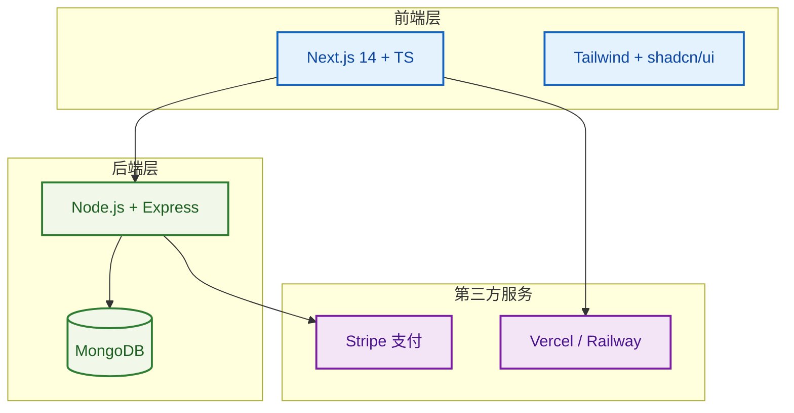

#### 第 3 轮：让 Claude 生成项目骨架（ROBOTIC 框架）

```
# Role（角色）
你是一位前端工程化专家，擅长项目架构和工具链配置。

# Objective（目标）
基于确定的技术栈生成完整的项目骨架。

# Background（背景）
技术栈：Next.js 14 + PostgreSQL + Prisma + Stripe（适配器模式）+ Vercel/Railway
时间约束：2 周内完成 MVP

# Output format（输出格式）
1. 完整的目录结构
2. pnpm-workspace.yaml 配置
3. 初始 Prisma schema（User / Product / Cart / Order 四个模型）
4. CLAUDE.md 文档
5. ESLint + Prettier + Husky 配置

# Tone（语气）
专业、简洁、可直接执行

# Instructions（指令）
- monorepo 结构（pnpm workspace）
- apps/web（Next.js）、packages/db（Prisma schema）、packages/payment（适配器）
- 预置 ESLint + Prettier + Husky
- 写一个 CLAUDE.md 把这些约定固化

# Constraints（约束）
- 所有配置文件必须可直接使用，无需额外修改
- Prisma schema 要包含必要的关系和索引
- CLAUDE.md 要包含项目约定和开发规范
```

Claude 输出了目录、`pnpm-workspace.yaml`、初始 Prisma schema（User / Product / Cart / Order 四个模型）和一份精简的 `CLAUDE.md`。我在它生成的 CLAUDE.md 里又补了"金额单位统一用 cents（避免浮点）"和"所有 API 路由必须经 zod 校验"两条。

#### 第 4 轮：高风险模块单独开 session（BROKE 框架）

下单和支付链路是最容易出问题的地方，单独开 session 慢慢推：

```
# Background（背景）
下单和支付是电商系统的核心链路，涉及库存扣减、订单创建、支付处理等多个环节，容易出现并发、幂等、事务等问题。

# Role（角色）
你是一位后端架构师，擅长分布式事务和高并发场景的处理。

# Objective（目标）
实现一个可靠的下单接口，确保数据一致性和系统稳定性。

# Key Information（关键信息）
- 需要在事务里做库存扣减 + 订单写入 + 创建 Stripe PaymentIntent
- 任一步失败整个事务回滚
- Stripe 异步 webhook 回来后才把订单状态置为 PAID
- 幂等：同一个 cart_id 重复下单返回同一个 order_id
- PaymentIntent 创建是网络请求，不能放在数据库事务里

# Example（示例）
类似的两阶段提交模式：先在事务里建订单（状态 PENDING_PAYMENT），事务提交后再创建 PaymentIntent
```

Claude 给的实现里漏了一个细节——`PaymentIntent` 创建调用是网络请求，放在数据库事务里会拉长事务持续时间。我追问后改成两阶段：先在事务里建订单（状态 `PENDING_PAYMENT`），事务提交后再创建 `PaymentIntent`，更新订单的 `payment_intent_id` 字段。

#### 第 5 轮：上线前自查（CRISPE 框架）

```
# Context（上下文）
项目即将上线，需要对下单和支付相关代码进行全面审查，确保没有遗漏的安全和稳定性问题。

# Role（角色）
你是一位代码审查专家，擅长发现并发、安全、性能等问题。

# Instructions（指令）
用 code-review Skill 扫一遍下单和支付相关代码，重点检查以下维度。

# Steps（步骤）
1. 检查并发竞态问题（库存扣减、订单创建）
2. 检查金额计算是否正确（避免浮点数精度问题）
3. 检查敏感信息是否泄露到日志
4. 检查 Stripe webhook 是否验签
5. 给出优先级排序的修复清单

# Preferences（偏好）
- 优先标记高风险问题
- 给出具体的修复建议
- 列出修复的优先级

# Example（示例）
常见问题：库存扣减没用 SELECT FOR UPDATE、金额计算用 float、错误日志包含信用卡信息、webhook 没校验签名
```

Claude 报出 4 个问题：库存扣减没用 `SELECT FOR UPDATE`（并发下卖超）、运费计算用了 float（要换 decimal）、错误日志里把信用卡 fingerprint 打了出来、webhook 没校验 `stripe-signature` header。修完后才上线。

**两周排期**：
- Day 1：选型确认 + 初始化 + CI 跑通
- Day 2–3：商品列表、购物车、订单核心流程
- Day 4：Stripe 支付链路（两阶段提交 + webhook）
- Day 5–6：管理后台 + 数据看板
- Day 7：全量回归 + code-review 扫一遍
- Day 8–13：UI 打磨 + 修小问题
- Day 14：上线

**几个经验**：
- 时间约束摆最前面，Claude 才会给你"两周能上线"而不是"理论上最好"的方案
- 第一轮方案不用照单全收，质疑两三个选型点能换来更稳的栈
- 高风险模块（支付、下单、权限）单独开 session，给出明确的并发/幂等/审计要求

---

### 场景 2：SaaS 平台迭代开发

已有 SaaS 平台，要在 3 天内加一个团队协作模块。重点是不能破坏现有数据隔离。

#### 第 1 轮：先问风险，不直接要方案（BROKE 框架）

```
# Background（背景）
现有 SaaS（React 18 + Node.js）要加团队协作模块，涉及团队创建/管理、项目管理、实时评论 @ 提醒等功能，数据严格按租户隔离，100+ 并发。

# Role（角色）
你是一位系统架构师，擅长评估架构风险和设计复杂系统。

# Objective（目标）
先识别风险点，说明怎么破坏现有架构最容易，再给出解决方案。

# Key Information（关键信息）
- 团队创建/管理、项目管理
- 实时评论 @ 提醒
- 数据严格按租户隔离，100+ 并发
- 不能破坏现有数据隔离

# Example（示例）
类似功能的常见风险：实时通信选型容易跑偏、权限要在数据库层做行级隔离、@ 提醒的邮件发送如果同步写会让接口变慢
```

Claude 列出的风险：
1. 实时通信选型容易跑偏，自己搭 WebSocket 维护成本高
2. 权限要在数据库层做行级隔离，光在中间件判断不够，绕过中间件就漏
3. @ 提醒的邮件/站内信发送如果同步写在评论接口里，会让评论 P95 变长
4. 现有 user 表如果没有 `team_id` 概念，加协作会引入循环依赖

#### 第 2 轮：让 Claude 给方案，并指出哪些是"成熟方案"（CRISPE 框架）

```
# Context（上下文）
基于之前识别的 4 个风险，需要给出解决方案。

# Role（角色）
你是一位技术选型专家，擅长选择成熟的技术方案。

# Instructions（指令）
针对这 4 个风险，给一套现成轮子能解决的方案。不要从零造，能用托管服务就用。

# Steps（步骤）
1. 针对每个风险给出对应的解决方案
2. 说明每个方案为什么是"成熟方案"
3. 列出具体的工具/服务名称
4. 说明如何与现有系统集成

# Preferences（偏好）
- 优先选择托管服务
- 避免自己搭建基础设施
- 选择有良好文档和社区支持的方案

# Example（示例）
实时通信可以用 Supabase Realtime，权限可以用 PostgreSQL RLS，消息队列可以用 BullMQ
```

Claude 的方案：
- 实时通信用 Supabase Realtime（托管 + Postgres CDC）
- 权限用 PostgreSQL RLS（Row Level Security），策略写在数据库层
- @ 提醒发送走消息队列异步化（用现有 BullMQ）
- 加一张 `team_memberships` 关联表，user 表不动

#### 第 3 轮：评审 Schema（ROBOTIC 框架）

```
# Role（角色）
你是一位数据库架构师，擅长 PostgreSQL RLS 策略设计。

# Objective（目标）
把 schema 详细写出来，特别是 RLS 策略。

# Background（背景）
需要实现"用户只能看到自己所在 team 的项目"这条策略，确保数据严格按租户隔离。

# Output format（输出格式）
1. 完整的 SQL schema（表结构）
2. RLS 策略的完整 SQL
3. 应用层如何设置 current_user_id 的示例
4. 边界情况的处理方案（如管理员跨租户查询）

# Tone（语气）
技术性强、精确、可执行

# Instructions（指令）
- 把 schema 详细写出来，特别是 RLS 策略
- 我要看一下"用户只能看到自己所在 team 的项目"这条策略具体怎么写

# Constraints（约束）
- RLS 策略必须在数据库层实现
- 不能依赖应用层过滤
- 要考虑管理员跨租户查询的场景
```

```sql
-- projects 表的 RLS 策略
CREATE POLICY tenant_isolation ON projects
  FOR ALL
  USING (
    team_id IN (
      SELECT team_id FROM team_memberships
      WHERE user_id = current_setting('app.current_user_id')::uuid
    )
  );

-- 应用层在每次请求开始时 SET LOCAL app.current_user_id
```

我追问了一个边界情况：**管理员需要跨租户查询时怎么办？** Claude 给的答案是加一个 `bypass_rls` 角色，管理员请求时切换 role。

**数据库模型**：
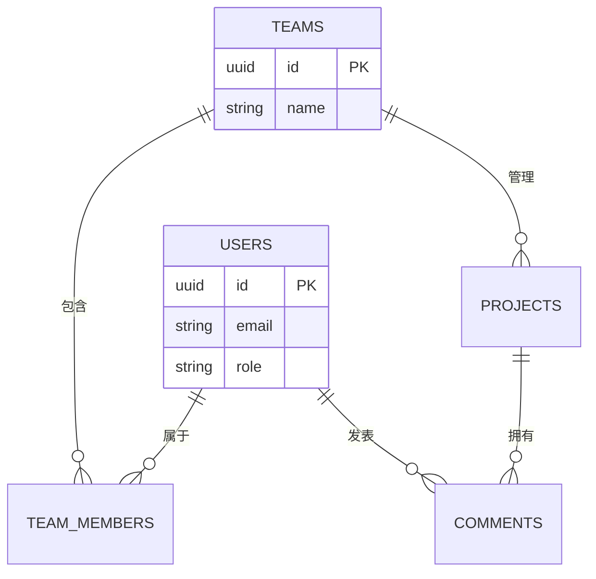

#### 第 4 轮：实时评论上线后才发现的坑（BROKE 框架）

实现过程中触发了一个原本没预期的问题：

```
# Background（背景）
评论实现完了，但本地测试时发现删除评论后，其他用户的页面没有自动消失。后端 DELETE 接口确实执行了，Supabase Realtime 也推了 DELETE 事件。

# Role（角色）
你是一位前端调试专家，擅长定位实时通信相关的问题。

# Objective（目标）
找出前端订阅代码的问题，确保删除评论后其他用户页面能自动更新。

# Key Information（关键信息）
- 后端 DELETE 接口执行成功
- Supabase Realtime 推了 DELETE 事件
- 其他用户页面没有自动消失
- 前端只订阅了 INSERT 和 UPDATE

# Example（示例）
Supabase Realtime 的 * 通配在某些 SDK 版本里不生效，要显式列出三个事件
```

Claude 看完后定位到：前端只订阅了 `INSERT` 和 `UPDATE`，漏了 `DELETE`。Supabase Realtime 的 `*` 通配在某些 SDK 版本里不生效，要显式列出三个事件。修完一行代码搞定。

**三天排期**：
- Day 1：Schema + RLS 策略 + Supabase Realtime 接入
- Day 2：团队/项目 CRUD + 权限中间件 + 前端列表页
- Day 3：实时评论 + @ 提醒（异步队列）+ 修删除同步 bug

让 Claude 先做风险评估，再让它给"用成熟轮子"的方案，能少踩很多坑。最容易出问题的地方往往不是大模块，是评审 schema 时漏掉的边界情况——多问一句"如果是 X 怎么办"。

---

### 场景 3：Plan 规划模式（复杂任务）

Plan 模式适合复杂任务：先让 Claude 制定计划，再逐步执行和调整。避免一次性甩大需求，导致输出不可控。

#### 第 1 轮：让 Claude 制定计划

```
我要重构用户认证模块，涉及以下改动：
- 从 JWT 切换到 Session
- 引入 Redis 存储会话
- 添加 OAuth2 登录（Google/GitHub）
- 更新所有相关 API 的鉴权逻辑

先制定一个详细的执行计划，包括：
1. 改动范围和风险评估
2. 执行步骤和依赖关系
3. 每步的验证方法
4. 回滚方案
```

Claude 给出的计划：

**风险评估**：
- 高风险：所有 API 鉴权逻辑改动，影响面大
- 中风险：Redis 集成，需要考虑可用性
- 低风险：OAuth2 集成，独立模块

**执行计划**：
1. Day 1：Redis 集成 + 会话存储基础（独立验证）
2. Day 2：OAuth2 登录流程（独立验证）
3. Day 3：API 鉴权逻辑切换（分批，先非核心 API）
4. Day 4：核心 API 鉴权切换 + 全量回归
5. Day 5：JWT 清理 + 监控告警

#### 第 2 轮：质疑计划，调整优先级

```
Day 3 分批切 API 的风险太高，容易导致线上问题。
调整一下：
1. 先在测试环境完整跑一遍
2. 用灰度发布，先切 10% 流量
3. 保留 JWT 作为降级方案
```

Claude 调整后的计划：
- 增加"测试环境完整验证"步骤
- Day 3 改为"灰度发布 10% → 50% → 100%"
- 添加"JWT 降级开关"，灰度期间可快速回切

#### 第 3 轮：逐步执行，每步验证

```
开始执行 Day 1：Redis 集成。
要求：
1. 只做 Redis 集成，不动其他逻辑
2. 写一个简单的 set/get 测试验证
3. 确认 Redis 故障时的降级策略
```

Claude 完成 Redis 集成后，继续下一步。

#### 第 4 轮：中途发现问题，调整计划

```
OAuth2 集成时发现 Google 的回调 URL 需要域名，但我们还在开发环境。
调整计划：
1. 先跳过 OAuth2，专注 Session 切换
2. OAuth2 改到第二阶段
3. 先用本地测试账号验证流程
```

Claude 同意调整，更新计划并继续执行。

**Plan 模式的价值**：
- 把复杂任务拆解成可验证的小步
- 中途发现问题可以灵活调整
- 每步都有验证点，风险可控
- 避免一次性大改动导致的灾难

---

### 场景 4：移动 App 跨平台开发

电商 App 要 iOS、Android 都上，预算和时间都紧。

#### 第 1 轮：方案对比（CRISPE 框架）

```
# Context（上下文）
电商 App，iOS 和 Android 都要，预算有限，时间紧。

# Role（角色）
你是一位移动端技术选型专家，擅长跨平台开发方案评估。

# Instructions（指令）
列三个候选方案对比：React Native、Flutter、各写一套原生。告诉我哪个最合适，理由是什么。

# Steps（步骤）
1. 列出三个方案的优缺点对比
2. 从开发成本、维护成本、性能、生态成熟度等维度评估
3. 给出最终推荐方案
4. 说明推荐理由和潜在风险

# Preferences（偏好）
- 优先考虑开发速度和成本
- 考虑团队现有技术栈
- 关注长期维护成本

# Example（示例）
如果团队已有 React 经验，React Native 可能是更好的选择
```

Claude 的对比结论：React Native 最合适。理由是团队已有 React 经验（学习成本最低）、Expo 把支付/推送/相机封装好了、热更新能避免每次小改都走 App Store 审核。Flutter 性能更好但要学 Dart，原生方案双倍工作量，都不适合当前情况。

#### 第 2 轮：Expo Managed 还是 Bare Workflow（BROKE 框架）

```
# Background（背景）
用 Expo 的话，Managed 工作流就够吗？我之前听说要接某些原生 SDK（比如统计、支付）的话，Managed 会受限。

# Role（角色）
你是一位 React Native 专家，熟悉 Expo 的工作流和原生模块集成。

# Objective（目标）
评估 Expo Managed 工作流是否够用，如果不够用，什么时候需要切换到 Bare Workflow。

# Key Information（关键信息）
- 需要接 Stripe 支付
- 需要推送通知
- 需要相机功能
- 可能需要接统计 SDK

# Example（示例）
Expo SDK 50 之后大部分常见原生模块都有官方支持，只有需要自己写原生模块时才需要 Bare
```

Claude 解释：Expo SDK 50 之后大部分常见原生模块都有官方支持（Stripe、Notifications、Camera 都覆盖了），Managed 够用。只有需要自己写原生模块或接非常小众的 SDK 时才需要 Bare。结论是先 Managed，遇到不行再 prebuild 切到 Bare（这条路是单向的，但 prebuild 工具能自动处理）。

#### 第 3 轮：项目骨架 + 离线策略（ROBOTIC 框架）

```
# Role（角色）
你是一位 React Native 项目架构师，擅长 Expo 和离线策略设计。

# Objective（目标）
生成项目骨架，包含离线浏览功能。

# Background（背景）
电商 App 需要支持离线浏览商品列表，提升用户体验。

# Output format（输出格式）
1. 完整的项目目录结构
2. package.json 配置
3. Expo Router 配置
4. React Query 配置
5. 离线缓存实现代码
6. MMKV 持久化配置

# Tone（语气）
技术性强、精确、可直接执行

# Instructions（指令）
- TypeScript + Expo Router（不要 React Navigation 老式写法）
- 状态管理用 React Query
- 商品列表要支持离线浏览（缓存 100 件最近浏览过的商品）
- 用 MMKV 持久化 Query Cache（AsyncStorage 性能不够）

# Constraints（约束）
- 必须使用 Expo Router
- 离线缓存要按 query key 分片存储
- 缓存策略要考虑性能和存储空间
```

Claude 生成的骨架里漏了一个细节——`AsyncStorage` 存大对象有性能问题（每次都是全量序列化）。我追问后改用 `MMKV`（同步、快 10 倍），并按 query key 分片存储。

**架构**：
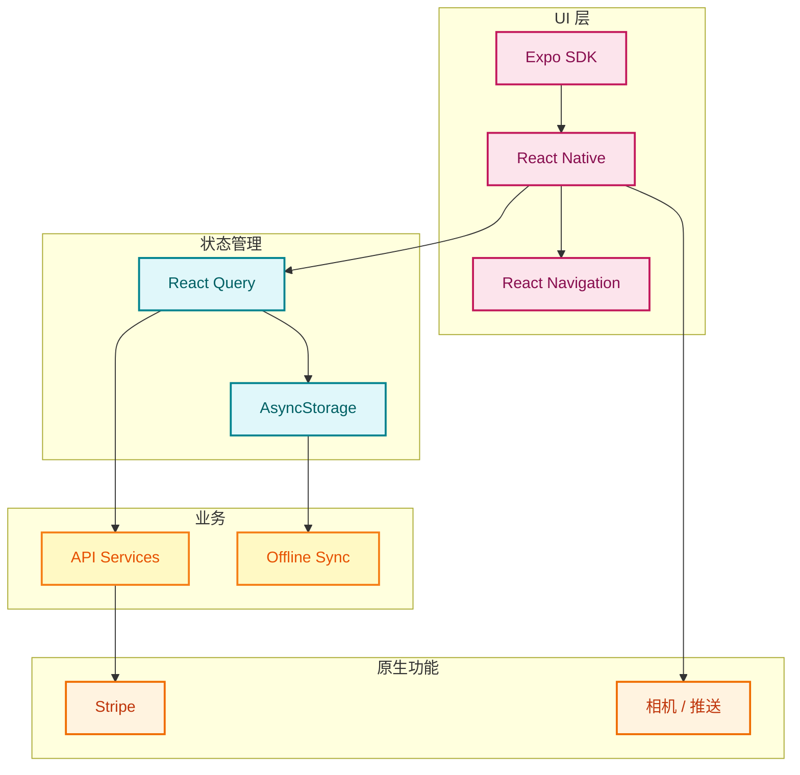

#### 第 4 轮：上架前再让 Claude 过一遍审核风险（CRISPE 框架）

```
# Context（上下文）
准备提交 App Store / Google Play，需要确保符合审核规范。

# Role（角色）
你是一位移动应用审核专家，熟悉 App Store 和 Google Play 的审核政策。

# Instructions（指令）
帮我列一下两个平台最常拒审的点，对照我们的代码看看有没有命中。

# Steps（步骤）
1. 列出 App Store 最常拒审的点
2. 列出 Google Play 最常拒审的点
3. 对照我们的代码检查是否命中
4. 给出修复建议

# Preferences（偏好）
- 重点关注隐私政策、权限申请
- IAP（我们没用，是不是要解释清楚）
- 后台任务、推送内容

# Example（示例）
常见拒审点：隐私政策跳转、相机权限的 NSCameraUsageDescription 文案、未使用 IAP 但有付费功能需声明走外部支付
```

Claude 列了 6 个常见拒审点（隐私政策跳转、相机权限的 NSCameraUsageDescription 文案、未使用 IAP 但有付费功能需声明走外部支付、推送权限请求时机过早、深色模式适配、儿童隐私 COPPA），其中 3 个命中了。逐个改完后两次审核都过了。

**节奏**：
- Day 1：初始化 + Expo Router + MMKV 持久化
- Day 2：首页商品列表（FlatList + React Query 分页 + 离线缓存）
- Day 3：Stripe 支付 + 离线同步队列
- Day 4：补审核合规点 + 截图 + 提交

提示词里把"双端 + 预算紧"摆出来，Claude 才会主动倾向跨平台方案。选型时让它做对比，比直接要"最优方案"更可信——你能看到它的推理过程。

---

## Vibe Coding 实战

Vibe Coding 不太正式，就是"边聊边写"。一边描述问题一边让 Claude 改代码，像和搭档结对编程。

#### Vibe Coding 工作流程

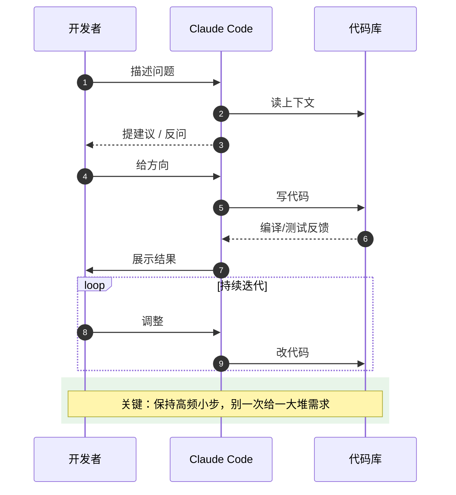

### 实战：重构 2000 行的遗留代码

接手一个项目，`src/services/UserService.ts` 单文件 2000 行，鉴权、邮件、日志全混在一起。下面是和 Claude 一起一步步剥离它的全过程。

#### 第 1 步：让 Claude 摸清问题，自己别先下结论（BROKE 框架）

不要一上来就问"怎么拆"，先问"有什么问题"——这样能拿到 Claude 自己的判断，比你强行命令它按你的想法做更可靠。

```
# Background（背景）
这个项目代码太乱了，先看 src/services/UserService.ts，2000 行。

# Role（角色）
你是一位代码重构专家，擅长分析代码结构和识别问题。

# Objective（目标）
不要急着改，先回答我三个问题，帮我摸清问题。

# Key Information（关键信息）
- 文件：src/services/UserService.ts，2000 行
- 需要分析职责混用情况
- 需要识别最严重的问题
- 需要给出重构优先级

# Example（示例）
类似的问题通常包括：职责混用、类型缺失、错误处理不一致、测试覆盖不足
```

Claude 读完给出的判断：
- **6 类职责**：CRUD（行 1-200）、认证（行 200-600）、权限（行 600-900）、邮件发送（行 900-1200）、日志格式化（行 1200-1500）、数据验证（行 1500-2000）
- **Top 3 问题**：全 `any` 类型、错误处理散落各处（70+ 个不一致的 try-catch）、0 测试覆盖
- **下手顺序**：先按职责拆 → 再处理重复 → 最后补类型和测试。先拆是因为后两件事在 2000 行单文件里做没法 review

#### 第 2 步：拆 AuthService（保持外部接口不变）（ROBOTIC 框架）

```
# Role（角色）
你是一位代码重构专家，擅长渐进式重构和接口兼容。

# Objective（目标）
先把认证相关的代码拆到 AuthService，保持外部接口不变。

# Background（背景）
需要重构 2000 行的 UserService，先拆出认证相关代码。保持兼容性是关键，避免大量 git diff。

# Output format（输出格式）
1. AuthService 完整代码
2. UserService 中的 re-export 桥接代码
3. 需要后续删除的"临时 re-export"清单
4. 迁移步骤说明

# Tone（语气）
精确、可执行、标注清晰

# Instructions（指令）
- 保持所有调用方的 import 路径暂时不变（用 re-export 桥接）
- 提取后写一个 import 兼容层，让现有 controller 不用改
- 列出所有需要后续删除的"临时 re-export"，方便我们之后清理

# Constraints（约束）
- 必须标注 @deprecated
- 不能破坏现有功能
- 桥接层要清晰标注"待清理"
```

要求 "临时桥接" 这种细节很关键——直接拆 import 会让 git diff 爆炸，没法 review。

拆完后核心长这样：

```typescript
// 拆之前：UserService.createUser 里塞了密码加密、写库、发欢迎邮件
async createUser(data: any) {
  if (!data.email) throw new Error('邮箱必填');
  const hashed = await bcrypt.hash(data.password, 10);
  const user = await db.users.create({ email: data.email, password: hashed });
  await sendEmail(user.email, '欢迎注册');   // CRUD 里混了副作用
  return user;
}

// 拆之后：AuthService 只关心认证
export class AuthService {
  async login(credentials: LoginDto) {
    const user = await this.validateUser(credentials.email, credentials.password);
    return { token: this.generateToken(user), user };
  }

  private async validateUser(email: string, password: string) {
    const user = await db.users.findOne({ email });
    if (!user) throw new UnauthorizedError('用户不存在');
    if (!(await bcrypt.compare(password, user.password)))
      throw new UnauthorizedError('密码错误');
    return user;
  }

  private generateToken(user: User) {
    return jwt.sign({ userId: user.id }, SECRET, { expiresIn: '7d' });
  }
}

// 桥接层：保持老 import 可用，标注"待清理"
// services/UserService.ts
/** @deprecated use AuthService.login */
export { login } from './AuthService';
```

#### 第 3 步：让 Claude 自己发现重复，不要预设答案（CRISPE 框架）

```
# Context（上下文）
拆完干净多了。现在扫一遍剩下的代码，找出重复模式。

# Role（角色）
你是一位代码重构专家，擅长识别和抽取重复代码。

# Instructions（指令）
找出 3-5 处最值得抽公共的重复。

# Steps（步骤）
1. 扫描剩余代码，识别重复模式
2. 对每处重复给出：重复次数、能省多少行、抽取方式
3. 按投入产出比排序
4. 给出抽取后的代码示例

# Preferences（偏好）
- 优先选择出现次数多的重复
- 优先选择能节省大量代码的重复
- 抽取方式要简单实用

# Example（示例）
常见抽取方式：utility 函数、decorator、基类、工具对象
```

Claude 找出三处重复：
- try-catch 模板（出现 47 次，抽成 `withErrorHandler` 高阶函数省约 280 行）
- 邮箱/密码验证（出现 12 次，抽成 `Validator` 工具对象省 60 行）
- 日志格式化（出现 23 次，已有 `logger`，建议统一调用习惯，不需要新抽取）

我让它先实现前两个：

```typescript
export async function withErrorHandler<T>(fn: () => Promise<T>, msg?: string): Promise<T> {
  try { return await fn(); }
  catch (e) {
    logger.error('Operation failed', { error: e, msg });
    throw new AppError(msg || '操作失败', e);
  }
}

export const Validator = {
  email: (e: string) => /^[^\s@]+@[^\s@]+\.[^\s@]+$/.test(e),
  password: (p: string) => p.length >= 8,
};
```

#### 第 4 步：替换 any，发现历史 bug（BROKE 框架）

```
# Background（背景）
把 any 全部换成实际类型。如果发现某处类型对不上是历史 bug，需要单独处理。

# Role（角色）
你是一位 TypeScript 类型专家，擅长类型安全和历史 bug 识别。

# Objective（目标）
把 any 全部换成实际类型，同时识别历史 bug。

# Key Information（关键信息）
- 调用方传的字段实际是 string，但被当 number 用
- metadata 字段在数据库里是 JSONB，老代码当成字符串拼接
- 日期字段在三处被当 timestamp（number），实际是 ISO string

# Example（示例）
类似的历史 bug：user.role 在两处被当成布尔值（`if (user.role)` 永远为真，因为是字符串）
```

这一步意外捞出 5 个潜伏 bug：
- `user.role` 在两处被当成布尔值（`if (user.role)` 永远为真，因为是字符串 `'admin'` / `'user'`）
- `metadata` 字段在数据库里是 JSONB，老代码当成字符串拼接
- 日期字段在三处被当 timestamp（number），实际是 ISO string

让 Claude 单独开一组 commit 修这些历史 bug，和重构本身分开提交。

#### 第 5 步：补测试（ROBOTIC 框架）

```
# Role（角色）
你是一位测试工程师，擅长编写单元测试和集成测试。

# Objective（目标）
给 AuthService 加测试，覆盖主要路径。

# Background（背景）
重构完成后需要补充测试，确保功能正确性。

# Output format（输出格式）
1. 完整的测试文件代码
2. 测试用例说明
3. testcontainers 配置（如果需要）
4. 测试覆盖率说明

# Tone（语气）
精确、可执行、覆盖全面

# Instructions（指令）
- 覆盖这几条路径：login 成功 / 用户不存在 / 密码错误 / token 过期
- register 成功 / 邮箱已存在 / 弱密码
- 不要 mock 整个 db，用 testcontainers 起真实 Postgres

# Constraints（约束）
- 测试必须可独立运行
- 不能依赖外部服务
- 测试用例要覆盖边界情况
```

```typescript
describe('AuthService', () => {
  it('错误密码应抛 UnauthorizedError', async () => {
    await expect(authService.login({ email: 'a@b.com', password: 'wrong' }))
      .rejects.toThrow('密码错误');
  });
  // 其他 case 类似
});
```

#### 第 6 步：复盘（CRISPE 框架）

```
# Context（上下文）
重构完成了，需要总结这次重构的经验和教训。

# Role（角色）
你是一位技术复盘专家，擅长总结项目经验和改进建议。

# Instructions（指令）
把这次重构总结一下，输出关键指标和改进建议。

# Steps（步骤）
1. 输出改动前/改动后对比表（文件数、行数、测试覆盖、类型覆盖）
2. 统计顺手修了多少历史 bug
3. 分析哪些环节如果重来会做得不一样
4. 给出未来重构的建议

# Preferences（偏好）
- 数据要具体可量化
- 改进建议要可执行
- 关注投入产出比

# Example（示例）
类似重构的常见改进点：第一步应该先生成依赖图，能更早发现反向依赖关系
```

Claude 总结的数据：单文件 2000 行 → 5 个文件均 < 300 行，重复代码砍掉六成，类型覆盖 0% → 95%，测试覆盖 0% → 80%，顺手修了 5 个历史 bug。

"重来会做得不一样"的部分：第一步就应该让我先生成一份 import 依赖图，那样能更早发现 `PermissionService` 其实被 6 个地方反向依赖（重构到第三步才发现，多绕了半天）。

#### 经验

整个过程一天半。对话节奏的几个关键：
- **第一步不要急着改，先让 Claude 给"诊断"**，能比你的预判更全面
- **每一步只问一件事**，不要让它"一次性拆完所有 service"，那样 diff 没法 review
- **遇到要动外部 API 的地方，要求加桥接层**（标注 deprecated）保持兼容
- **重构和修 bug 用不同 commit**，方便回滚和 review

---

## Spec Coding 指南

Spec Coding 是另一种风格：先把规格写清楚，再让 Claude 一步步实现。适合 PRD 已经定型、不想反复改的场景。

#### 完整流程

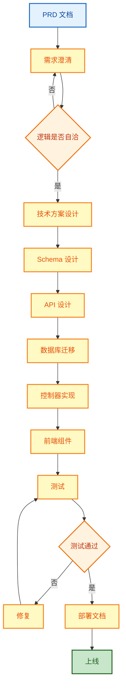

### 实战：用户反馈系统

PRD 拿到手，先做一遍澄清，再让 Claude 出方案。下面是从产品文档到部署文档的完整对话流。

#### 第 1 步：把 PRD 念给 Claude，先问清楚（BROKE 框架）

注意提示词最后那句"告诉我有哪些地方说得不够清楚"——这是 Spec Coding 的灵魂，**让 Claude 主动找模糊点**，比你自己看一遍 PRD 全。

```
# Background（背景）
PRD 大致如下：
- 用户提交反馈（文本、截图、日志），分类（Bug / 建议 / 其他），优先级 4 档
- 管理员处理反馈，状态流转：待处理 → 处理中 → 已解决 → 已关闭
- 用户能查自己反馈的进度

非功能要求：3 秒响应、离线提交联网自动同步、加密存储、可批量导出。

# Role（角色）
你是一位产品需求分析师，擅长识别需求中的模糊点和冲突。

# Objective（目标）
不要急着给方案。先分析 PRD 的清晰度和可行性。

# Key Information（关键信息）
- 需要识别 PRD 里有哪些地方说得不够清楚
- 需要分析哪些非功能需求会显著影响技术选型
- 需要指出需求之间的冲突

# Example（示例）
常见模糊点：匿名提交、附件大小限制、管理员权限、通知渠道、数据保留策略
```

Claude 反问了 5 个点：
- **匿名提交？** 影响是否要登录、是否做防滥用
- **附件大小和格式上限？** 影响存储方案和前端校验
- **谁是管理员？能不能改用户提交的内容？** 影响权限模型
- **通知渠道？** 影响是否要接邮件服务、是否要 WebSocket
- **数据保留多久？** 影响清理任务和归档策略

并指出"3 秒响应 + 加密存储"是冲突的——同步加密会增加延迟，需要异步加密或硬件加速。

#### 第 2 步：补完答案，要 Claude 复述一遍（CRISPE 框架）

```
# Context（上下文）
基于之前的澄清，现在补完答案，需要确认理解一致。

# Role（角色）
你是一位需求分析师，擅长需求澄清和确认。

# Instructions（指令）
回答以下问题，然后把理解的需求复述一遍。

# Steps（步骤）
1. 确认以下答案：必须登录、附件大小限制、管理员权限、通知渠道、数据保留策略
2. 用 3-5 行复述一遍需求
3. 确认理解无误后再给方案

# Preferences（偏好）
- 复述要简洁但完整
- 要突出关键约束
- 要确认非功能需求

# Example（示例）
复述时要明确"P95 首屏 3 秒"而不是模糊的"3 秒响应"
```

Claude 复述时把"加密存储"拆成了"S3 服务端加密 + 应用层敏感字段加密"两层，并把"3 秒响应"明确为"P95 首屏 3 秒"。这两处复述帮我发现 PRD 里隐含的歧义，确认无误后再继续。

#### 第 3 步：让 Claude 给方案，明确"要现成的"

Claude 的栈：React 18 + Antd / Node + Express / PostgreSQL / S3 存附件 / 站内信走 WebSocket。离线方案是 IndexedDB 暂存，联网后用指数退避同步。

**数据库**（3 张表）：`feedbacks` / `attachments` / `notifications`，按 user_id 和 status 建索引。

**API**：

```
POST /api/feedbacks                 提交反馈
GET  /api/feedbacks                 列表（管理员）
GET  /api/feedbacks/:id             详情
PUT  /api/feedbacks/:id             更新（管理员）
GET  /api/feedbacks/my              我的反馈
POST /api/feedbacks/:id/attachments 上传附件
GET  /api/notifications             通知列表
```

我又追问了一句"为什么不用 GraphQL"——Claude 的回答是这个场景接口数少（< 10），用 REST 更简单，GraphQL 会引入额外的 schema 维护成本和缓存复杂度。这个判断我认。

#### 第 4 步：建表（要求附迁移和回滚）（ROBOTIC 框架）

```
# Role（角色）
你是一位数据库架构师，擅长 PostgreSQL schema 设计和迁移。

# Objective（目标）
先把 feedbacks 表的迁移写了。

# Background（背景）
用户反馈系统需要存储反馈数据，需要设计合理的表结构和索引。

# Output format（输出格式）
1. 完整的迁移文件代码（TypeScript）
2. up 函数：创建表和索引
3. down 函数：删除表（必须可执行）
4. 每个索引的查询场景说明

# Tone（语气）
精确、可执行、注释清晰

# Instructions（指令）
- PostgreSQL，UUID 主键
- 同时给出 up 和 down 函数，down 必须可执行
- 索引说明每个索引的查询场景

# Constraints（约束）
- 必须使用 UUID 主键
- 必须包含必要的约束（CHECK、FOREIGN KEY）
- down 函数必须能安全执行
```

```typescript
// src/migrations/001_create_feedbacks_table.ts
export async function up(pool: Pool) {
  await pool.query(`
    CREATE TABLE feedbacks (
      id UUID PRIMARY KEY DEFAULT gen_random_uuid(),
      user_id UUID NOT NULL REFERENCES users(id) ON DELETE CASCADE,
      category VARCHAR(20) CHECK (category IN ('bug','feature','other')),
      priority VARCHAR(20) CHECK (priority IN ('low','medium','high','urgent')),
      status   VARCHAR(20) DEFAULT 'pending'
        CHECK (status IN ('pending','processing','resolved','closed')),
      title VARCHAR(255) NOT NULL,
      content TEXT NOT NULL,
      attachments JSONB DEFAULT '[]',
      created_at TIMESTAMP DEFAULT NOW(),
      resolved_at TIMESTAMP,
      resolved_by UUID REFERENCES users(id)
    );
    -- 用户查自己反馈
    CREATE INDEX idx_feedbacks_user_id ON feedbacks(user_id);
    -- 管理员按状态筛选
    CREATE INDEX idx_feedbacks_status  ON feedbacks(status);
  `);
}

export async function down(pool: Pool) {
  await pool.query(`DROP TABLE IF EXISTS feedbacks CASCADE`);
}
// attachments / notifications 两张表的迁移类似
```

#### 第 5 步：API 控制器（要求边界情况覆盖）（ROBOTIC 框架）

```
# Role（角色）
你是一位后端开发工程师，擅长 API 设计和错误处理。

# Objective（目标）
写 createFeedback 接口，处理附件上传和边界情况。

# Background（背景）
用户反馈系统需要支持附件上传，需要处理 S3 上传和数据库写入的一致性问题。

# Output format（输出格式）
1. 完整的控制器代码
2. 错误处理逻辑
3. 边界情况处理
4. 限流配置

# Tone（语气）
严谨、可执行、注释清晰

# Instructions（指令）
- 附件先传 S3，再把元信息写入 feedbacks.attachments
- 如果 S3 上传成功但数据库写入失败，要异步清理 S3 上的孤儿文件
- 边界：附件超过大小限制、不支持的格式，提前拒绝
- 限流：同一用户 1 分钟最多 10 条

# Constraints（约束）
- 必须处理 S3 上传失败的情况
- 必须处理数据库写入失败后的清理
- 必须实现限流
- 必须验证附件大小和格式
```

```typescript
async createFeedback(req: Request, res: Response) {
  try {
    const userId = req.user.id;
    const { category, priority, title, content } = req.body;
    const attachments = [];
    const uploadedKeys: string[] = [];   // 失败时清理用

    for (const file of (req.files as Express.Multer.File[]) ?? []) {
      validateAttachmentOrThrow(file);  // 大小/格式校验
      const { url, key } = await s3Service.uploadFile(file);
      uploadedKeys.push(key);
      attachments.push({
        fileName: file.originalname, fileUrl: url,
        fileSize: file.size, fileType: file.mimetype,
      });
    }

    try {
      const feedback = await feedbackService.create({
        userId, category, priority, title, content, attachments,
      });
      res.status(201).json(feedback);
    } catch (dbError) {
      // 数据库失败：异步清理 S3 孤儿文件
      queueOrphanCleanup(uploadedKeys);
      throw dbError;
    }
  } catch (e) {
    res.status(500).json({ error: '创建反馈失败' });
  }
}
```

#### 第 6 步：前端（离线优先）（ROBOTIC 框架）

#### 反馈系统数据流

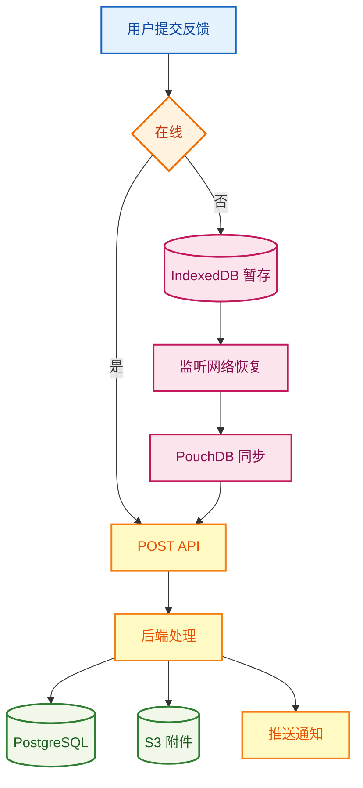

```
# Role（角色）
你是一位前端工程师，擅长 React 和离线优先架构。

# Objective（目标）
写一个离线优先的 hook，让组件不用关心在线状态。

# Background（背景）
用户反馈系统需要支持离线提交，联网后自动同步。

# Output format（输出格式）
1. useFeedback hook 完整代码
2. FeedbackForm 组件代码
3. 同步逻辑代码
4. IndexedDB 配置

# Tone（语气）
简洁、可执行、注释清晰

# Instructions（指令）
- 离线时立即返回成功（UI 显示"已暂存"）
- 联网后自动批量同步，按 createdAt 倒序排
- 同步失败重试 3 次（指数退避），3 次都失败标记 failed 但保留

# Constraints（约束）
- 必须使用 IndexedDB 暂存
- 必须监听网络恢复事件
- 必须实现指数退避重试
- 必须标记失败的同步项
```

```tsx
// useFeedback.ts —— 离线优先
export const useFeedback = () => {
  const submit = useMutation({
    mutationFn: async (data: CreateFeedbackDto) => {
      if (navigator.onLine) return api.post('/feedbacks', data);
      await idb.put('pending', { id: uuid(), data, createdAt: Date.now() });
      return { offline: true };
    },
  });
  return { submit };
};

// FeedbackForm.tsx —— UI 骨架
export const FeedbackForm = () => {
  const { submit } = useFeedback();
  return (
    <Form onFinish={v => submit.mutate(v)}>
      <Form.Item name="category"><Select options={CATEGORY_OPTIONS} /></Form.Item>
      <Form.Item name="priority"><Select options={PRIORITY_OPTIONS} /></Form.Item>
      <Form.Item name="title"><Input /></Form.Item>
      <Form.Item name="content"><Input.TextArea /></Form.Item>
      <Upload multiple beforeUpload={validateAttachment}>上传附件</Upload>
      <Button htmlType="submit">提交</Button>
    </Form>
  );
};
```

#### 离线同步时序

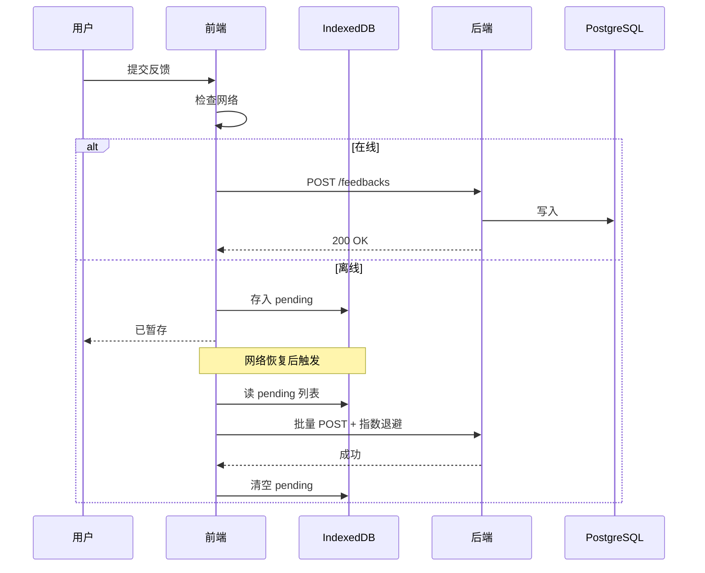

同步函数本身很短：

```typescript
const syncFeedbacks = async (items: PendingItem[]) => {
  for (const item of items) {
    await withRetry(
      async () => { await api.post('/feedbacks', item.data); await idb.delete('pending', item.id); },
      { maxRetries: 3 },
    );
  }
};
```

#### 第 7 步：测试（让 Claude 主动找边界）（CRISPE 框架）

```
# Context（上下文）
需要给反馈接口加测试，确保覆盖各种边界情况。

# Role（角色）
你是一位测试工程师，擅长识别边界情况和编写测试用例。

# Instructions（指令）
给反馈接口加测试。除了正常路径，主动想 5 个最容易出问题的边界。

# Steps（步骤）
1. 列出 5 个最容易出问题的边界
2. 逐个编写测试用例
3. 不要只测 happy path
4. 确保测试覆盖率和可维护性

# Preferences（偏好）
- 优先测试高风险场景
- 测试用例要独立可运行
- 测试描述要清晰

# Example（示例）
常见边界：未登录访问、附件超限、高频提交、孤儿文件清理、非法状态流转
```

Claude 列出的 5 个边界：
1. 未登录访问
2. 附件超过大小限制
3. 同一用户高频提交（限流）
4. 附件上传成功但数据库失败（孤儿文件清理）
5. 状态非法流转（已关闭 → 处理中）

```typescript
describe('FeedbackController', () => {
  it('登录用户应能创建反馈', async () => {
    const res = await request(app).post('/api/feedbacks')
      .set('Authorization', `Bearer ${token}`)
      .send({ category: 'bug', priority: 'high', title: '登录失败', content: '...' });
    expect(res.status).toBe(201);
  });

  it('未登录用户应被拒绝', async () => {
    const res = await request(app).post('/api/feedbacks').send({});
    expect(res.status).toBe(401);
  });

  it('附件超过 5MB 应被拒绝', async () => {
    const big = Buffer.alloc(6 * 1024 * 1024);
    const res = await request(app).post('/api/feedbacks')
      .set('Authorization', `Bearer ${token}`)
      .attach('files', big, 'huge.png');
    expect(res.status).toBe(413);
  });
  // 限流 / 孤儿清理 / 非法状态流转测试略
});
```

#### 第 8 步：让 Claude 生成部署文档（ROBOTIC 框架）

```
# Role（角色）
你是一位 DevOps 工程师，擅长部署文档编写和运维。

# Objective（目标）
照着 README 风格写一份部署文档。

# Background（背景）
用户反馈系统需要部署到生产环境，需要完整的部署文档。

# Output format（输出格式）
1. 环境要求
2. 依赖安装步骤
3. 环境变量配置
4. 数据库迁移步骤
5. Nginx 配置
6. SSL 配置
7. 定时任务配置
8. 回滚步骤

# Tone（语气）
清晰、可执行、步骤详细

# Instructions（指令）
- 从一台空白 Ubuntu 22.04 机器开始，照着抄就能上线
- 覆盖：依赖安装、环境变量、迁移、Nginx 配置、SSL、定时任务、回滚步骤

# Constraints（约束）
- 每个步骤必须可独立执行
- 必须包含错误处理
- 必须提供回滚方案
- 必须使用 systemd 或 pm2 管理进程
```

输出的要点（节选）：
```
环境：Node ≥ 18 / PostgreSQL ≥ 14 / Redis ≥ 6
环境变量：DATABASE_URL / S3_BUCKET / SMTP_HOST / JWT_SECRET / FRONTEND_URL
步骤：
  1. npm run migrate
  2. npm run build
  3. pm2 start ecosystem.config.js
  4. Nginx 反向代理 + HTTPS（certbot）
  5. cron 每天凌晨清理 30 天前的已关闭反馈
回滚：
  1. pm2 reload ecosystem.config.js --update-env（切回上版本镜像）
  2. npm run migrate:rollback（如果上版本 schema 不兼容）
```

#### 经验

Spec Coding 比 Vibe Coding 多花的时间，主要在第 1、2 步——把需求里隐藏的歧义全部澄清。这部分时间省不得，否则后面边写边改更费时间。三个高 ROI 的提示词技巧：
- "**有哪些地方说得不够清楚**"——让 Claude 主动找模糊点
- "**用 3-5 行复述一遍**"——验证它真的理解了
- "**主动想 5 个最容易出问题的边界**"——比你列要更全

---

## Skills 应用场景

Skills 是 Claude Code 里的"能力插件"，针对某个常见场景预置好了流程和提示词。下面是日常用得最多的几个。

#### 技能生态

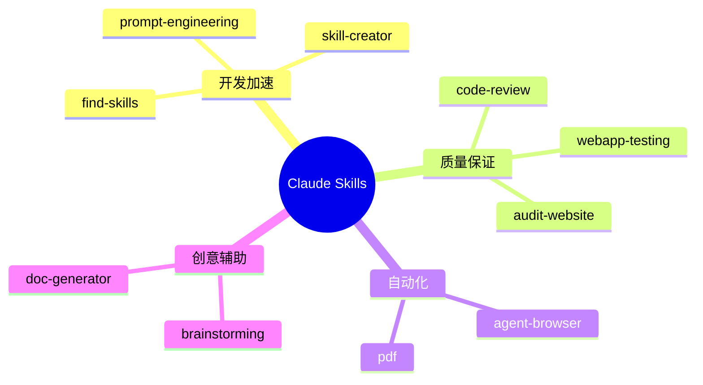

### find-skills：找合适的 Skill

```
我在做 React 项目，有什么能直接用的 Skill？
```

Claude 列了几个候选：`vercel-react-best-practices`（Vercel 官方的 React 最佳实践）、`frontend-design`、`web-design-guidelines`。安装命令：

```bash
npx skills add vercel/skills --skill vercel-react-best-practices
claude "用 vercel-react-best-practices 帮我审查这个组件"
```

### programmer-prompt-engineering-guide：写好提示词

经常觉得"生成的代码不符合预期"，多半是提示词太糙。这个 Skill 的核心建议就一条：**把"目标 + 上下文 + 约束 + 示例"四样里至少补两样**。

对比一下：

```
× 优化这个函数
○ 把这个函数从 O(n²) 降到 O(n)，输入是 1 万级别数组，要保持 API 不变

× 写一个购物车组件
○ 用 React + TS + Tailwind 写购物车：
  - 商品行（图/名/价/数）、加减、删除、合计、空状态
  - 用 Zustand 管状态，shadcn/ui 的 Card
  - 数据结构：interface CartItem { id, name, price, quantity, image }
```

### audit-website：网站审计

```
网站上线了，跑一遍全面审计。
```

Claude 给的报告通常包含四个维度的分数（性能 / SEO / 可访问性 / 安全）和优先级排序的修复清单。比如性能这块常见问题是图片没上 WebP、CSS 没压缩、字体没 preload，按 LCP 影响排序。

### brainstorming：起名 / 想点子

```
做一个 AI 写作助手，帮我想几个名字。
```

Claude 会按风格分类输出（科技感 / 文艺 / 现代 / 简洁），点哪类继续往下挖就行。这个 Skill 的核心价值是给"风格维度"，避免名字都长一个样。

### pdf：生成 PDF

订单转发票是高频需求，关键是中文字体。`pdfkit` 默认不支持，得自己指定字体文件：

```typescript
import PDFDocument from 'pdfkit';

export async function generateInvoicePDF(order: Order) {
  const doc = new PDFDocument();
  doc.font('src/assets/fonts/NotoSansSC-Regular.ttf');  // 中文字体
  doc.fontSize(24).text('发票', { align: 'center' });
  doc.fontSize(12).text(`订单号：${order.id}`)
                  .text(`日期：${order.createdAt.toLocaleDateString('zh-CN')}`);
  doc.fontSize(14).text('商品明细', { underline: true });
  order.items.forEach((it, i) =>
    doc.fontSize(12).text(`${i + 1}. ${it.name} - ¥${it.price} x ${it.quantity}`));
  doc.fontSize(16).text(`总计：¥${order.total}`, { align: 'right' });
  doc.end();
  return doc;
}
```

### skill-creator：把团队的套路沉淀成 Skill

团队反复写差不多的 REST API？做个 Skill 把模板固定下来：

```json
// skills/rest-api-generator/skill.json
{
  "name": "rest-api-generator",
  "description": "按字段定义快速生成 model + controller + service + routes",
  "commands": [{
    "name": "generate-api",
    "parameters": {
      "entity": "实体名",
      "fields": "字段定义",
      "database": "数据库类型"
    }
  }]
}
```

之后只需要：

```bash
claude "用 rest-api-generator 生成用户管理 API，字段：id, name, email, role, createdAt"
```

### agent-browser：浏览器自动化

爬数据或者跑 UI 流程，Playwright 是常用底层：

```typescript
import { chromium } from 'playwright';

export async function scrapeProducts(url: string) {
  const browser = await chromium.launch();
  const page = await browser.newPage();
  await page.goto(url);
  await page.waitForSelector('.product-item');
  const products = await page.evaluate(() =>
    Array.from(document.querySelectorAll('.product-item')).map(item => ({
      name:   item.querySelector('.product-name')?.textContent,
      price:  item.querySelector('.product-price')?.textContent,
      stock:  item.querySelector('.product-stock')?.textContent,
      rating: item.querySelector('.product-rating')?.textContent,
    })));
  await browser.close();
  return products;
}
```

### webapp-testing：E2E 测试

```
电商网站的结账流程要写 E2E。
```

```typescript
import { test, expect } from '@playwright/test';

test('购物车结账完整流程', async ({ page }) => {
  await page.goto('/');
  await page.click('.product-item:first-child .add-to-cart');
  await page.click('.cart-icon');
  await expect(page.locator('.cart-item')).toHaveCount(1);
  await page.click('.checkout-button');
  await page.fill('#name', '张三');
  await page.fill('#email', 'zhangsan@example.com');
  await page.fill('#address', '北京市朝阳区');
  await page.click('.submit-order');
  await expect(page.locator('.order-success')).toBeVisible();
});
```

跑：`npx playwright test`。

### code-review：代码审查

```
刚写完认证模块，帮我审一遍。
```

通常会按 安全 / 质量 / 性能 三类列问题。最常见的几条：密码没加盐、JWT secret 硬编码、没有限流、函数过长、缺输入校验。修复模板：

```typescript
import { z } from 'zod';
import rateLimit from 'express-rate-limit';

const loginSchema = z.object({ email: z.string().email(), password: z.string().min(8) });
export const loginLimiter = rateLimit({ windowMs: 15 * 60 * 1000, max: 5 });

export async function login(credentials: LoginDto) {
  const valid = loginSchema.parse(credentials);   // 校验失败抛 ZodError
  // ...
}
```

### documentation-generator：生成 API 文档

把控制器和路由文件喂给 Claude，让它生成 markdown 风格的 API 文档：

```markdown
## POST /api/auth/register
Body: { email, password, name }
返回 201：用户对象
错误：400 参数错误 / 409 邮箱已存在

## POST /api/auth/login
Body: { email, password }
返回 200：{ token, user }
```

输出本身不复杂，关键是它会按统一格式遍历所有接口，省得自己手抄。

---

## 团队协作模式

开多个 Claude Code 实例分工，可以模拟一个小团队。前端、后端、测试各跑一个 session，主终端做协调。

#### 多 Agent 协作架构

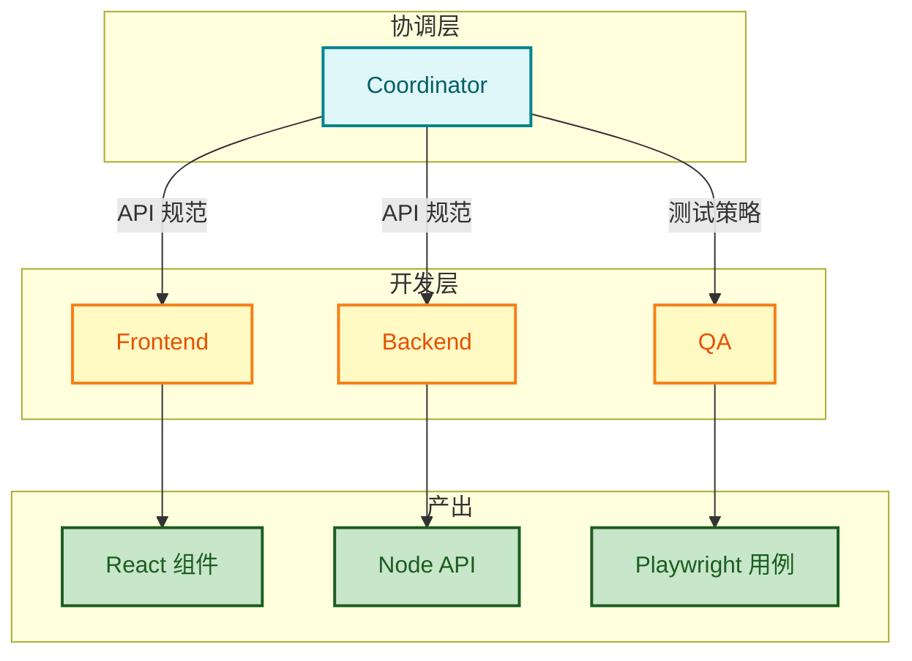

#### 协作时序

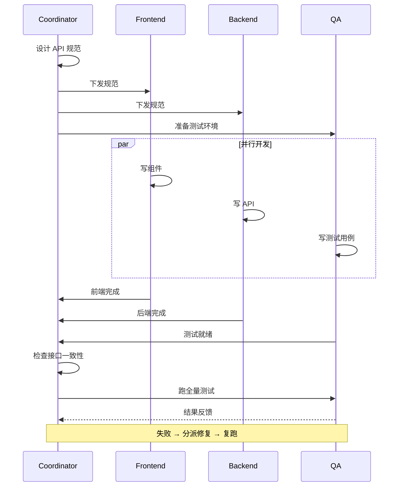

### 实战：博客系统三天搞定

#### 第 1 步：协调 session 出 API 规范

```
在 coordinator session 里：
我们三天做一个博客系统，团队有前端、后端、测试三个 agent 并行。
你作为协调，先出一份 REST API 规范。要求：
1. 字段命名统一 camelCase
2. 错误响应统一格式：{ code, message, details? }
3. 分页用 cursor-based（不要 offset），减少深翻页问题
4. 输出 OpenAPI 3 yaml，方便前后端共用类型
```

协调输出的 API 规范（节选）：

```
用户：POST /api/auth/register、/login，GET /api/users/me
文章：GET/POST /api/posts，GET/PUT/DELETE /api/posts/:id
评论：GET/POST /api/posts/:id/comments
错误响应：{ code: "VALIDATION_ERROR", message: "...", details: {...} }
分页：?cursor=xxx&limit=20
```

#### 第 2 步：分别启动前后端 session，把规范喂给它们

每个 session 开场都把协调出的 OpenAPI yaml 路径告诉它：

```
我（frontend session）：
读 docs/openapi.yaml。基于这个规范用 openapi-typescript 生成类型，
然后搭 Next.js 14 + TS + Tailwind 框架。
首页是文章列表（cursor 分页 + 无限滚动），点击进详情。
```

```
我（backend session）：
读 docs/openapi.yaml。用 Express + TS + PostgreSQL 实现这套接口。
重点：cursor 分页用 created_at + id 复合游标，避免重复/丢失。
认证用 JWT，权限：作者才能改自己的文章。
```

```
我（testing session）：
读 docs/openapi.yaml。用 Jest 写 API 集成测试 + Playwright 写 E2E。
覆盖：注册/登录/发文章/评论/权限拦截。先准备测试夹具，
等前后端完成 80% 再跑全量。
```

#### 第 3 步：第二天对接，协调出场

```
我（coordinator session）：
前后端报告：前端已实现，后端已实现，但联调时发现两个问题：
1. 后端返回的 createdAt 是 ISO string，前端类型生成的是 Date
2. 文章封面上传报错：Unexpected end of multipart data

帮我判断这两个问题该谁修，给出最小改动方案。
```

协调的判断：
- 问题 1：OpenAPI yaml 里我们标的是 `format: date-time`，后端实现正确（ISO string），前端 openapi-typescript 默认转 Date 是误读。**前端用 transform 函数转字符串**最小改动
- 问题 2：前端用 axios 传 FormData 时没设 `Content-Type: multipart/form-data`，axios 默认会用 JSON。**前端补一行 header**

两个 bug 都在前端，10 分钟修完。

#### 第 4 步：测试发现真问题，回滚再修

```
我（testing session）：跑 E2E，注册流程通过，但权限测试挂了：
PUT /api/posts/:id 用非作者账号能改成功（应该 403）。
请定位是后端权限中间件的问题还是路由配置漏了。
```

测试 session 自己跑 curl 复现 → 确认是后端 `requireAuthor` 中间件没挂在 PUT 路由上 → 切换到 backend session 修。这种 "测试发现 → 反馈给开发" 的 loop 走了 3 轮，第二天下午全绿。

#### 协作中的几个坑

- **第一轮没让协调出 OpenAPI yaml，直接口述 API 规范**。结果前后端对字段格式理解不一致，第二天对接花了两小时改字段名。第二个项目改成必须有共享 schema。
- **测试 session 启动太早**，前后端框架还没搭好，测试夹具写了一半要重写。改成"协调出 API → 前后端启动 → 等 30% 进度后测试启动"。
- **协调 session 提示词最讲究**：它要同时理解需求、技术方案、各 session 的进度。建议在协调 session 维护一个 `STATUS.md`，每次开始对话先让它读。

**整体效率**：传统串行排期是 5 天，并行后 2 天，省了大概 60%。隐性成本是协调 session 的认知负担——它的提示词得写得很清楚，否则各 session 输出不对齐，对接反而更费时间。

---

## 高级调试技巧

### 案例：Node.js 内存泄漏

生产环境每天 +500MB，3 天 OOM。日志没异常，最近改动只有一个：3 天前加了 WebSocket。

#### 排查流程

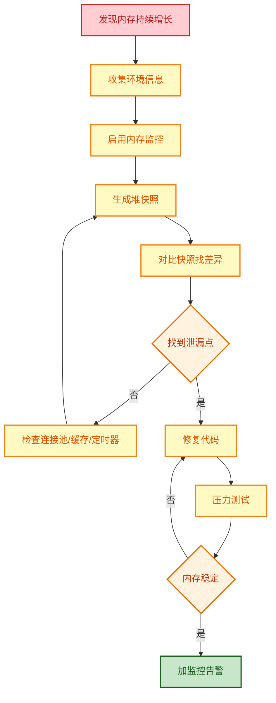

#### 第 1 步：把现状报给 Claude，让它先排优先级

```
Node 18 + Express 4 + MongoDB + Redis。
现象：内存每天 +500MB，GC 后不释放，3 天 OOM。
线索：3 天前刚加了 WebSocket 实时通知功能。
日志：没有明显异常。
QPS：高峰 200，平均 50。

不要急着给代码。先做两件事：
1. 按可能性排序，列出 5 个最大嫌疑点
2. 告诉我每个嫌疑的"廉价验证方法"是什么（不要一上来就让我抓堆快照）
```

Claude 排序的嫌疑（按可能性从高到低）：
1. **WebSocket 连接未清理**——时间点完全吻合，验证方法：`netstat | grep ESTABLISHED | wc -l` 看连接数是否持续增长
2. **事件监听器累积**——常见于 `socket.on()` 没配对的 `removeListener`，验证：`process._getActiveHandles().length`
3. **MongoDB 连接池泄漏**——连接复用配置不当，验证：观察 mongo 端 `db.serverStatus().connections`
4. **Redis 订阅未清理**——pub/sub 模式下订阅者退出没退订，验证：`CLIENT LIST` 看订阅客户端数
5. **闭包持有大对象**——这个最难定位，留到最后用堆快照

"先做廉价验证"省了我半天——直接 `netstat` 一跑就看到 ESTABLISHED 数从 50 涨到 800+ 还在涨，基本锁定 WebSocket。

#### 第 2 步：加监控，量化问题

```
要先量化问题。
给我一份监控代码，每分钟输出：
- RSS / heapUsed / external 内存
- 活跃 handle 数 / 活跃 request 数
- 当前 WebSocket 连接数

输出到 stdout 就行，方便我用 grep 拉趋势。
```

```javascript
const heapdump = require('heapdump');

setInterval(() => {
  const used = process.memoryUsage();
  const handles = process._getActiveHandles().length;
  const wsCount = io.engine.clientsCount;   // socket.io 的活跃连接数
  console.log(JSON.stringify({
    ts: new Date().toISOString(),
    rss: Math.round(used.rss / 1024 / 1024),
    heap: Math.round(used.heapUsed / 1024 / 1024),
    ext: Math.round(used.external / 1024 / 1024),
    handles,
    wsCount,
  }));
}, 60_000);

// 触发堆快照，到 Chrome DevTools → Memory → Load 分析
heapdump.writeSnapshot(`/tmp/heap-${Date.now()}.heapsnapshot`);
```

跑一晚上后数据很清楚：`wsCount` 从 50 涨到 1200，`handles` 同步涨，但 `rss` 涨幅是 `wsCount` 的 8-10 倍——说明不只是连接对象本身，还有它持有的其他东西。

#### 第 3 步：抓堆快照，做差异对比

```
抓了两个快照间隔 4 小时，rss 涨了 200MB。
现在看哪些对象增长最多。
重点关注：Socket 类、EventListener 数组、闭包持有的 user data。
```

Claude 给的分析方法：用 Chrome DevTools 的 "Comparison" 视图，对比两个快照按 "Delta" 排序。结果：
- `Socket` 对象 +1100 个
- `Array(EventListener)` 累计 +3400 个（每个 socket 多 ~3 个监听器）
- `Object` 类下的匿名闭包对象 +1100 个，retainer 链指向 `userSessions` 这个 Map

定位到代码：

```javascript
// 问题代码
io.on('connection', (socket) => {
  userSessions.set(socket.id, await loadFullUserSession(socket.userId));
  // ↑ loadFullUserSession 返回包含 user / preferences / recentActivity 的大对象
  socket.on('disconnect', () => {
    cleanupUserData(socket.id);   // ← 只清理了业务数据
    // 漏了：删除 userSessions、移除 socket 上的监听器
  });
});
```

#### 第 4 步：修复 + 验证 + 还有少量泄漏

```javascript
const connections = new Map();
const userSessions = new Map();

io.on('connection', (socket) => {
  connections.set(socket.id, socket);
  userSessions.set(socket.id, await loadFullUserSession(socket.userId));

  socket.on('disconnect', () => {
    connections.delete(socket.id);
    userSessions.delete(socket.id);    // 漏了这行
    socket.removeAllListeners();       // 也漏了这行
    cleanupUserData(socket.id);
  });
});

// 周期性扫一次僵尸连接（兜底）
setInterval(() => {
  for (const [id, s] of connections) {
    if (s.disconnected) {
      connections.delete(id);
      userSessions.delete(id);
    }
  }
}, 5 * 60 * 1000);
```

部署后内存增长从 +500MB/day 降到 +50MB/day。还在涨，但慢得多——继续往下挖。

```
还剩 +50MB/day。原嫌疑列表里 MongoDB 连接池没排除，
帮我看看 mongoose 这块的连接池配置有没有问题。
当前配置就一行：mongoose.connect(uri)。
```

Claude 指出问题：默认 `maxPoolSize` 是 100，但 `minPoolSize` 是 0，导致空闲时连接全部关闭，请求来了又重新建连。频繁建连销毁会留下少量内存碎片。优化：

```javascript
mongoose.connect(process.env.MONGODB_URI, {
  maxPoolSize: 50,
  minPoolSize: 10,          // 维持最少 10 个空闲连接
  socketTimeoutMS: 45_000,
  serverSelectionTimeoutMS: 5_000,
  heartbeatFrequencyMS: 10_000,
});
```

调完连接池，内存基本稳定在波动 ±10MB 之内。

#### 第 5 步：补告警，防止再发生

```
现在修好了，怎么避免下次再出？给我一套监控告警配置。
要求：
- 不要只看 RSS，那个会被云厂商误判
- 看 trend：RSS 6 小时内增长 > 100MB 就告警
- WebSocket 连接数和实际用户数偏差 > 30% 告警（暗示有僵尸连接）
```

Claude 给了 Prometheus + Grafana 的 alert rule 配置，关键是用 `rate()` 函数算趋势而不是绝对值。这套告警之后帮我们在另一个项目的内存泄漏出现两天内就发现了。

#### 经验

排查过程的几个关键节奏：
- **不要一上来抓堆快照**，先做廉价验证（`netstat`、`top`、`ps`）能省一大半时间
- **量化先于猜测**——加监控让数据说话，不要光看代码瞎想
- **修复后接受"还没完全好"**，分阶段逼近，每次解决最大头的那个原因
- **修完别忘了加告警**，否则下次还是要复盘一次

常用工具：`heapdump`、Chrome DevTools Memory、`clinic.js doctor`、`node --inspect` + DevTools。

---

## 典型场景速查

下面是日常碰到的几类任务，每个给一份能直接抄的提示词和关键代码。

### A. Bug 快速修复

**症状**：React 应用登录后页面闪白。

```bash
claude "
登录后 Dashboard 闪一下白屏才显示。
相关文件：src/hooks/useAuth.ts、src/pages/Dashboard.tsx
帮我定位并修复。
"
```

闪白的常见原因是没处理 loading 态：

```typescript
// 原版：user 短暂 undefined 时访问 .name 报错
export const Dashboard = () => {
  const { user } = useAuth();
  return <h1>欢迎, {user.name}</h1>;
};

// 修复
export const Dashboard = () => {
  const { user, isLoading } = useAuth();
  if (isLoading) return <LoadingSpinner />;
  if (!user) return <Navigate to="/login" />;
  return <h1>欢迎, {user.name}</h1>;
};
```

### B. API 接口开发

```bash
claude "
用 Express 写用户管理 API：
- GET/POST /api/users，GET/PUT/DELETE /api/users/:id
- Mongoose + 输入校验 + JWT 中间件
- 错误码：400 参数 / 404 不存在 / 409 重复
"
```

```typescript
export class UsersController {
  async list(req: Request, res: Response) {
    const { page = 1, limit = 10, search } = req.query;
    const filter = search ? { name: { $regex: search, $options: 'i' } } : {};
    const users = await User.find(filter).limit(+limit).skip((+page - 1) * +limit);
    res.json({ data: users, total: await User.countDocuments(filter) });
  }

  async create(req: Request, res: Response) {
    try {
      const user = await new User(req.body).save();
      res.status(201).json(user);
    } catch (e: any) {
      if (e.code === 11000) return res.status(409).json({ error: '邮箱已存在' });
      res.status(500).json({ error: e.message });
    }
  }
  // update / delete / getById 略
}
```

### C. 生成测试用例

```bash
claude "
为 src/services/CartService.ts 生成单元测试：
- 覆盖 add/remove/update/clear
- 边界：空购物车、负数量、超大商品列表（1000+）
- Jest
"
```

```typescript
describe('CartService', () => {
  let cart: CartService;
  beforeEach(() => { cart = new CartService(); });

  it('累加已存在商品的数量', () => {
    cart.addItem('PROD-001', 2);
    cart.addItem('PROD-001', 3);
    expect(cart.getItems()[0].quantity).toBe(5);
  });

  it('负数量应抛错', () => {
    expect(() => cart.addItem('PROD-001', -1)).toThrow('数量必须大于 0');
  });

  it('1000 商品操作应在 100ms 内完成', () => {
    const t = performance.now();
    for (let i = 0; i < 1000; i++) cart.addItem(`PROD-${i}`, 1, Math.random() * 100);
    expect(performance.now() - t).toBeLessThan(100);
  });
});
```

### D. 性能优化

```bash
claude "
这个函数 O(n²)，1 万元素要跑 200ms。优化到 O(n)，保持签名不变：
function findDuplicates(arr) { ... }
"
```

```typescript
function findDuplicates<T>(arr: T[]): T[] {
  const seen = new Set<T>(), dup = new Set<T>();
  for (const x of arr) seen.has(x) ? dup.add(x) : seen.add(x);
  return [...dup];
}
// 1 万元素：200ms → 2ms
```

### E. 全栈应用脚手架

```bash
claude "
生成任务管理系统脚手架：
前端 React + Vite + Tailwind，登录、任务 CRUD、拖拽排序、Socket.io 实时同步
后端 Express + TS + PostgreSQL + JWT
docker-compose 一键起
"
```

项目结构是常规四件套：

```
task-manager/
├── frontend/         # React + Vite
├── backend/          # Express + Socket.io
├── docker-compose.yml
└── .env.example
```

拖拽和广播的关键片段：

```typescript
// 前端：react-beautiful-dnd 的 onDragEnd
const handleDragEnd = (result) => {
  if (!result.destination) return;
  const items = [...(tasks ?? [])];
  const [moved] = items.splice(result.source.index, 1);
  items.splice(result.destination.index, 0, moved);
  updateTaskOrder.mutate(items);
};

// 后端：socket 房间广播
io.on('connection', (socket) => {
  socket.on('join-room', (roomId) => socket.join(roomId));
  socket.on('task-updated', async ({ taskId, updates, roomId }) => {
    await TaskService.updateTask(taskId, updates);
    socket.to(roomId).emit('task-update', { taskId, updates });
  });
});
```

```yaml
# docker-compose.yml 三件套
services:
  postgres: { image: postgres:15, ports: ["5432:5432"] }
  backend:  { build: ./backend,  ports: ["3001:3001"], depends_on: [postgres] }
  frontend: { build: ./frontend, ports: ["5173:5173"], depends_on: [backend] }
```

### F. 移动 App 离线优先

```bash
claude "
React Native + Expo，离线优先的任务管理：
- 在线直连 API，离线写 AsyncStorage 等联网同步
- 推送、生物识别、深色模式
"
```

```typescript
export const useOfflineTasks = () => {
  const createTask = useMutation({
    mutationFn: async (task: Task) => {
      const { isConnected } = await NetInfo.fetch();
      if (isConnected) return taskService.createTask(task);
      // 离线：本地暂存
      const cached = JSON.parse((await AsyncStorage.getItem('offlineTasks')) ?? '[]');
      cached.push({ ...task, id: String(Date.now()), pending: true });
      await AsyncStorage.setItem('offlineTasks', JSON.stringify(cached));
      return task;
    },
    onSuccess: () => syncTasks(),   // 联网后批量同步
  });
  return { createTask };
};
```

### G. 微服务架构

```bash
claude "
设计电商微服务架构：
拆 5 个服务：用户/商品/订单/支付/通知
NestJS + K8s + RabbitMQ + PostgreSQL + Redis
要 API Gateway、服务发现（Consul）、链路追踪（Jaeger）
"
```

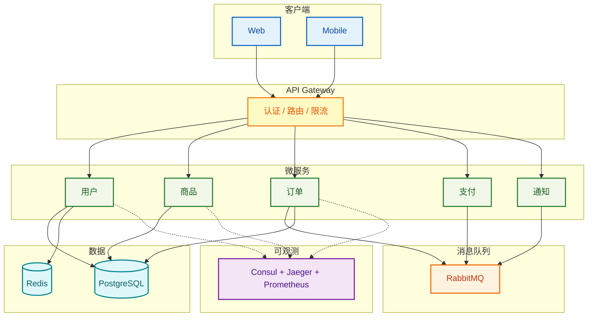

Gateway 的核心就是 proxy 转发：

```typescript
app.use('/api/users',    proxy('http://user-service:3001'));
app.use('/api/products', proxy('http://product-service:3002'));
app.use('/api/orders',   proxy('http://order-service:3003'));
app.use('/api/payments', proxy('http://payment-service:3004'));
```

服务之间走事件：

```typescript
@Controller()
export class OrderController {
  @EventPattern('order_created')
  async handleOrderCreated(@Payload() data: any) {
    await this.orderService.processOrder(data);
    await this.orderService.publishEvent('inventory_reserved', { /*...*/ });
  }

  @EventPattern('payment_completed')
  async handlePaymentCompleted(@Payload() data: any) {
    await this.orderService.updateOrderStatus(data.orderId, 'PAID');
    await this.orderService.publishEvent('order_shipped', { /*...*/ });
  }
}
```

K8s 部署模板：

```yaml
apiVersion: apps/v1
kind: Deployment
metadata: { name: user-service }
spec:
  replicas: 3
  template:
    spec:
      containers:
        - name: user-service
          image: user-service:latest
          ports: [{ containerPort: 3001 }]
          env: [{ name: DATABASE_URL, valueFrom: { secretKeyRef: { name: db-secret, key: url } } }]
```

### H. AI 智能客服

```bash
claude "
做 AI 客服系统：
意图识别 + 实体抽取 + 多轮对话 + 知识库检索 + 情感分析
Python + FastAPI + LangChain + Elasticsearch + Redis + WebSocket
"
```

对话引擎的骨架：

```python
class ConversationEngine:
    def __init__(self):
        self.embeddings = OpenAIEmbeddings()
        self.vectorstore = ElasticsearchStore(
            es_url="http://localhost:9200",
            index_name="knowledge_base",
            embedding=self.embeddings,
        )
        self.memory = ConversationBufferWindowMemory(
            k=5, return_messages=True, memory_key="chat_history")
        self.chain = ConversationalRetrievalChain.from_llm(
            llm=ChatOpenAI(model="gpt-4"),
            retriever=self.vectorstore.as_retriever(),
            memory=self.memory)

    async def process_message(self, user_id: str, message: str) -> dict:
        intent = await self.detect_intent(message)
        if intent == "complaint":
            response = await self.handle_complaint(message)
        elif intent == "inquiry":
            response = (await self.chain({"question": message}))["answer"]
        else:
            response = await self.generate_general_response(message)
        await self.save_conversation(user_id, message, response)
        return {"response": response, "intent": intent}
```

WebSocket 入口：

```python
@app.websocket("/ws/{user_id}")
async def ws(websocket: WebSocket, user_id: str):
    await manager.connect(websocket, user_id)
    engine = ConversationEngine()
    try:
        while True:
            data = json.loads(await websocket.receive_text())
            if data["type"] == "message":
                result = await engine.process_message(user_id, data["content"])
                await websocket.send_text(json.dumps({"type": "response", "data": result}))
    except WebSocketDisconnect:
        await manager.disconnect(websocket, user_id)
```

### I. DevOps 自动化

```bash
claude "
搭 CI/CD：
- GitHub Actions 跑测试 → 构建 Docker 镜像 → 推 registry → K8s 部署
- Prometheus + Grafana 监控
- 错误率 > 5% 推 Slack
"
```

#### CI/CD 流水线

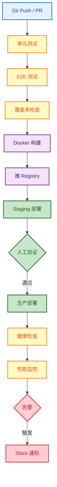

```yaml
jobs:
  test:
    runs-on: ubuntu-latest
    steps:
      - uses: actions/checkout@v3
      - uses: actions/setup-node@v3
        with: { node-version: '18', cache: 'npm' }
      - run: npm ci && npm test && npm run test:e2e
      - uses: codecov/codecov-action@v3
  build:
    needs: test
    steps:
      - run: |
          docker build -t myapp:${{ github.sha }} .
          echo ${{ secrets.DOCKER_PASSWORD }} | docker login -u ${{ secrets.DOCKER_USERNAME }} --password-stdin
          docker push myapp:${{ github.sha }}
  deploy:
    needs: build
    if: github.ref == 'refs/heads/main'
    steps:
      - run: |
          kubectl set image deployment/myapp myapp=myapp:${{ github.sha }}
          kubectl rollout status deployment/myapp
```

监控中间件：

```typescript
const httpDuration = new prometheus.Histogram({
  name: 'http_request_duration_seconds',
  help: 'HTTP 请求时长',
  labelNames: ['method', 'route', 'status_code'],
});

export const metrics = (req, res, next) => {
  const t = Date.now();
  res.on('finish', () => {
    httpDuration
      .labels(req.method, req.route?.path || req.path, String(res.statusCode))
      .observe((Date.now() - t) / 1000);
  });
  next();
};
// 错误率 > 5% 或 P95 > 1s 时触发 Slack webhook
```

---

## 高效工作流

### 渐进式开发

复杂的事情拆四步问 Claude，每步看一眼输出再继续，比一口气描述完更不容易跑偏：

```bash
claude "设计用户管理 API 的接口规范"        # 1. 定义接口
claude "按上面的规范实现后端服务"            # 2. 实现逻辑
claude "为这套接口写单元测试"                # 3. 加测试
claude "生成 API 文档，附调用示例"           # 4. 出文档
```

### Bug 处理四步法

```bash
claude "这个 API 返回 500，帮我看日志"      # 1. 复现/分析
claude "根据日志定位最可能的原因"            # 2. 定位
claude "给出修复代码"                        # 3. 修复
claude "加监控 + 告警防止类似问题"           # 4. 预防
```

### Plan 模式

复杂任务先按两次 `Shift+Tab` 进入 Plan 模式，描述需求让 Claude 列出执行步骤；看完没问题再切回执行模式 + Auto-accept。这套对"动手前能想清楚"的任务特别管用，能避免写到一半推倒重来。

### 多 Agent 协作

参考前面的[团队协作模式](#团队协作模式)章节。要点：协调 session 单独开，所有跨 session 的接口约定先在协调里固化。

---

## 实用提示词技巧

### 写得具体一些

```
× 优化这个函数
○ 把这个函数的时间复杂度从 O(n²) 降到 O(n)，输入是已排序的数组，
  保持 API 不变，附上前后的基准对比
```

### 把上下文摆出来

```
× 修复登录 bug
○ 修复登录 bug：
  - React 18 + TypeScript
  - 认证库：@auth0/react-auth0
  - 报错信息：Cannot read property 'name' of undefined
  - 出现在 src/components/Login.tsx 的 onLoginSuccess 回调里
```

### 复杂任务拆步骤

每步只问一件事，比起一次抛出 5 个要求，结果质量好很多：

```bash
claude "分析这个需求的技术要点"
claude "基于刚才的分析，给一份技术方案"
claude "按方案实现核心模块"
claude "为核心模块写测试"
```

### 用 `CLAUDE.md` 把项目背景固化

放在项目根目录，Claude 每次自动加载，省得反复粘贴上下文：

```markdown
# 项目：电商系统

## 技术栈
- 前端 React 18 + TypeScript + Tailwind
- 后端 Node + Express + MongoDB
- 部署 Docker + AWS

## 编码规范
- ESLint + Prettier
- 组件 PascalCase，文件 kebab-case
- 提交信息走 Conventional Commits

## 项目结构
src/
  components/   # React 组件
  pages/        # 页面
  hooks/        # 自定义 hooks
  services/     # API 服务
  utils/        # 工具函数
  types/        # 类型定义

## 测试
- 单测 Jest + RTL，覆盖率 ≥ 80%
- E2E 走 Playwright

## 部署
push main → CI/CD → staging → 人工验证 → 生产
```

### 多文件 / 自定义工作流

```bash
# 把常用提示词存下来
claude --save "api-development" "
开发 REST API 的标准流程：
1. 数据模型
2. 控制器
3. 验证中间件
4. 单元测试
5. API 文档
"
claude --load "api-development" "用户管理模块"

# 一次性给多个相关文件
claude --file src/auth/service.ts --file src/auth/middleware.ts \
  "分析整个认证流程，找出潜在问题"
```

---

## 常见问题

**Q：Claude 生成的代码能直接用吗？**

可以读、可以参考，但别盲信。重要功能一定要写测试，安全敏感的（认证、支付、权限）人工审一遍。习惯做法是把生成的代码当 PR 看，过一遍 code review 流程再合。

**Q：怎么让 Claude 理解项目结构？**

最稳的办法是写 `CLAUDE.md`（见上文）。临时也可以在提示词里贴一段目录树和技术栈说明。

**Q：项目很大怎么办？**

分模块给。每次只让 Claude 关注一两个相关文件：

```bash
claude "实现用户认证模块"
claude "基于认证模块实现订单系统"
claude "写跨模块的 E2E 测试"
```

避免一次性甩"看完整个项目再帮我改"这种需求——Claude 不擅长，你也很难审查它的输出。

---

## 小结

用好 Claude Code 其实很简单，就四件事：

- **写清楚需求**——目标、上下文、约束，至少占两样
- **拆小步走**——复杂任务每步只问一件事
- **该审就审**——代码当 PR 看，测试别省
- **沉淀套路**——常用提示词存起来，项目背景写进 `CLAUDE.md`

Claude 替你接管了大量机械工作，但"想清楚做什么"和"判断结果对不对"这两件事，依然是你的活。

---

## 相关资源

- [Claude Code 官方文档](https://docs.anthropic.com/claude-code)
- [Claude Code 快速入门（本仓库）](https://github.com/microwind/ai-skills/blob/main/docs/claude/claude-code-guide/01-快速入门.md)
- [Claude Code 完整学习系列（本仓库索引）](https://github.com/microwind/ai-skills/blob/main/docs/claude/claude-code-guide/README.md)
- [Claude Code Skills 推荐（本仓库）](https://github.com/microwind/ai-skills/blob/main/docs/skills/Claude-Code-10大Skills推荐.md)
- [51 万行代码分析报告（本仓库附录）](https://github.com/microwind/ai-skills/blob/main/docs/claude/claude-code-guide/附录-最佳实践.md)
- [Claude Code AI 编程完全指南（本仓库长文）](https://github.com/microwind/ai-skills/blob/main/docs/claude/ClaudeCodeAI编程完全指南.md)
