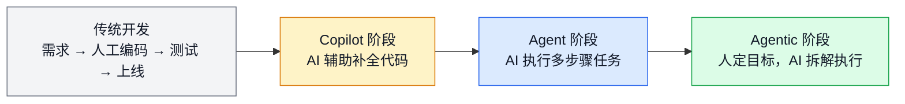
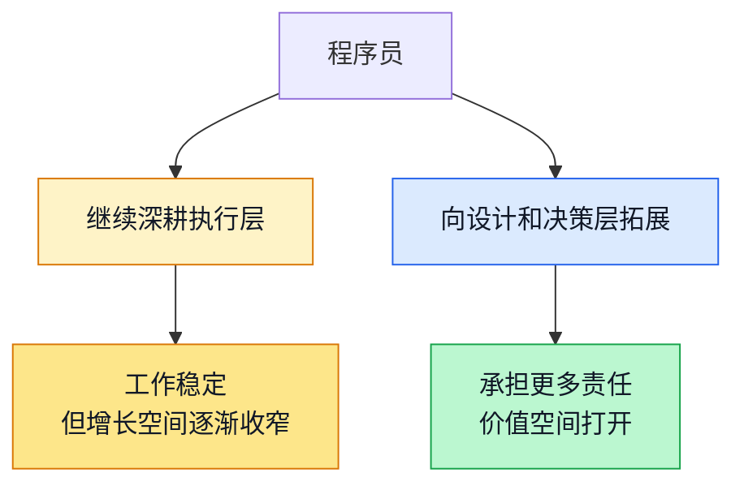
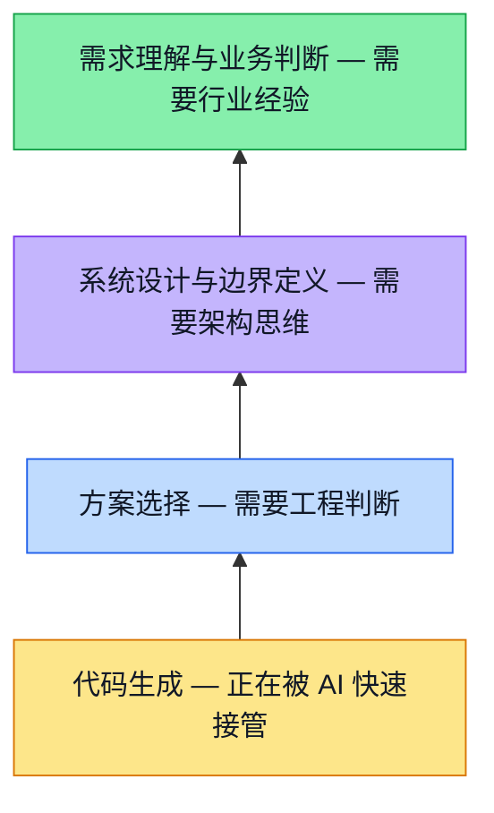
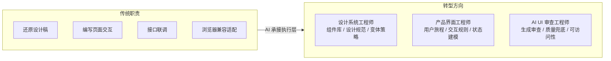
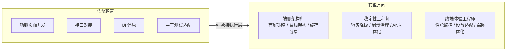
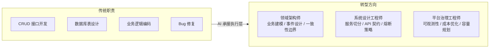
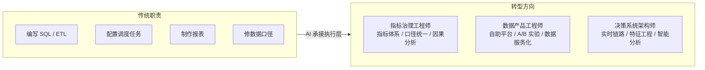
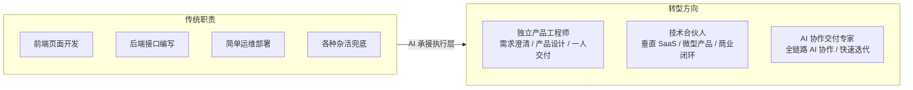
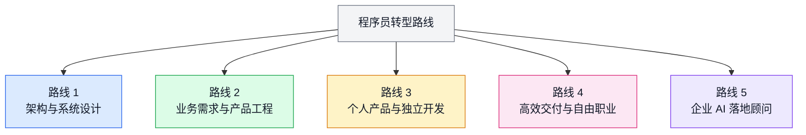
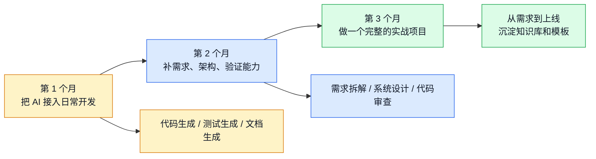

# 2026年，程序员面临的转型之路

> 这两年我越来越强烈地感觉到：写代码这件事本身，正在从程序员最值钱的本事，变成交付链条里的一个环节。不是说写代码不重要了，而是光会写代码，不够了。

你可能也有过这种体验——需求刚理清楚，AI 已经把第一版代码、测试用例甚至部署脚本都铺好了。你回过头一看，自己真正花时间的地方，其实是在想清楚"到底要做什么"和"做出来的东西对不对"。

这不是某个工具有多厉害的问题，而是软件开发的生产方式确实在变。拉开差距的地方，已经不太一样了：

- 能不能把业务问题讲清楚
- 能不能定义好边界、约束和取舍
- 能不能判断 AI 的产出哪里靠谱、哪里有坑
- 能不能对最终交付结果负责

一句话说：**程序员的重心，正在从"把代码写出来"移到"把问题定义好、把系统设计好、把结果验证好"。**

---

## 一、变化已经在发生

很多人还在讨论"AI 到底行不行"，但实际上，前端页面、接口样板、测试脚本、SQL、运维脚本、文档整理这些工作，AI 已经能又快又好地出一版了。不是说它完美，而是说——它确实能干活了。

这带来一个直接的变化：团队的协作方式在重组。

以前一个功能需要产品写文档、设计师画稿、前端切页面、后端写接口、测试补用例，五六个人转一圈。现在越来越多地变成：少数核心工程师把目标和约束定好，AI 负责大部分初稿，人负责决策、校正和验收。

冲击最直接的，是长期停留在纯执行层的工作。

### 几组公开数据

不只是个人体感，公开数据也指向同一个方向：

- **GitHub Octoverse 2024**：2024 年新增超 7 万个公开生成式 AI 项目，相关项目总量同比增长 98%
- **Stack Overflow 2024 调查**：76% 的开发者已经在使用或计划使用 AI 工具
- **Anthropic 2025 分析**：对 50 万次编码交互的研究发现，79% 更接近自动化执行；UI/UX、Web 与移动开发是最高频场景
- **JetBrains 2025 调查**：86% 的开发者用 AI 编程助手，但只有 42% 觉得真正有效——差异在于是否参与了系统设计和需求澄清
- **IEEE 2025 编程指数**：具备需求分析和架构能力的工程师，升职周期缩短了约 40%

这些数据告诉我们的不是"程序员要完了"，而是：**标准化工作（CRUD、模板代码、测试脚本）正在被快速消化，工程师的核心价值在向业务理解、系统设计、质量把关三个方向集中。**

---

## 二、同样是写代码，工作方式已经分出两条路

这不是什么"淘汰论"，而是一个客观现象：做同样职位的两个人，因为工作方式不同，成长轨迹已经拉开了。

一类人的日常还是：接需求 → 写代码 → 改 bug → 交付。这没什么不好，很多项目确实需要这么干。但问题是，AI 的自动化边界一直在扩大，这类工作的稀缺性在慢慢下降。

另一类人已经换了个节奏：先搞清业务目标和边界条件，明确约束（成本、性能、风险），让 AI 快速出几个方案来对比，自己把主要精力放在决策、评审和验证上。

两类人表面上都在"做开发"，但在团队里承担的角色、获得的机会已经不一样了。

AI 天生擅长执行定义清楚的任务。所以核心问题不是"AI 会不会取代你"，而是——**你现在的工作里，"定义问题"占多少，"执行问题"占多少。**

这不是说执行不重要，也不是要求所有人马上转型。但如果你想在职业发展上有更多选择，往"定义"和"决策"的方向靠一靠，回报会越来越明显。

---

## 三、程序员不会消失，价值在整体上移

AI 很强，但它强在执行，弱在负责。

它可以给你十个方案，但它不清楚哪个更适合你的业务节奏、团队水平、预算约束和上线风险。它可以生成大段代码，但下面这些事它做不了：

- 这个需求到底值不值得做
- 哪些边界必须守住
- 哪些复杂度属于过度设计
- 哪些性能问题会在三个月后爆出来
- 这次交付到底算不算真解决了用户的问题

程序员未来最重要的价值，正在从最底层的"代码生成"，向上迁移到四个层次：

越往上，越靠近需求、边界、取舍和责任，越离不开人。

方向很清楚：**不是离开技术，而是站到比"写代码"更高一层的位置上去。**

---

## 四、五种岗位各有各的变法

AI 对不同岗位的冲击方式不一样。下面分别聊聊前端、客户端、后端、大数据和全栈这五类工程师，各自面临什么变化、可以往哪些具体方向走。

先看总览：

| 角色 | 根本变化 | 更值得投入的方向 |
|------|------|------|
| 前端工程师 | 从页面实现转向产品界面工程 | 设计系统、产品工程、AI UI 审查 |
| 客户端工程师 | 从功能开发转向终端体验负责 | 端侧架构、稳定性工程、跨端体验 |
| 后端工程师 | 从接口开发转向领域建模与系统设计 | 业务架构、平台治理、可观测性 |
| 大数据工程师 | 从跑任务转向数据资产与决策系统 | 指标治理、数据产品、智能分析 |
| 全栈工程师 | 从什么都写一点转向一人交付业务 | 独立产品、微型 SaaS、技术合伙人 |

### 1. 前端工程师：从"切页面"到"产品界面工程"

前端过去最常见的价值是还原设计稿、写交互、接接口、做兼容。这些工作 AI 已经能完成大半。前端要找到新的立足点，得往更上层走。

**怎么理解这个变化？**

以一个电商前端为例。以前的主要工作是把商详、购物车、结算的页面写好。现在更值钱的工作变成了：定义这三个流程的交互规则、组件模型和状态流转，然后让 AI 针对不同渠道（PC、移动、小程序）快速生成页面变体。

具体来说，转型后的前端需要能做这些事：

- **理解产品流程**：从用户旅程出发，识别哪些交互影响转化、哪些状态流转容易出错——不只是"按设计稿做"
- **设计组件体系**：定义组件库、API 规范、变体策略，让一个组件系统支撑多个业务线
- **状态建模**：用状态机等方式定义复杂交互，而不是靠堆 flag 变量
- **自动化质量保障**：用工具验证可访问性和兼容性，而不是手工测每个浏览器

一个简单的自测：你能不能用 5 个组件规范加一套状态规则，让 AI 生成一个完整业务流程的页面？如果能，你的竞争力已经跟"写页面快"的人拉开差距了。

转型周期大约 6-9 个月，前提是有真实项目支撑。

### 2. 客户端工程师：从"功能开发"到"终端体验负责"

客户端看起来也能被 AI 大量生成，但它有一个天然门槛：**真实设备环境太复杂了**。弱网、低端机、系统版本碎片化、厂商定制——这些东西 AI 没法自己搞定。

**典型场景：**

一个电商 App 的客户端工程师，核心工作变成了：设计首屏加载策略（预加载 + 渲染优化）、离线缓存方案（冷启 + 热更新）、网络异常时的 UI 降级和重试机制。代码实现大部分让 AI 来，但这些架构层面的决策完全靠人。

转型后要能做到：

- **端侧架构设计**：定义首屏、离线、缓存、网络分层的整体策略
- **容灾和降级**：网络异常时怎么补偿、版本不兼容时怎么降级、内存溢出时怎么恢复
- **性能指标闭环**：用 Lighthouse、RUM 等工具定义可量化目标，并持续追踪
- **设备适配策略**：理解 Android/iOS 版本差异和厂商坑点，提前规避而不是靠测试发现

自测标准：你能不能独立设计一套完整的"弱网加载方案"——包括缓存、重试、降级、通知？

转型周期 8-12 个月，需要经历过至少一个从 0 到 1 的完整迭代。坦率说，这类能力稀缺性很高，但市场需求相对集中在中大型公司，小公司未必用得上。

### 3. 后端工程师：从"写接口"到"领域建模与系统设计"

后端受冲击最直接。接口开发、ORM 映射、CRUD 服务、脚手架代码——这些是规则明确、重复度高、AI 最擅长生成的东西。继续在"写接口速度"上卷，性价比越来越低。

**典型场景：**

一个做交易系统的后端，核心工作变成了：设计订单、支付、库存的事件模型和状态机，定义库存扣减的一致性策略（先扣库存还是先确认支付），设计补偿和重试机制。这些决策一旦出错，代价很高。代码实现可以交给 AI，但设计决策必须人来做。

转型需要补齐的能力：

- **业务建模和领域分析**：从业务流程反推数据模型、事件序列、一致性边界
- **服务设计**：服务怎么切、API 契约怎么定、熔断降级怎么做、跨服务一致性怎么保证
- **可观测性架构**：日志、链路追踪、指标体系——系统出问题时 15 分钟内定位，而不是人工排查
- **成本和复杂度权衡**：缓存、索引、分片、数据库选型，每一个都是成本和性能的折衷

从"CRUD 工程师"到"系统设计工程师"，通常需要 12-18 个月，而且最好经历过一次大规模重构或性能优化。这类能力稀缺性最高，竞争也最激烈。

### 4. 大数据工程师：从"跑数写任务"到"数据资产与决策系统"

很多数据工程师的日常本质上是：写 SQL、搭 ETL、配调度、做报表、修口径。这些事模式化很强，AI 非常擅长。

**典型场景：**

原来负责日报和埋点的工程师，可以转去做"指标治理"或"增长分析平台"。具体就是：定义 GMV、漏斗、配送时长等关键指标的计算口径，建立从原始事件到指标的计算链路，让业务方能自己查数据。代码由 AI 生成，但指标定义和业务逻辑的对错，必须人来把关。

这条路需要补齐的能力：

- **指标体系设计**：什么是关键指标、怎么分层、指标之间的因果关系是什么
- **口径治理**：不同系统对"用户""订单"等概念的定义不同，怎么统一
- **实时 vs 离线分层**：什么指标该实时算、什么该离线跑，成本和延迟怎么平衡
- **数据产品化**：把数据管道包装成面向业务的自助工具

从"数据工程师"到"数据架构师"需要 12-24 个月，而且必须深入理解业务逻辑。纯技术背景的人容易做出"技术正确但业务用不上"的东西，这点要特别注意。

### 5. 全栈工程师：从"什么都写一点"到"一人交付整个业务"

全栈在 AI 时代其实是最有机会的一类人。前后端、脚本、部署、测试都能让 AI 代劳之后，真正能把一个完整产品从需求做到上线的人，反而更稀缺了。

**典型场景：**

一个全栈工程师，给中小培训机构做"招生线索管理 + 课消分析 + 家长回访"的轻量 SaaS。过去这至少需要 3-5 人团队，现在一个人加 AI 可以做出第一版并上线收费。关键不在于技术栈有多全，而在于你能独立走完从业务分析到上线运维的全过程。

这条路需要的能力跟其他岗位不太一样，更偏"产品 + 交付"：

- **需求澄清和产品设计**：能跟业务方聊需求、做原型、定优先级
- **系统折衷**：功能、性能、成本、速度之间怎么权衡，前后端一起考虑
- **全链路交付**：从开发到上线、监控、迭代，整条链都能自己搞
- **业务指标意识**：知道怎么评估产品是不是真的解决了问题

转型周期 18-24 个月，最好在小团队或个人项目里完整试过。市场机会最大——垂直 SaaS、内部工具、创业项目都缺这样的人。但也别忽视风险：中大型企业通常还是倾向专业分工，全栈的主战场在小公司、创业和独立开发。

---

## 五、几条真正走得通的路

不是每个人都要去做管理，也不是每个人都必须创业。但大方向上，至少有这几条路是现实中走得通的。

### 路线 1：架构设计和系统设计

最适合后端、资深全栈、基础架构工程师。

你的价值不再是"写服务"，而是定义边界、切模块、做容量规划、定 SLA、控制成本、决定哪些交给 AI 哪些必须人工兜底。

**比如**：一个做了多年订单系统的后端工程师，可以升级成业务架构负责人。以前亲自写服务写接口，以后更多是拆业务域、定事件模型、做容灾策略，然后让 AI 帮生成代码、测试和文档。

### 路线 2：业务需求和产品工程

特别适合前端、客户端、做了很多年业务开发的人。

AI 最怕的不是代码有多难写，而是问题说不清楚。真正理解业务的人，在 AI 时代反而更值钱。你可以转向需求分析、业务建模、原型设计、AI 协同交付、验收决策。

**比如**：一个长期做运营平台的前端，其实非常懂业务流程、权限模型、表单规则。这类人完全可以升级成"产品工程师"——自己跟业务方对需求、拉 AI 生成页面和接口、自己做验收，交付效率比传统协作模式高很多。

### 路线 3：做个人产品，跑小而美的软件业务

这是 AI 时代给程序员最大的新增机会之一。

以前一个人做产品，难在人手不够、周期太长。现在这些门槛大幅降低了。如果你有技术底子，再加上 AI 协作，垂直行业 SaaS、小型管理后台、内部工具、数据分析工具这些方向，一个人就能启动。

**比如**：一个全栈工程师，针对某个垂直行业做轻量管理工具。以前至少需要 3 到 5 人团队，现在一个人加 AI 可以做出 MVP、上线、收费、迭代。核心竞争力不是技术多全面，而是对目标行业的理解和快速交付能力。

### 路线 4：高效交付和自由职业

以前程序员做兼职，最大问题是时间不够、交付太慢。现在不一样了。

把 AI 用到交付流程里，很多中小项目变得可做：企业官网、CRM/ERP 定制、小程序、数据报表平台、自动化脚本和内部工具。

**比如**：一个熟悉 React 和 Java 的工程师，以前接一个后台系统要 6 周。现在把需求拆清、让 AI 生成前后端主体代码、自己盯业务规则和部署，2-3 周就能交第一版。单价未必更高，但单位时间产出明显提升。

### 路线 5：企业 AI 落地顾问

这条路门槛不低，但非常适合资深工程师。

很多公司不缺一个"会用 AI 的人"，缺的是能把 AI 真正接进研发流程的人。包括：怎么建团队提示词规范、怎么搭内部知识库、怎么让 AI 参与编码测试评审、怎么定义自动化边界、怎么把模型能力接进业务系统。

**比如**：一个做过平台工程或数据平台的工程师，可以给中型企业做"AI 研发效能改造"。不是卖概念，而是把需求模板、代码规范、知识库、测试策略、自动审查流程都具体落下来。

---

## 六、用好 AI，实际上意味着什么

聊到这里，可能有人会问：学 AI 到底能带来什么实际好处？

说几个比较明确的收益：

- **交付效率**：同样的时间内，产出更多、质量更稳定
- **更大的项目空间**：公司倾向于把更复杂的任务交给会用 AI 的工程师
- **晋升优势**：架构师、技术负责人这类位置，企业会优先看"既懂系统设计、又能用 AI 提效"的人
- **职业自由度**：兼职、独立项目、小团队这些机会，用好 AI 的人更容易抓住

但也别把预期拉太高。当"用 AI"变成基本技能之后，这个优势也会被拉平。**真正长期升值的，是系统设计能力 + 业务理解能力 + AI 协作能力的组合**，而不是单纯的"我会用 AI"。

归根结底这不是站队问题。你可以对 AI 持任何态度，但生产方式确实变了。早点适应，多一些选择权。

---

## 七、最值得补的四种能力

根据这几年 AI 编程实践中反复出现的规律，下面这四种能力最直接、也最经得起时间考验。

### 1. 把问题定义清楚

很多人觉得 AI "生成质量不高""不符合需求"，根本原因往往是问题没说清楚。

试试围绕五个维度来拆解需求：

- **What**：具体做什么？关键词搜索、标签筛选还是组合查询？
- **Who**：给谁用？内部员工还是终端用户？技术水平如何？
- **Scale**：数据规模和并发量多大？这直接决定技术方案
- **Constraint**：响应时间、成本、精度各要求多少？
- **Edge**：哪些边界必须处理？空值、超长输入、特殊字符、多语言？

把这五个问题答清楚再让 AI 动手，产出质量会有质的飞跃。

### 2. 做好系统设计的权衡

AI 能快速产出三个方案，但选哪个、赌什么，靠人。

每次推进方案前，过一遍这四组权衡：

- **功能 vs 时间**：这个版本必须做什么、可以砍什么？
- **性能 vs 成本**：缓存、CDN、数据库投入多少才划算？
- **通用 vs 特化**：值不值得做通用方案，还是针对当前业务定制？
- **简单 vs 完善**：第一版要多完善？容灾、监控、扩展性做到什么程度？

这些没有标准答案，取决于公司阶段、预算和风险承受力。AI 帮不了你做这个决定。

### 3. 识别问题模式，给 AI 指方向

不是为了刷题，而是为了能快速告诉 AI "用什么思路"。

比如遇到搜索问题，你得判断该用索引、倒排还是 B 树；遇到调度问题，得判断贪心够不够、要不要上动态规划；遇到实时计算，得决定时间窗口怎么划分、迟到数据怎么处理。

你能快速判断问题类型、给出方向，AI 负责实现细节。方向对了，效率能翻好几倍；方向错了，代码生成再快也是白搭。

### 4. 验证 AI 的产出

AI 最常犯的错是"看起来对但其实有问题"。

验证时关注这几个维度：

- **业务逻辑**：核心流程、边界情况、异常处理讲不讲得通？
- **数据**：输入数据的实际分布是什么？AI 考虑到了吗？
- **性能**：有没有明显瓶颈？大数据量下还能跑吗？
- **安全**：SQL 注入、权限绕过、信息泄露这些有没有？
- **可维护性**：半年后你还改得动吗？

建议给自己建一套 Review Checklist，每次审查 AI 的产出都过一遍。用工具辅助——单元测试、性能分析、SAST 扫描，别全靠肉眼。

---

## 八、一条 90 天的实践路线

如果你想试试看，最实在的方式不是空想，而是花 90 天把工作方式切换一下。

### 第 1 个月：让 AI 成为日常工具

选一个趁手的工具（Claude、GitHub Copilot 等），每天用。从小任务开始——写测试、写脚本、写文档、写 PR 描述。记录一下哪些 AI 产出能直接用、哪些需要大幅修改，找到自己的节奏。

两个容易踩的坑：一是沉迷"调提示词"，其实 80% 的收益来自好的需求定义，不是提示词微调。二是"什么都交给 AI"导致代码风格混乱、技术债堆积。给自己建一个"AI 交付标准"。

目标：2 周内养成习惯——遇到一个任务，下意识地想"这个先让 AI 来一版"。简单任务的直用率达到 70% 以上。

### 第 2 个月：补上层能力

这个月集中精力补一个最薄弱的方向，别贪多：

- **需求拆解**：用上面说的 5W 方法拆几个真实需求，最好在团队内部试用
- **系统设计**：读几个开源项目的架构文档，搞清楚它为什么这么设计
- **代码审查**：建一套自己的 Review Checklist，每次都用

注意：这个月容易"学了一堆但没在实际工作中用"。一定要挑真实项目练手。

目标：能写出一份你自己理解透彻的系统设计文档。Code Review 的反馈从"格式命名"上升到"逻辑、性能、可维护性"。

### 第 3 个月：完整做一个项目

选一个不大但完整的项目——管理后台、内部工具、小程序、自动化系统都行。重点不在规模，而在于完整走一遍从需求到上线的全流程。

要求自己做到：

- 需求用 5W 模型写清楚
- 开工前定好"哪些部分 AI 生成、哪些手工、哪些用开源"
- 至少 70% 的代码由 AI 产出，你负责审核和集成
- 自己写核心测试用例
- 项目要真的跑起来

做完之后回头看：你能不能解释为什么这样设计、为什么选这个方案？如果能，你已经走过了一次"AI 时代的开发全流程"，后续任何项目都能套用这个框架。

---

## 九、面对现实：转型的难处

前面聊了很多方向和方法，但也得看看真实的困难。

### 能力转型比学新框架难得多

从"执行型工程师"到"系统设计工程师"，通常需要 12-24 个月，不是 12 周。需要同时懂业务、懂设计、懂 AI、懂质量——而且心态也要转：从"做完任务就完了"到"要对结果负责"，这个心理转变有时候比技能更难。

### 市场需求在变，但节奏很不均匀

大厂和创业公司感受最强烈，中小企业可能 2-3 年内还是老样子。外包市场受冲击最快。金融、医疗这些对合规要求高的领域，AI 代码的普及会慢很多。

### 别指望立竿见影

"会用 AI"带来的初期薪资提升大概是 10-15%，不是翻倍。而且一旦"用 AI"变成标配，这个优势也会抹平。真正升值的还是系统设计 + 业务理解 + 团队协作的综合能力。

### 转型本身有风险

如果你在保守的公司，"突然用 AI 开发"可能被视为不稳重。如果你的项目要求代码可追溯（金融、医疗），AI 生成的代码需要格外谨慎。更现实的做法是：不要一下子改变整个工作方式，在日常中逐步尝试（测试、文档、脚本），跟团队保持同步，确认效果后再扩大范围。

---

## 十、写在最后

AI 让很多程序员不舒服。不是因为 AI 本身，而是因为我们过去十几年最依赖的能力——写代码——正在被重新评价。有焦虑很正常。

但看清楚几件事之后，其实没那么可怕：

**这个过程会很长。** 不是一两年的事。你有时间调整。

**入门门槛不高。** 不需要变成 AI 专家，也不需要追每一个新框架。只是换一种工作方式。

**不是所有人都必须"往上爬"。** 有人就是喜欢写代码，喜欢一行行敲。这完全没问题。这类工作不会消失，只是增速和天花板可能会受影响。

**不同公司、不同领域的节奏完全不同。** 基础设施团队可能暂时不太受影响，创业公司和大公司的压力也不一样。

如果你有精力，我的建议是：**花 3 个月完整经历一次"用 AI 从需求到上线"的流程。** 不是为了成为 AI 专家，而是为了搞清楚几件事：什么工作 AI 能做好、什么工作还得靠你、你在新流程中的角色是什么、你愿不愿意往这个方向走。

试了之后觉得"不适合我"也没关系——至少你是主动做了这个判断，而不是被动地发现自己掉队。

这条路不轻松，但比想象中清晰。

---

## 相关链接

- AI编程核心知识库：https://microwind.github.io
- 参考主题：需求描述、系统设计、算法思想、Agent 工程师
- 主要参考来源：`/Users/jarry/github/algorithms/start-here/` 目录下相关文档
- GitHub Octoverse 2024: https://github.blog/news-insights/octoverse/octoverse-2024/
- Stack Overflow 2024 Developer Survey AI Insights: https://stackoverflow.blog/2024/07/22/2024-developer-survey-insights-for-ai-ml/
- Anthropic Economic Index, AI's impact on software development: https://www.anthropic.com/news/impact-software-development
