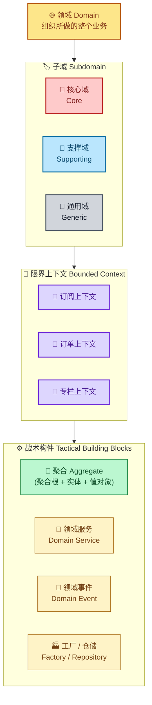
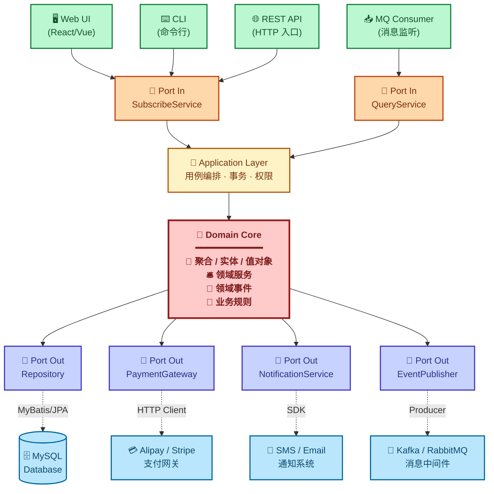

# Domain Driven Design

## 概述

领域驱动设计技能，涵盖DDD核心概念、战略设计、战术设计、建模方法与工程落地。DDD 不是银弹，而是处理复杂业务领域的一套系统方法论。

**一句话总结**：DDD 用业务语言统一代码和需求，让复杂系统按业务边界清晰拆分。

## DDD 基本结构图

DDD 将业务分层切片：**领域 → 子域 → 限界上下文 → 聚合 → 实体/值对象**，战略设计定边界，战术设计填血肉。



**核心要点**：

- **战略设计**（上半部分）：领域 → 子域分类 → 限界上下文，决定"系统如何拆""团队怎么分"
- **战术设计**（下半部分）：聚合、实体、值对象、领域服务、领域事件、工厂、仓储，决定"代码怎么写"
- **限界上下文**是战略与战术的交汇点 —— 它既是模型边界，也是微服务边界

## 六边形架构图 (Hexagonal Architecture)

六边形架构（端口与适配器模式）通过 **"端口 + 适配器"** 将**领域核心**与外部技术隔离，使业务逻辑不依赖任何框架或基础设施。详见 [六边形架构](./hexagonal-architecture/)。



**图例说明**：

| 颜色 | 区域 | 作用 |
|:---:|------|------|
| 🟥 红 | **Domain Core** | 业务核心，纯领域逻辑，无框架依赖 |
| 🟨 黄 | Application Layer | 用例编排、事务、权限校验 |
| 🟧 橙 | Port In（主动端口） | 由外部触发系统的入口 |
| 🟦 紫 | Port Out（被动端口） | 系统调用外部的抽象 |
| 🟩 绿 | Driver Adapter | UI / API / MQ Consumer 等**驱动方** |
| 🟦 蓝 | Driven Adapter | 数据库 / 支付 / 通知等**被驱动方** |

**核心原则（依赖倒置）**：

```
外部技术 ──依赖──▶ 端口（接口）◀──实现──── Domain Core
            ✓                         ✗
(Adapter 依赖 Port)         (Domain 不依赖任何技术)
```

> 领域核心**永远不认识**外面的技术。 替换 MySQL 为 MongoDB、替换支付宝为 Stripe，**只需要新增/替换 Adapter，领域层零修改**。

## 目标

- 介绍 DDD 的核心概念和思想
- 提供战略设计和战术设计的实践指南
- 讲解事件风暴、四色建模等建模方法
- 展示 DDD 在不同业务场景下的应用
- 分析 DDD 与其他架构方法的结合（六边形架构、清洁架构、微服务）
- 提供完整的端到端业务案例落地参考

## 适用场景

- 复杂业务系统设计（B 端、SaaS、金融、电商核心）
- 微服务架构拆分与团队分工
- 领域建模项目（新项目 / 既有系统重构）
- 大型系统持续演进

## 主要内容

### 核心概念

- [领域模型](./domain-model/) - 业务领域的抽象模型（含 8 大特点）
- [限界上下文](./bounded-context/) - 明确的边界和上下文
- [通用语言](./ubiquitous-language/) - 团队共享的业务语言
- [上下文映射](./context-mapping/) - 上下文之间的关系
- [DDD 与 MVC 对比](./ddd-vs-mvc/) - 何时需要 DDD

### 战略设计

- **[战略设计总览](./strategic-design/)** - 领域 / 子域 / 限界上下文 / 上下文映射的上帝视角
- [领域划分](./domain-partitioning/) - 如何划分领域（含"领域"的定义）
- [核心域、支撑域、通用域](./domain-types/) - 领域重要性分类
- [聚合根设计](./aggregate-root-design/) - 聚合的设计原则
- [领域事件](./domain-events/) - 领域内的事件机制

### 战术设计

- **[战术设计总览](./tactical-design/)** - 七大构件的协作全景
- [实体 (Entity)](./entity/) - 具有唯一标识的对象（含四种血液模型）
- [值对象 (Value Object)](./value-object/) - 没有标识的不可变对象（含单一/多属性两种形态）
- [聚合 (Aggregate)](./aggregate/) - 数据修改的单元
- [工厂 (Factory)](./factory/) - 封装聚合创建逻辑
- [领域服务 (Domain Service)](./domain-service/) - 领域逻辑服务
- [应用服务 (Application Service)](./application-service/) - 应用层服务
- [仓储 (Repository)](./repository/) - 聚合的持久化抽象（含 Mapper + DO 转换）

### 建模方法

- **[领域建模总览](./domain-modeling/)** - 建模目的、七大交付物与方法论对比
- [事件风暴建模](./event-storming/) - 多角色工作坊式发散建模
- [四色建模法](./four-color-modeling/) - 基于现金流和 KPI 的强分析建模

### 实践模式

- [CQRS 模式](./cqrs-pattern/) - 命令查询责任分离
- [事件溯源](./event-sourcing/) - 基于事件的持久化
- [读模型优化](./read-model-optimization/) - 查询性能优化
- [Saga 模式](./saga-pattern/) - 分布式事务处理

### 架构集成

- [六边形架构](./hexagonal-architecture/) - 端口适配器架构
- [清洁架构](./clean-architecture/) - 依赖倒置架构
- [DDD 分层架构 (COLA)](./layered-architecture/) - 面向团队协作的应用分层
- [微服务中的 DDD](./ddd-in-microservices/) - 分布式 DDD 实践
- [事件驱动架构](./event-driven-architecture/) - 基于事件的架构

### 案例研究

- [RabbitAdvisors 知识付费案例](./rabbitadvisors-case-study/) - 从领域建模到微服务落地的端到端实践

## 学习路径

1. **方法论入门** - 理解 [DDD 与 MVC 的差异](./ddd-vs-mvc/)，判断何时需要 DDD
2. **基础概念** - 理解[领域模型](./domain-model/)、[限界上下文](./bounded-context/)、[通用语言](./ubiquitous-language/)
3. **战略设计** - 阅读 [战略设计总览](./strategic-design/)，学习[领域划分](./domain-partitioning/)、[域类型](./domain-types/)和[上下文映射](./context-mapping/)
4. **战术设计** - 阅读 [战术设计总览](./tactical-design/)，掌握[实体](./entity/)、[值对象](./value-object/)、[聚合](./aggregate/)、[工厂](./factory/)等构建块
5. **建模方法** - 阅读 [领域建模总览](./domain-modeling/)，通过[事件风暴](./event-storming/)或[四色建模](./four-color-modeling/)完成业务建模
6. **工程落地** - 应用 [DDD 分层架构](./layered-architecture/) 组织代码
7. **实践应用** - 应用 [CQRS](./cqrs-pattern/)、[事件溯源](./event-sourcing/)、[Saga](./saga-pattern/) 等模式
8. **端到端案例** - 阅读 [RabbitAdvisors 案例研究](./rabbitadvisors-case-study/) 整合全部知识

## 使用指南

- 每个 SKILL.md 文件将包含：
  - 概念定义和核心思想
  - 适用场景和解决的问题
  - 实现步骤和最佳实践
  - 代码示例和架构图
  - 实际项目应用案例
  - 常见误区和注意事项
  - 与其他概念的关系

## 核心精神

> 领域驱动设计是一种软件工程的**思想**，不是一套**模板**：
>
> 1. 直接面向业务进行领域建模，将业务知识沉淀到领域模型中
> 2. 业务知识的沉淀不是一蹴而就，应反复提炼、持续演进；团队用通用语言沟通
> 3. 高内聚、低耦合是应对软件复杂度的不二法则 —— 领域、子域、限界上下文、聚合都是为此服务的工具
>
> **DDD 不是银弹**。对于不复杂的项目，MVC 更简单高效。深刻理解业务、洞察问题本质，才是架构师最核心的能力体现。

## 参考链接
https://www.zhihu.com/tardis/zm/art/641295531
